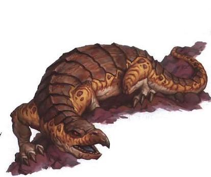

# The Dark Sun Bestiary

Скопировать источник: [Dark Sun Bestiary (Part 1: Domestic Beasts) | New Monsters for Fifth Edition - DMDave | All Things Fifth Edition](https://dmdave.com/dark-sun-bestiary-part-1-domestic-beasts-new-monsters-for-fifth-edition/)

Life is a mysterious and resilient thing. Even in the starkest wastes of Athas, the careful observer finds it clinging to the horns of sand dunes, peeking out from beneath wind-raked boulders, and creeping along the cracked plains of sun-baked clay.

To survive, almost every form of life has become a monster. On the increasingly infertile world of Athas, these adaptations have taken an almost diabolical turn. The land is so barren that every form of life, to one extent or another, is both predator and prey. Some of the more notable of these monsters are described in the content that follows.

## Animals, Domestic

There are numerous domesticated animals on Athas. Some of the most common ones, at least in the Hinter and Tablelands, are described here.

### Crodlu

Crodlu are large, reptilian animals that roam the deserts and scrublands of Athas in herds. Easily domesticated, they are widely used for transportation or as beasts of burden, particularly by merchant houses.

Crodlu resemble enormous, scaled ostriches with long arms that end in wicked claws. They vary in color from dusty yellow to brick red, with splotches or rosettes of contrasting color along their dorsal sides and lighter colored scales along the belly. Powerful muscles enable them to run across the sands at high speed. While their eyesight is poor, their sense of smell is acute, more than making up for their visual impairment.

Crodlu travel in herds of 5 to 30. Of these, one-fifth are chicks (1d8 hit points, a single 1d4 bite attack) and the remainder are adults. Each herd is led by a single adult male. If attacked, adult crodlu form a defensive ring around the young and, if necessary, die to defend them.

If taken from the herd as chicks, crodlu may be trained to serve as mounts. Only 10% of adult crodlu may be so trained, while male leaders can never be trained.

Each female crodlu may give birth to a single young each year. The chicks are able to run and fight within a few minutes of birth. Crodlu are omnivorous, feeding off anything edible they find, sometimes even resorting to pack hunting techniques against smaller animals.

When used as riding beasts, crodlu are unparalleled, carrying their riders with great speed and endurance. While crodlu normally flee rather than fight if carrying a rider or
 cargo, war crodlu may be trained to use their substantial combat abilities in battle. Also valuable as beasts of burden, crodlu can carry substantial loads, although larger amounts reduce their movement, as shown in the following table.

#### Crodlu

Large beast, unaligned

---

Armor Class 15 (natural armor)

Hit Points 30 (4d10 + 8)

Speed 60 ft.

---

Abilities Str 17 (+3), Dex 15 (+2), Con 15 (+2), Int 2 (-4), Wis 13 (+1), Cha 6 (-2)

---

Senses Perception +3

Languages –

Challenge 3 (700 XP)

---

**Keen Smell.** The crodlu has advantage on Wisdom (Perception) checks that rely on smell.

**Pack Tactics.** The crodlu has advantage on an attack roll against a creature if at least one of the crodlu’s allies is within 5 feet of the creature and they ally isn’t incapacitated.

---

##### Actions

**Multiattack.** The crodlu makes two attacks: one with its claws and one with its kick.

**Bite.** Melee Weapon Attack: +5 to hit, reach 10 ft., one target. Hit: 7 (1d8 + 3) piercing damage.

**Claws.** Melee Weapon Attack: +5 to hit, reach 5 ft., one target. Hit: 8 (2d4 + 3) slashing damage, and if the target is a creature it is grappled (escape DC 13). The crodlu can use its bonus action to make a bite attack against a creature it has grappled.

**Kick.** Melee Weapon Attack: +5 to hit, reach 5 ft., one target. Hit: 10 (2d6 + 3) bludgeoning damage.

### Erdlu

Erdlus are flightless, featherless birds covered with flaky gray-to-red scales. They weigh as much as 200 pounds and stand up to seven feet tall. They have powerful, lanky legs ending in four-toed feet with razor-sharp claws, and can run at great speeds over short distances (no more than half-a-mile). Their bodies are massive and round, with a pair of useless wings folded at their sides. Attached to their yellow, snake-like necks are small round heads with huge wedge-shaped beaks.

Erdlus make ideal herd animals, as they can eat many forms of tough vegetation, as well as snakes, lizards, and other small reptiles. They instinctively band together in flocks for protection. When threatened, their first impulse is to flee. If this is not possible, the entire flock will turn and give battle as a group. When they fight, they strike at their attackers with their sharp beaks and then rake them with their claws.

Erdlu eggs are excellent food, containing all the nutrients that a human or demihuman needs to survive for months at a time. If eaten raw, they can even substitute for water (1 gallon per egg) for periods of up to one week. In addition, the hard scales of their wings make excellent shields or armor, their beaks can be used to make fine spearheads, and their claws are often crafted into daggers or tools.

#### Erdlu

Medium beast, unaligned

---

Armor Class 12 (natural armor)

Hit Points 16 (3d8 + 3)

Speed 50 ft.

---

Abilities Str 13 (+1), Dex 13 (+1), Con 12 (+1), Int 2 (-4), Wis 10 (+0), Cha 5 (-3)

---

Senses passive Perception 10

Languages –

Challenge 1/4 (50 XP)

---

**Erdlu Speed.** When the erdlu moves on its turn in combat, it can double its speed until the end of the turn. Once it uses this ability, the erdlu can’t use it again until it moves 0 feet on one of its turns.

---

##### Actions

**Multiattack.** The erdlu makes two attacks: one with its beak and one with its claws.

**Beak.** Melee Weapon Attack: +3 to hit, reach 5 ft., one target. Hit: 4 (1d6 + 1) piercing damage.

**Claws.** Melee Weapon Attack: +3 to hit, reach 5 ft., one target. Hit: 3 (1d4 + 1) slashing damage.

### Inix

The inix is a large lizard midway in size between a kank and mekillot. It weighs about two tons and grows up to sixteen feet long. Its back is protected by a thick shell, while its belly is covered with a layer of flexible scales.

Inix make spirited mounts and are capable of carrying up to a seven-hundred and fifty pounds. They move at steady pace for hours on end, and over short distances, their charge is as fast as that of a kank. Inix riders often travel in howdahs, small box-like
 carriages that are strapped to the beast’s back.
The one major drawback to traveling by inix is that these large herbivores need vast amounts of forage. If they don’t get enough to eat they are nearly impossible to control. Thus, they are seldom used in regions where forage is at a premium.

#### Inix

Huge beast, unaligned

---

Armor Class 14 (natural armor), 12 while prone

Hit Points 57 (6d12 + 18)

Speed 40 ft.

---

Abilities Str 19 (+4), Dex 10 (+0), Con 17 (+3), Int 2 (-4), Wis 10 (+0), Cha 5 (-3)

---

Senses passive Perception 10

Languages –

Challenge 3 (700 XP)

---

**Howdah.** The inix carries a compact fort on its back. One Large creature or up to four Medium or Small creatures can ride in the fort without squeezing. To make a melee attack against a target within 5 feet of the inix, they must use spears or weapons with reach. Creatures in the fort have three-quarters cover against attacks and effects from outside it. If the inix dies, creatures in the fort are placed in unoccupied spaces within 5 of the inix.

---

##### Actions

**Multiattack.** The inix makes two attacks, one with its bite and one with its tail.  It can’t make both attacks against the same target.

**Bite.** Melee Weapon Attack: +6 to hit, reach 5 ft., one target. Hit: 17 (3d8 + 4), and if the target is a creature it is grappled (escape DC 14). Until this grapple ends, the target is restrained, and the inix can’t bite another target.

**Tail.** Melee Weapon Attack: +6 to hit, reach 10 ft., one target. Hit: 17 (3d8 + 4) bludgeoning damage, and if the target is a Huge or smaller creature it must make a DC 14 Strength saving throw. On a failed saving throw, the creature falls prone.

### Kank

Kanks are large docile insects. Their bodies have a black chitinous exoskeleton and are divided into three sections: head, thorax, and abdomen. Kanks often weigh as much as 400 pounds and stand up to four feet tall at the back, with bodies as long as eight feet from head to abdomen. Around their mouths, they have a pair of multi-jointed pincers which they use to carry objects, to feed themselves, and occasionally to fight with. On their thoraxes, they have six lanky legs ending in a single flexible claw with which the kank can grip the surfaces it walks upon. Their bulbous abdomens have no appendages and are simply carried above the ground.

Kanks are often used as caravan mounts, as they can travel for a full day at their top speed, carrying a two-hundred-pound passenger and two-hundred pounds of cargo. They also make decent herd animals and are especially valued by elves. Because they can digest nearly any sort of organic matter, these hardy beasts will thrive in almost any environment. In addition, they require little attention, for a kank hive instinctively organizes itself into food producers, soldiers, and brood queens.

The food producers secrete melon-sized globules of green honey that they store on their abdomens to feed the young and when food is scarce, the rest of the hive. Humans and demihumans can live on this nectar alone for periods of up to three weeks but must supplement their diets with meat and/or vegetation after longer periods. The sweet taste of this nectar makes it very valuable, and it is this that has caused the kank to be domesticated. It should be noted that wild kanks produce far fewer globules than their carefully breed cousins.

When the tribe stops in an area that looks as though there is a considerable amount of vegetation, the brood queens lay a clutch of twenty to fifty eggs. The soldier kanks, along with the rest of the hive, ferociously defend this area from all predators, and will not leave until the eggs hatch. Herders must delay their migrations or abandon their hives when this conflicts with their plans.

Although predators may attack kanks for the food producers’ honey globules, only the foulest carrion eaters will eat kank flesh. As soon as a kank dies, its meat emits a foul-smelling odor that not even a starving man can stomach.

#### Kank

Large beast, unaligned

---

Armor Class 14 (natural armor)

Hit Points 37 (5d10 + 10)

Speed 40 ft.

---

Abilities Str 17 (+3), Dex 11 (+0), Con 15 (+2), Int 2 (-4), Wis 12 (+1), Cha 6 (-2)

---

Senses passive Perception 11

Languages –

Challenge 1 (200 XP)

---

**Death Stench.** When the kank dies, it emits a horrible stench. Any creature that starts its turn within 10 feet of the dead kank must succeed on a DC 12 Constitution saving throw or be poisoned until the start of its next turn. On a successful saving throw, the creature is immune to the dead kank’s Death Stench for 24 hours.

---

##### Actions

**Bite.** Melee Weapon Attack: +5 to hit, reach 5 ft., one target. Hit: 10 (2d6 + 3) slashing damage, and if the target is a creature it must succeed on a DC 12 Constitution saving throw or become paralyzed for 1 minute. The creature can repeat its saving throw at the end of each of its turns, ending the effect on itself with a success.

### Mekillot

Mekillots are mighty lizards weighing up to six-tons, with huge, mound-shaped bodies as long as 30 feet. Their backs and heads are covered with a thick shell that serves as both a sunshade and protection from attacks by other large creatures. Their undersides are covered with much softer scales.

Despite their vicious dispositions, mekillots are often used as caravan beasts. A hitched pair can pull a wagon weighing 10-20 tons at a slow, plodding pace. Mekillots are never truly tame, however; even when they are hitched to a wagon, the stubborn creatures have been known to turn off the road and go wandering off for days—without any apparent reason. They are also noted for making snacks of their handlers. Because of the difficulties of controlling these beasts, most caravans rely on psionicists with the appropriate powers to drive them.

#### Mekillot

Gargantuan beast, unaligned

---

Armor Class 17 (natural armor), 15 while prone

Hit Points 248 (16d20 + 80)

Speed 30 ft.

---

Abilities Str 24 (+7), Dex 8 (-1), Con 20 (+5), Int 1 (-5), Wis 9 (-1), Cha 3 (-4)

---

Saving Throws Str +11, Con +12

Senses passive Perception 9

Languages –

Challenge 9 (5,000 XP)

---

**Belly Drop.** As a bonus action, the mekillot can drop onto its belly. Until it moves, the mekillot has advantage on ability checks and saving throws to avoid being knocked prone. In addition, any Medium or smaller creature underneath the mekillot when it drops must make a DC 11 Dexterity saving throw. On a failed saving throw, the creature takes 13 (2d12) bludgeoning damage and is pinned. While pinned, the creature is prone and restrained (escape DC 17). If the mekillot moves or is knocked prone, the creature is no longer restrained.

---

##### Actions

**Bite.** Melee Weapon Attack: +11 to hit, reach 5 ft., one target. Hit: 29 (4d10 + 7) piercing damage, and the target is swallowed if it is a Large or smaller creature. A swallowed creature is blinded and restrained, has total cover against attacks and damage outside of the mekillot, and takes 17 (5d6) acid damage a the start of each of the mekillot’s turns.

The mekillot’s gullet can hold up to two creatures at a time. If the mekillot takes 30 damage or more on a single turn from a creature inside it, the mekillot must succeed on a DC 22 Constitution saving throw at the end of that turn or regurgitate all swallowed creatures, each of which falls prone in a space within 10 feet of the mekillot. If the mekillot dies, a swallowed creature is no longer restrained by it and can escape from the corpse using 10 feet of movement, exiting prone.

**Tongue.** The mekillot targets one Large or smaller creature that it can see within 30 feet of it. The target must succeed on a DC 17 Strength saving throw, or the target is pulled into an unoccupied space within 5 feet of the mekillot, and the mekillot can make a bite attack against it as a bonus action.

---

More to come…
