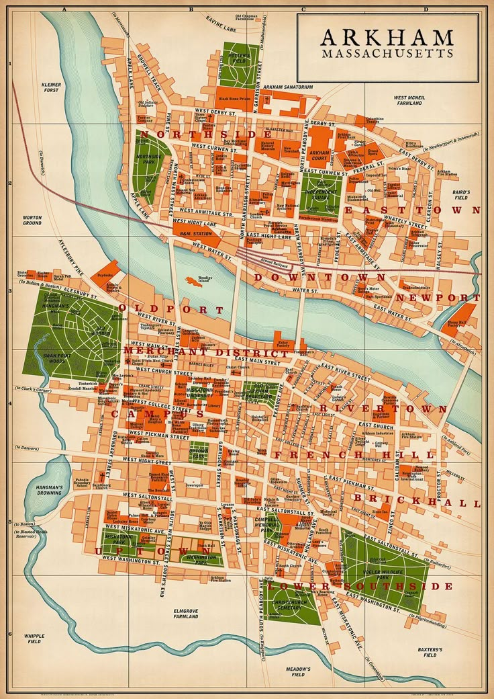
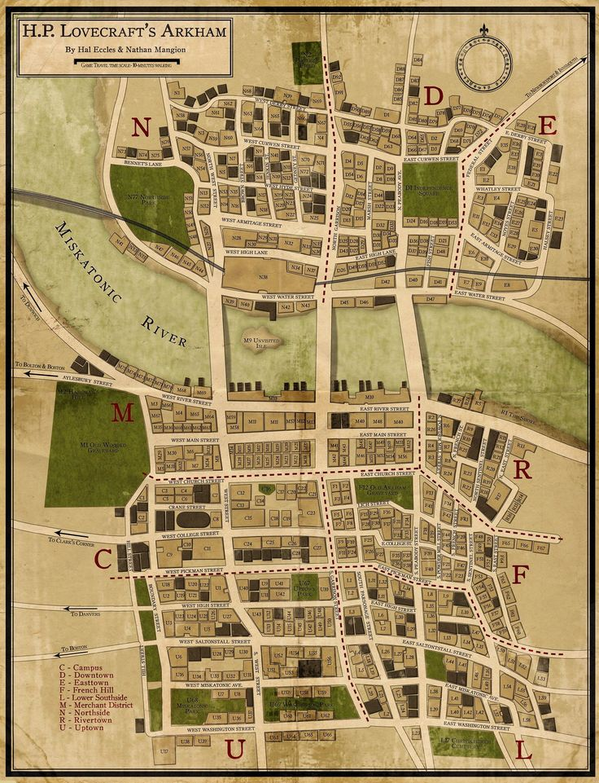
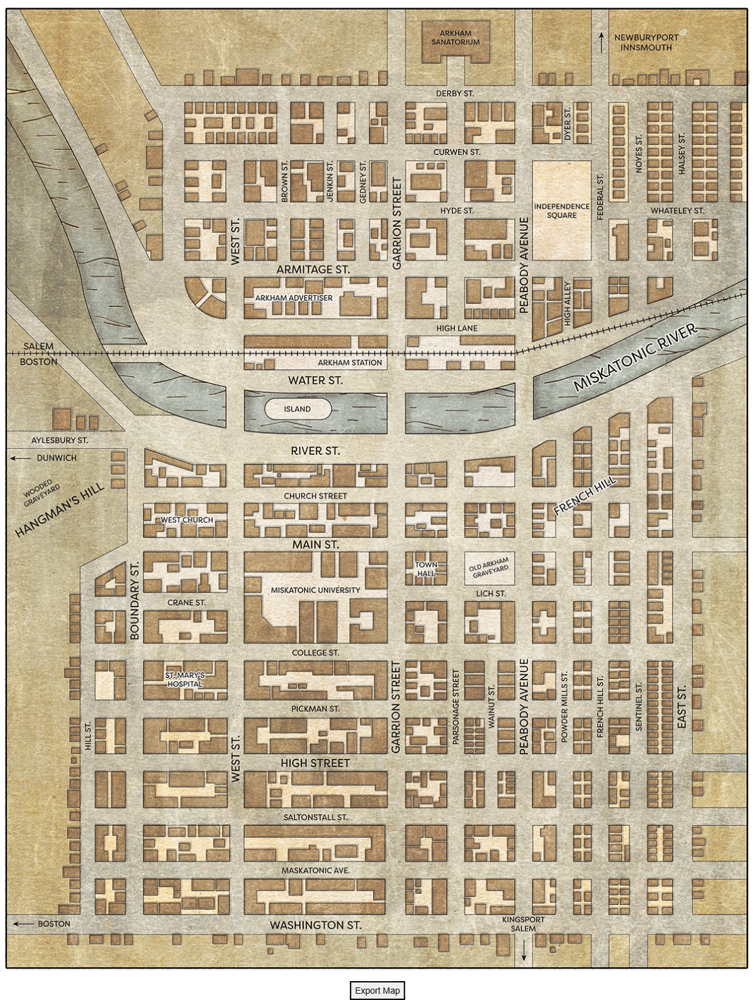

# Аркхем

Карта Аркхэма, нарисованная Лавкрафтом

А́ркхем (англ. Arkham, МФА (англ.): [ˈɑːrkəm]), иногда Архем или Аркхэм — вымышленный город в штате Массачусетс, в произведениях американского писателя Говарда Филлипса Лавкрафта и последователей «Мифов Ктулху». Неотъемлемая часть окружения в творчестве Лавкрафта («Страны Лавкрафта»).

В честь этого города получила название частное издательство «Arkham House» Августа Дерлета, писателя и друга Лавкрафта, который после его смерти издал незаконченные произведения автора. Также Аркхем — вымышленное учреждение в рассказах о Бэтмене DC Comics, которое тоже было названо в честь Аркхема Лавкрафта.

## Основные сведения

Лавкрафт впервые описывает Мискатоникскую долину в рассказе «Картина в доме» (1920), где с первых же строк говорится про дикую природу здешних мест: дремучий лес с нечистой силой, безлюдный горный кряж и монолиты на необитаемых островах, что служат объектами паломничества для тех, кто интересуется колдовством.

Аркхем ( /ˈɑːrkəm/ ) — самый известный город в долине Мискантоник, пользующийся славой выходящей далеко за его пределы. Аркхем стал известен на весь мир в первую очередь как образовательный и научный центр, поскольку именно здесь был построен Мискатоникский университет (названный по имени реки Мискатоник (англ. Miskatonic). Впервые Аркхем появляется в рассказе «Герберт Уэст — реаниматор», где упоминается: Мискатоникcкий университет, общежитие, Историческое общество, сумасшедший дом Сэфтон, ферма Чапмена, кладбище на поле Поттера, полицейский участок и множество кварталов. Аркхем большой город с современными чертами и выполняет центральную роль в творчестве Лавкрафта, который редко описывал мегаполисы. Аркхем был изрядно опустошен эпидемией брюшного тифа в 1905 году. Аркхем граничит соседнем городом Болтоном (англ. Bolthon), где находится самая большая ткацкая фабрика и цирк. Название Аркхем похоже на слова «архаичный» (англ. Archaic), «тьма» (англ. Dark) и «анх» (англ. Ankh).

В рассказе «Неименуемое» описан старинный район Аркхема, где располагается старинное кладбище, церковь, бойня и Медов-Хилл, — как место колдовских сборищ. Самыми примечательными характеристиками города являются старинные дома XVII-XVIII века с гигантскими островерхими крышами и мрачные легенды, что веками окружали город. Аркхем — город, хранящий немало темных тайн. Исчезновение детей и другие «нечестивые деяния» воспринимаются как обычная часть жизни. Во времена охоты на ведьм в здешних местах укрывались колдуны, многих из которых казнили на Висельном холме. Достаточно лишь немного побродить среди его обветшалых домов и насладиться прекрасными образцами георгианской архитектуры, как возникнет стойкое ощущение, что Аркхем не только остался уязвим для проникновения загадочных теней, но и по-прежнему населен призраками прошлого.

В рассказе «Серебряный ключ» описана холмистая местность за Аркхемом, где находится хижина ведьмы Гуди Фаулер и пещера «Змеиное логово» на горе, с которой виден Кингспорт.

В рассказе «Цвет из иных миров» описана совершенно глухая, дикая местность, к западу от Аркхема, где повсюду царит запустение и стоят лишь одинокие фермы на склонах холмов, а фермеры еще помнят охоту на ведьм. В рассказе упоминается университет, полицейский участок, Медов-Хилл, островок посреди реки Мискатоник, — как место колдовских сборищ. Водохранилище и Испепеленная пустошь (место падения метеорита). Фермеры предпочли проложить дорогу в обход фермы Гарднеров и распускали слухи об их ферме.

Мискатоникcкий университет финансирует экспедицию аркхемских ученых в повести «Хребты Безумия» (1936) и «За гранью времён» (1936).

В рассказе «Грёзы в ведьмовском доме» Аркхем списан как легендарная колдовская деревушка, где упоминается: университет, темная долина за Медов-Хилл и круг из камней на острове посреди реки, — как место колдовских сборищ. На старинной улице в центре города до 1931 года располагался дом ведьмы Кеции Мейсон. Исчезновение детей (убитых в ритуальных жертвоприношениях) в канун мая и другие «зловещие поступки» часто упоминаются жителями. Основное печатное издание — «Аркхем Эдвертайзер» (англ. Arkham Advertiser) — распространяется также и в Данвиче. До 1880 года оно называлось «Аркхемская газета» (англ. Arkham Gazette). Джилмен упоминает некоторые места Аркхема:

* Хейверхилл (англ. Haverhill) – Джилмен родился там.
* Долина Белого Камня (англ. Valley of the white stone) – место проведения шабаша.
* Медоу-Хилл (англ. Meadow-Hill) – колдовской холм, упоминается в рассказе «Модель для Пикмана».
* Ручей Висельников (англ. Hangman’s Brook) – место казни ведьм. Похожее описывается в рассказе «Модель для Пикмана».
* Заброшенная пристань (англ. Abandoned wharves) – пристань упоминается в рассказе «Модель для Пикмана».
* Орнская пристань (англ. Orne’s Gangway) – персонаж по фамилии Орн появляется в романе «Случай Чарльза Декстера Варда».
* Пибоди авеню (англ. Peabody Avenue bridge) – персонаж по фамилии Пибоди упоминается в повести «Хребты Безумия».
* Дорога в Иннсмут (англ. Road to Innsmouth) – это место действий повести «Тень над Иннсмутом».

В рассказе «Тварь на пороге» упоминается связь аркхемских и иннсмутских колдунов с Культом ведьм из Чесонкук, штат Мэн. Аркхем занимает особое место в произведениях Лавкрафта:

> Мою любовь к миру теней и чудес, вне всякого сомнения, выпестовал древний и ветхий, исподволь пугающий городок, в котором живы ведьмины проклятья, овеянный старинными легендами Аркхем, чьи нахохлившиеся одряхлевшие двускатные крыши и выщербленные георгианские балюстрады по соседству с Мискатоникским университетом сонно предавались воспоминаниям о протекших веках.
>
> Г. Ф. Лавкрафт «Тварь на пороге».

## Прототипы

Точное расположение Аркхема не указано, хотя, вероятно, он находится в холмистой местности, недалеко от прибрежных городов: Иннсмута, Данвича и Кингспорта. Изучая произведения Лавкрафта, можно предположить, что Аркхем лежит к северу от Бостона и, вероятно, находится в округе Эссекс, штат Массачусетс. Известно, что Лавкрафт изменил изначальное местоположение Аркхема, поскольку решил, что долина Куаббин (англ. Quabbin) была затоплена под Водохранилище Куаббин, созданное для снабжения Бостона пресной водой — об этом говорится в рассказе «Цвет из иных миров». Более поздняя карта «Страны Лавкрафта» подтверждает это предположение, поскольку упоминается, что Аркхэм расположен недалеко от Кингпорта и Бостона.

Реальной моделью Аркхема, возможно, послужил город Салем, чья репутация оккультизма привлекает тех, кто изучает запретные книги в поисках тайных знаний. Лавкрафт часто упоминает Новую Англию и старинные дома XVII века.

Уилл Мюррей отмечает, что водохранилище Аркхема вдохновлено городом Ситьюэит в Род-Айленде. Он ссылается на неопубликованное письмо, в котором Лавкрафт упоминает о походе «через обречённую Аллею Квабен», незадолго до того, как там было построено водохранилище, а вся территория была затоплена в 1926 году.

Санаторий Аркхема появляется в рассказе «Тварь на пороге» и, возможно, был вдохновлён государственной психиатрической лечебницей штата Данверс, Массачусетс. Сумасшедший дом Данверс фигурирует в рассказах «Модель для Пикмана» и «Тень над Иннсмаутом».

В «Энциклопедии Лавкрафта» отмечается, что местонахождение Аркхема является предметом споров. Уилл Мюррей помещает Аркхэм в центральный Массачусетс и считает, что он основан на небольшой деревне Окхэм (англ. Oakham). Роберт Д. Мартен делают эту теорию крайне маловероятной и утверждает, что Аркхэм всегда находился на Северном Берегу и (как неоднократно заявлял Лавкрафт) и был аналогом Салема, и находился на севере от него, недалеко от моря и устья реки.

> [моё] мысленное представление об Аркхэме представляет собой городок, напоминающий Салем по атмосфере [и] стилю домов, но более холмистый [и] с колледжем (которого в Салеме [нет]) ... Я помещаю город [и] воображаемую Мискатоник [реку] где-нибудь к северу от Салема - возможно, недалеко от Манчестера.
>
> Письмо Лавкрафта к Ф. Ли Болдуину от 29 апреля 1934 года

Мартен полагает, что Аркхэм назван в честь Аркрайта (англ. Arkwright), Род-Айленд (который теперь является частью Фисквилля). Лавкрафт отмечал в письмах, что «Ужас Данвича» «принадлежит к циклу Аркхэма» (Избранные письма 2.246), но значение этой фразы неясно. Возможно, он имел в виду тот факт, что некоторые из его недавних рассказов имели не только псевдомифологический фон, но и воображаемую топографию Новой Англии.

В своем эссе «Сверхъестественный ужас в литературе» Лавкрафт пишет об островерхих домах Новой Англии:

> Главным произведением Готорна о сверхъестественном является роман "Дом о семи фронтонах", в котором вновь с поразительной силой идет речь о древнем проклятии, и мрачным фоном служит очень старый дом в Салеме - один из тех готических домов с островерхими крышами, которые стали типичными для новоанглийских городов, но которые после XVII века уступили место более известным домам с двускатными крышами классического георгианского стиля, что называется колониальным. Из готических островерхих домов едва ли дюжина сохранилась в США в первоначальном виде, однако один, отлично известный Готорну, все еще стоит на Тернер-стрит в Салеме, и на него указывают как на вероятный прототип литературного дома, вдохновивший автора на написание романа. Это сооружение с призрачными шпилями, скоплением труб, нависающим вторым этажом, с газовыми рожками на углах и ромбовидными зарешеченными окошками, несомненно, могло произвести впечатление как символ темной пуританской эпохи скрываемого ужаса и перешептываний о ведьмах, которая предшествовала красоте, рациональности и приволью XVIII века.

## Аркхем в творчестве Лавкрафта

Аркхем и связанные с ним понятия постоянно появляются в творчестве Лавкрафта. Вот некоторые из упоминаний:

* «Картина в доме» (1920 г.) — первое упоминание Аркхема и Мискатоника.
* «Герберт Уэст — реаниматор» (1921—1922 гг.) — первое упоминание Мискатоникского университета.
* «Неименуемое» (1923 г.)
* «Серебряный ключ» (1926 г.)
* «Цвет из иных миров» (1927 г.)
* «Ужас Данвича» (1928 г.)
* «Хребты Безумия» (1931 г.) — один из кораблей экспедиции носит название «Аркхем», другой — «Мискатоник», да и сам главный герой родом из этого таинственного города.
* «Тень над Иннсмутом» (1931 г.) — первое упоминание Аркхемского исторического общества (Arkham Historical Society).
* «Грёзы в ведьмовском доме» (1932 г.)
* «Врата серебряного ключа» (1932—1933 гг.)
* «Тварь на пороге» (1933 г.) — первое упоминание Аркхемского сумасшедшего дома.
* «За гранью времен» (1934—1935 гг.) — главный герой родом из Аркхема, средний сын его — профессор Мискатоникского университета.

## Аркхем в других источниках

* Аркхем неоднократно упоминается в творчестве последователей Лавкрафта, включая Роберта Блоха и Брайана Ламли.
* Аркхемский сумасшедший дом часто встречается в комиксах, фильмах, мультфильмах и играх о Бэтмене, являясь местом содержания разнообразных сумасшедших злодеев. В этом качестве он впервые упомянут в 1974 году. Следует отметить, впрочем, что Лавкрафт использовал для обозначения этого сумасшедшего дома слово Sanitarium, тогда как в комиксах употреблено слово Asylum, как и в компьютерной игре Call of Cthulhu: Dark Corners of the Earth.
* Лечебница Элизабет Аркхем для душевнобольных преступников (The Elizabeth Arkham Asylum for the Criminally Insane) упоминается в телесериале «Готэм».
* Аркхемский сумасшедший дом является одним из мест действия фильма «Кэрри 2».
* В настольной ролевой игре «Ужас Аркхема» герои пытаются спасти этот город от пришествия Древнего.
* Аркхем — один из главных антагонистов игры Devil May Cry 3: Dante’s Awakening.
* Упоминается лечебница для душевно больных города Аркхэм в повести Стивена Кинга «Несущий смерть»
* Настольно ролевой мир, также не обошёл стороной тему Аркхэма: например в игре "Древний ужас" город является одной из локаций, где можно обучится древним заклинаниям. А в "Ужас Аркхэма" и "Тайны Аркхэма" этот город является главным местом, где буквально можно погулять по улицам и пообщаться с его жителями.
