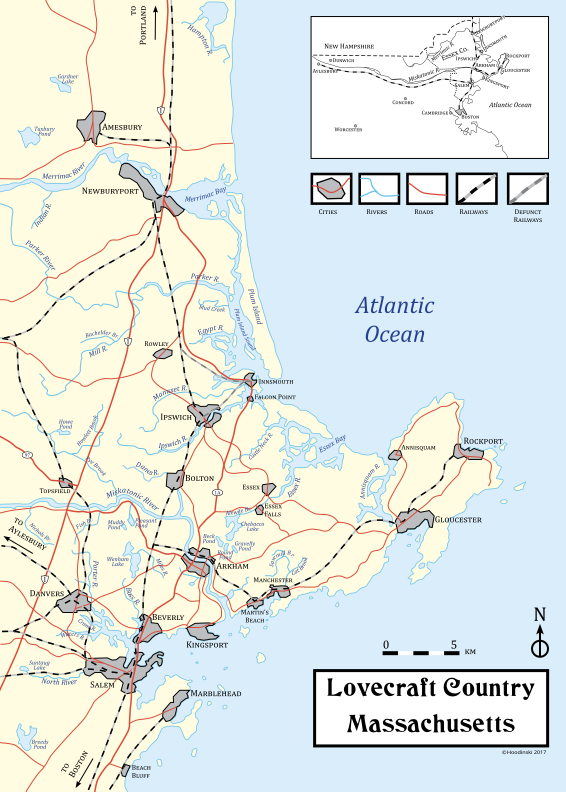
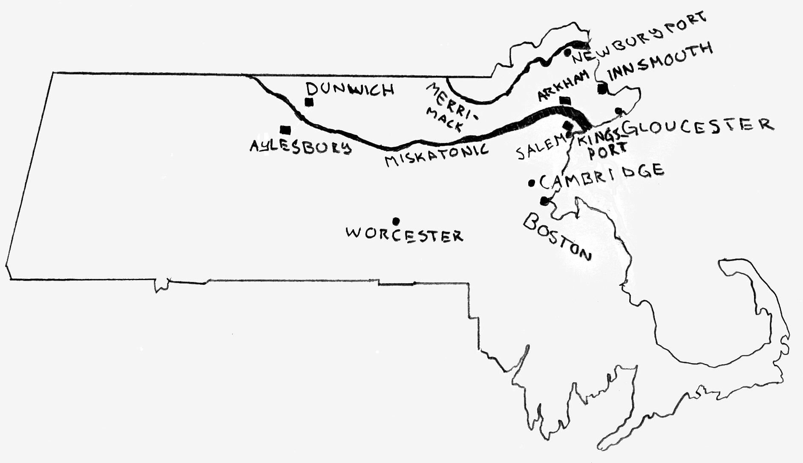

# Страна Лавкрафта

Подробная карта «Страны Лавкрафта»

«Страна Лавкрафта» (англ. Lovecraft Country) — вымышленные города и миры в произведениях американского писателя Говарда Филлипса Лавкрафта и последователей «Мифов Ктулху». Термин не использовался при жизни Лавкрафта, его придумал Кит Гербер для настольной ролевой игры «Зов Ктулху», издательства «Chaosium» 1981 года. И хотя это определение возникло в сообществе настольных ролевых игр, сейчас его широко используют. Термин «Страна Лавкрафта» — лишь одна из многих попыток обозначения литературного наследия Лавкрафта, использовавшего в своём творчестве мотивы окрестностей Новой Англии — что стало одним из самых популярных окружений в фантастической литературе.

Лавкрафт описывает старинные дома, заброшенные особняки, изолированные деревушки, извилистые улочки, церкви, замки, склепы, кладбища, колдовские холмы, круги из камней, циклопические руины и многое другое. Произведения знакомят читателя с легендами городов, где скрываются колдуны, сектанты и нечеловеческие существа. Наиболее примечательные города: Аркхем, Данвич, Иннсмут, Кингспорт, Провиденс и другие. Место действий в основном охватывает штаты Массачусетс, Вермонт и Род-Айленд.

«Энциклопедия Лавкрафта» полагает, что автор совмещал городские легенды двух городов и таким оригинальным образом создавал новый смешанный тип. Локации связаны между собой, а события переходят из одного окружения в другое. При этом они не противоречат друг другу, а расширяют границы миров Лавкрафта; и все они — маленькая часть от целого. Произведения Лавкрафта и его последователей представляют собой большую мультивселенную.

## Описание

Карта Страны Лавкрафта

### Название

Американский литературный критик С. Т. Джоши, исследователь творчества Лавкрафта, отмечает, что в «Мискатоникском регионе» (англ. Miskatonic Region) наиболее известным является Мискатоникский университет, что имеет такое же название, что и река Мискатоник. Лин Картер, биограф Лавкрафта, использует название «Округ Мискатоник» или «Страна Мискатоник» (англ. Miskatonic County). Лавкрафт использует настоящие названия штатов и округов, но рядом с ними граничат и полностью вымышленные города. В повести «Тень над Иннсмутом» и рассказе «Грёзы в ведьмовском доме» сказано, что некоторые из вымышленных городов располагаются в округе Эссекс (англ. Essex County). Важно, что «Эссекс» существует, как графство в Англии, так и округ в США, а также есть несколько городов с одинаковым названием в штатах Массачусетс, Вермонт и Нью-Йорк. Лавкрафт часто переносит города и достопримечательности из Великобритании в состав штата Массачусетс. Вероятно, это связано с тем, что Лавкрафт считал огромной ошибкой существование США и ни разу не использует это название в своём творчестве. До конца жизни Лавкрафт считал себя подданным британской короны. Позже Лавкрафт расширил окружение, включив в него ближайшие достопримечательности из соседних штатов и другие вымышленные названия, такие как Мискатоникский университет.

Лавкрафт писал в письмах, что «Ужас Данвича» «принадлежит к циклу Аркхэма» (Избранные письма 2.246), но значение этой фразы неясно. Возможно, он имел в виду тот факт, что некоторые из его недавних рассказов имели не только псевдомифологический фон, но и воображаемую топографию Новой Англии.

В фильме «Цвет из иных миров» (2019) используется название «округ Аркхем» (англ. Arkham County). В одноимённом телесериале «Lovecraft Country» (2020) от HBO события происходят в округе Аркхем и регионе Мискатоник. Мэтт Рафф, автор романа «Страна Лавкрафта», описывает свой вымышленный «округ Девон» (англ. Devon County), Массачусетс.

## Творчество Лавкрафта

«Страна Лавкрафта» — беллетризованная версия Новой Англии, что служит основой для «Мифов Ктулху». Она представляет историю, культуру, мифологию и фольклор региона Массачусетс в интерпретации Лавкрафта, который ассоциировал себя с этим местом. Лавкрафт использует городские легенды и связи с Новой Англией. Эти атрибуты специально преувеличены и насыщены элементами, которые способны внушать страх. Лавкрафт тяготел к старине и говорил, что ощущает себя стариком. Он часто описываете современные города и старинные дома XVII века, а окружение переходит из одного произведения в другое. Чтобы сделать города более реалистичными он внедряет в произведения мифологию и научные материалы. В произведениях выражены черты готической литературы, хотя Лавкрафт стремился отличаться от этого жанра. Окружение Новой Англии впервые применяется в рассказе «Страшный старик». В рассказе «Картина в доме» Лавкрафт впервые упоминает вымышленные города наряду с настоящими и начинает все меньше полагаться на стандартные атрибуты готической литературы, а все больше на свой родной регион. Мискатоникская долина напоминает Нил, чье название означает «Речная долина». В рассказе «Память» Лавкрафт упоминает Долину Нис, что вдохновлена стихотворением «Долина Нис» Эдгара По, последователем которого является сам Лавкрафт. Провиденс, родной город Лавкрафта, основан на семи холмах — что напоминает Семь холмов Рима. Лавкрафт использует имена исторических личностей Салема. Персонажи скрываются в небольших поселениях, где возникают новые магические сообщества. Стивен Кинг является последователем Лавкрафта и действие его произведений часто происходит в небольших американских городах, — что также характерно для Лавкрафта, который считал, что самые страшные вещи творятся в таких вот местах.

> Этот ночной чёрный Массачусетс, легендарный, представляющий действительно жуткое увлечение. Вот материал для действительно глубокого исследования массовой неврастении, ведь никто не может отрицать существование глубоко болезненной черты в пуританском воображении.
>
> Письмо Лавкрафта к Роберту Говарду (1930 год).

## Август Дерлет

Август Дерлет, писатель и друг Лавкрафта, дописал незавершённые рассказы после его смерти. Дерлет отговорил других писателей писать произведения в окружении Новой Англии Лавкрафта, чтобы у него было время издать то, что не успел автор. Дерлет основывался на фрагментах и черновиках среди невероятно огромного числа писем Лавкрафта (от 30 до 100 тысяч). Для этой цели Дерлет специально создал издательство «Arkham House».

Дерлет расширил описание региона к северу от Данвича в повести «Затаившийся у порога» и рассказах: «День Уэнтворта», «Наследство Пибоди», «Тень в мансарде», «Тайна среднего пролёта», «Наблюдатели». Рассказы «Рыбак с Соколиного мыса», «Иннсмутская глина» и «Комната с заколоченными ставнями» относятся к Иннсмуту. Действие рассказа «Ведьмин лог» происходит, к западу от Аркхема. Рассказы «Единственный наследник» и «Ночное братство» относятся к Провиденс.

Некоторые критики отделяют окружение из творчества Дерлета и называют его «Страна Дерлета» (англ. Derleth County). Дерлет описывает более персональный характер окружения, сравнивая дом с монстром и т. п.

Кроме «Мифов Ктулху», Дерлет писал о Сок-Сити, штат Висконсин, в романе «Сага о Сок-Прери» и «Висконсинская сага»; описывал природу и деревенскую жизнь в Америке на Среднем Западе, имеющую фундаментальное значение для страны. Дерлет не стал заимствовать материалы из справочников библиотеки и «написал так, будто, выпил все это с молоком матери». Дерлет преуспел в том, чтобы собрать висконсинские мифы и усилил ценность деревенского пейзажа в дикой природе; а его письмо приобретает качество старой фламандской картины, живой, человеческой, милой.

Рэмси Кэмпбелл создал «Долину Северн» (англ. Severn Valley), как аналог «Страны Лавкрафта» по совету Августа Дерлта.

Уилл Мюррей отмечает, что Лавкрафт редко использовал свои вымышленные города в произведениях, написанных в соавторстве, а окрестности Аркхема ставил исключительно для себя. В таких случаях действие происходит в городах неподалеку.

## Локации

Самым известным местом является Мискатоникская долина и огромная река Мискатоник (англ. Miskatonic), что тянется вглубь штата Массачусетс. Первоначально Лавкрафт описывал воображаемый треугольник. Большая часть поселений находится вдоль реки, что тянется от Данвича, в её дальнем западном истоке, до устья, впадающего в Атлантический океан, между Аркхемом, Кингспортом и Мартинс-Бич. На севере побережья находятся Иннсмут и Ньюберипорт. В поздних произведениях события происходят также и в других областях Новой Англии, в том числе, в штатах Вермонт («Шепчущий во тьме») и Род-Айленд («Случай Чарльза Декстера Варда»), — эти обширные территории также следует рассматривать как часть «Страны Лавкрафта». В ранних рассказах Лавкрафт часто упоминает дикую местность, долины и холмы в штате Массачусетс, а также английские города, такие как Суссекс.

### Мискатоникская долина

Мискатоникская долина (англ. Miskatonic Valley) — местность с лесами и горами, впервые появляется в рассказе «Картина в доме» (1920), где также упоминаются Аркхем и Салем. Рассказ начинается с чего-то вроде манифеста, в котором Лавкрафт описывает воображаемую сельскую местность Новой Англии, — что станет известна как «Страна Лавкрафта»:

> Подлинный ценитель ужасов превыше всего ставит сельские дома в глуши Новой Англии, ибо там темные силы, порок и невежество пребывают в своем первозданном обличии, идеально согласуясь с атмосферой ужасов. Самым пугающим зрелищем являются неказистые деревянные дома, расположенные вдали от дорог, на склоне холмов. Два века с лишним простояли они так, оседая и кренясь, и все это время вились и ползли по их стенам виноградные лозы, и окружали ширившиеся деревья. Они почти сокрыты в буйстве зелени и под покровом тени, но их окна по-прежнему таращатся на мир и будто моргают в мертвенном оцепенении, притупляющем в памяти жуткие события. Только тихие и сонные дома в лесной глуши все видят и могут поведать о том, что лежит за тайнами прежних времен; но они не желают отгонять дремоту, что помогает им забыться. Порою кажется, что лучше бы снести эти дома, о чем и они, должно быть, мечтают.
>
> Г. Ф. Лавкрафт. «Картина в доме» (1920).

### [Аркхем](./Аркхем.md)

Аркхем (англ. Arkham) — самый известный город в долине Мискантоник, пользующийся славой выходящей далеко за его пределы. Самыми примечательными характеристиками Аркхема являются его старинные дома XVIII века с двухскатной крышей и мрачные легенды о ведьмах, и призраках, которые веками окружали город. Исчезновение детей и другие «нечестивые деяния» воспринимаются как обычная часть жизни. Во времена охоты на ведьм в здешних местах укрывались колдуны, многих из которых казнили на Висельном холме. В XX веке Аркхем преобразился и стал известен на весь мир в первую очередь как образовательный и научный центр, поскольку именно здесь был построен Мискатоникский университет. В рассказе «Герберт Уэст — реаниматор» Аркхем описан как современный город, где есть несколько жилых районов, церкви, кладбища, фермерские поля, фабрики, пруд, историческое общество, сумасшедший дом Сефтон. Рядом находится промышленный городок Болтон. В рассказе «Неименуемое» описан старый район Аркхема, где находится кладбище. Достаточно лишь немного побродить среди его обветшалых домов и насладиться прекрасными образцами георгианской архитектуры, как возникнет стойкое ощущение, что Аркхем не только остался уязвим для проникновения загадочных теней, но и по-прежнему населен призраками прошлого. В рассказе «Цвет иных миров» описаны фермерские поселения и совершенно дикие места к западу от Аркхема, что были затоплены под водохранилище.

Реальной моделью для Аркхема, фактически, является Салем, что завлекает ценителей ужасов своей репутацией оккультизма. Аркхем часто фигурирует в произведениях последователей «Мифов Ктулху».

> В древнем Аркхеме, казалось, остановилось время, и люди живут одними легендами. Здесь повсюду в немом соперничестве вздымаются к небу островерхие крыши; под ними, на пыльных чердаках, в колониальные времена скрывались от преследований Королевской стражи аркхемские ведьмы. Старый город полон тенистых хитросплетений немощеных, пахнувших плесенью переулков; побуревшие от времени жуткие глыбы домов, не имевшие, казалось, возраста, склоняются над головой, словно грозя обрушиться вниз, и с издевкой бросали злобные взгляды узких подслеповатых оконец. Остров посередине реки вызывает много суеверных толков в городе. Там стоят необычные фигуры, образуемые рядами серых, поросших мхом камней, расставленные неведомой рукой в туманном прошлом, которое не оставило никаких иных следов в памяти людей.
>
> Г. Ф. Лавкрафт. «Грёзы в ведьмовском доме» (1932).

### Кингспорт

Кингспорт (англ. Kingsport) — старинный город на побережье, что стоит среди горных утесов и поросших ивами холмов. Основанный ещё в XVII веке как маленькое рыбацкое поселение, со временем он разросся в городок, но все ещё сохранил следы архитектуры колониального периода: мощеные булыжником тесные улицы со скрипучими вывесками, мансарды и фронтоны под старомодными островерхими крышами с печными трубами, шпилями и флюгерами, нависающие над темными улочками меж домов с ромбовидными окошками. На Централ-Хилл ранее стояла каменная конгрегационалистская церковь и кладбище, а теперь выстроен госпиталь. На площади перед ним, как и прежде, извилистые и крутые улицы спускаются к порту, с его деревянными причалами и мостками. Впервые описан в рассказе «Страшный старик» как портовый город, полный суеверных жителей. В рассказе «Праздник» Кингспорт похож на город-призрак: улицы безлюдны, а в окнах не горит свет. Город всегда окутывало множество легенд и тайн, он не избежал волны гонений колдунов и ведьм, прибывших сюда из Салема в 1692 году. В 1740-х здесь проводили языческие обряды в пещерах. Лавкрафт описал в письме Кингспорт как идеализированную версию Марблхеда, что граничит в Салемом. Скалы вдохновлены скалам Марблхед и Рокпорта. Уилл Мюррей пишет, что Лавкрафт по разному указывал его местоположение: иногда Кингспорт находится рядом с Иннсмутом. Лавкрафт писал про Кингспорт ещё до того, как увидел его реальную модель, посетив Марблхед в 1922 году.

> В сумерках заснеженный Кингспорт казался огромным: с затейливыми флюгерами и шпилями, старомодными крышами и дымниками на печных трубах, причалами и мостками, деревьями и погостами; с бесчисленными лабиринтами улочек, узких, извилистых и крутых, сбегающих с высокого холма в центре города, увенчанного церковью; с невообразимой мешаниной домов колониального периода, разбросанных тут и там и громоздящихся под разными углами и на разных уровнях, словно кубики, раскиданные рукой младенца. Античность парила на серых крыльях над посеребренными морозом кровлями. Дома с остроконечной крышей и ромбовидными окнами строили до 1650 года.
>
> Г. Ф. Лавкрафт. «Праздник» (1923).

### [Данвич](./Данвич.md)

Заброшенный амбар в Атол, штат Массачусетс, прототип Данвича
Данвич (англ. Dunwich) — полузаброшенная деревенька, представляющая собой скопище обветшалых лачуг с островерхими крышами, притаившихся в тени огромного Сторожевого холма, что в долине реки Мискатоник. Впервые появляется в рассказе «Ужас Данвича»: поселение основано в 1692 году переселенцами из Салема, эта деревушка старше любого другого поселения. В нём до сих пор сохранились каменные стены подвалов и печные трубы XVII века; в то время как самой поздней постройкой является водяная мельница 1806 года. С тех пор поселение таилось в изоляции и пришло в упадок. Жители захолустного уголка прошли по пути регресса и в результате близких кровных связей образовали свою собственную расу. Необразованные и очень суеверные отшельники до сих пор хранят старинные суеверия о служителях Сатаны, ведьминой крови, странных лесных обитателях и обитавших в этой местности индейцах, которые свершали языческие обряды на вершинах холмов, сопровождавшиеся ярко пылавшими кострами и молениями. Козодои по местным поверьям являются проводниками в мир мёртвых. Ныне все дорожные указатели, где отмечен Данвич, убрали, поскольку у него плохая репутация. Пыльная дорога тянется далеко на север, но уже давно никем не используется, а отходящие от неё грунтовки петляют по каменистым склонам холмов мимо одиноко разбросанных ферм с редкими полями и скудными лугами. Церковь была перестроена в хозяйственный магазин Осборна.

Данвич существует в Суффолке, Англия, и произносится как «ДАН-вич», но Лавкрафт никогда не уточнял, как он предпочел бы произносить Данвич. Лавкрафт вдохновлялся такими городами западного Массачусетса, как Спрингфилд, Уилбрахам, Монсон и Хэмпден. С. Т. Джоши считал, что Данвич вдохновлен легендами Ист-Хаддам, Коннектикут, о «Дьявольскому луге» и «Нездешних шумах».

> Данвич — небольшая деревушка, зажатая между рекой и вертикальным склоном Круглой горы. Поселение это представляет собой скопище жалких лачуг под островерхими двускатными крышами, что были возведены не одну сотню лет назад и сильно обветшали. Многие из домов давно уже опустели и того гляди рухнут, а в древней церквушке с обломанным шпилем нашла себе приют убогая лавчонка — единственное торговое заведение в поселении. В ноздри вам ударяет отвратительный затхлый запах — дух тлена, что веками подтачивает дома и улицы выморочной деревушки. Два столетия тому назад, разговоры о кровавых шабашах ведьм, поклонении Сатане и жутких обитателях лесов вызывали у приступы суеверного ужаса. Этот страх основывается суевериях, которым так подвержены деградировавшие за долгие годы глухой изоляции обитатели медвежьих углов Новой Англии. Почти полная их отрезанность от внешнего мира и, как следствие, большое количество родственных браков сделали свое дело — жители этой затерянной глубинки давно уже выродились в особую расу, отмеченную явными признаками умственного и физического упадка. Болотистая местность вызывает инстинктивную неприязнь и страх из-за стрекота невидимых козодоев; изобилия светлячков и хриплого свиста жаб. Узкая сверкающая лента Мискатоника в его верховьях очень напоминает змею, когда он, изгибаясь, подходит к подножию куполообразных холмов. Засеянные поля встречаются всё реже; а редкие дома несут на себе отпечаток старости, разрушения и запущенности. Никакого притока людей Данвич не знает. Все указатели, где был отмечен Данвич, убрали.
>
> Г. Ф. Лавкрафт. «Ужас Данвича» (1928).

### [Иннсмут](./Иннсмут.md)

Иннсмут (англ. Innsmouth) — старинный портовый город в штате Массачусетс, рыбацкое захолустье, к югу от острова Плам и к северу от Мыса Энн, что граничит с рекой Мануксет (англ. Manuxet River). Пользуется дурной славой, поэтому во всей округе об Инсмуте принято лишний раз не вспоминать. Инсмут всегда был сам по себе. От других поселений его отрезают болота и заливы, а суеверных моряков отпугивает Чертов риф у порта. Впервые появляется в рассказе «Тень над Иннсмутом» (1931): некогда это был индустриальный портовый город, в котором процветало судостроение и мореходство, и промышленность. После XIX веке город пришел в упадок. Ныне Инсмут бедный город, который пребывает в ужасающем состоянии разрушения, многие здания гниют и находятся на грани обрушения. Но вопреки всему Инсмуту удалось сохранить внешнее очарование. Даже заброшенные и неухоженные здания по-прежнему являют собой достойные образцы георгианской архитектуры. Безмолвно теснясь вдоль пустынных улиц, они будто служат отражением старинной американской культуры, что безвозвратно изменилась с той поры — всюду, но только не здесь. Особенно разрушения заметны ближе к береговой линии — гавань занесена песком и огорожена молом. Наибольший страх у редких гостей Инсмута вызывает не тошнотворная рыбная вонь, не аура запустения и не грозный вид Рифа Дьявола — а местные жители. У большинства из них выражены общие черты — это знаменитый «инсмутский облик»: низкие сплюснутые головы, плоские носы, выпученные глаза. В самом деле, есть в инсмутцах что-то рыбье. После событий 1846 года, когда половина населения города исчезла без следа, здесь не осталось никого, кто не посещает Тайный Орден Дагона. По слухам, в городе скрывается раса Глубоководных.

Иннсмут появляется в рассказе «Селефаис» (1920) и основан на сочетании названия похожего на «гостиница» или «постоялый двор» (англ. Inn) — вокруг таких мест, где путник мог отдохнуть, разрастались тихие деревушки. Лавкрафт назвал Иннсмут «значительно искаженной версией Ньюберипорта» и, вероятно, он основан на рыбацком городке Флетвуд в Ланкашире, что имеет заметное сходство с описанием деревни.

> Иннсмут заполнен компактными домами начала XIX века. В нём ощущается непривычный дефицит зримой, ощутимой жизни. Над чёрными дымоходами не курится ни единый дымок, а три высокие неокрашенные колокольни холодно маячат на фоне омываемого морем горизонта. Приземистая каменная церковь построена много позже; её создатели решили предпринять неуклюжую попытку подражать традициям готики. Необъятная взору масса провисающих двускатных крыш и заострённых фронтонов домов ясно свидетельствует о далеко зашедшем упадке. Во многих крышах зияют чёрные провалы, а некоторые обвалились целиком. Большие, квадратные дома, выстроенные в георгианском стиле, с унылыми куполообразными крышами, располагаются вдали от кромки воды, поэтому пара из них относительно крепкие на вид. Над всем этим зависает всепроникающий, тошнотворный рыбный запах из этих мерзких портовых трущоб. Гнетущая напряжённость местных жителей отразилась на их виде. “Иннсмаутская внешность” не просто отражает состояние психики, а самая настоящая болезнь. Портовые районы стали убежищем наиболее тяжёлых и запущенных случаев тайного недуга.
>
> Г. Ф. Лавкрафт. «Тень над Иннсмаутом» (1931).

### Провиденс

Провиденс (англ. Providence) — современный город в Род-Айленд, который сохранил старомодный и величественный вид колониальной архитектуры с внушительными коттеджами и лабиринтах улочек меж домовXVIII века. Это родной город Лавкрафта, поэтому он наиболее реалистичный и хранит забытый дух Новой Англии. Лавкрафт сделал Провиденс одним из главных мест в его произведениях, населив город вампирами и пришельцами. Провиденс стоит на семи холмах, — что напоминает семь холмов Рима. Повиденс впервые появляется в рассказе «Из глубин мироздания». В романе «Случай Чарльза Декстера Варда» Проведенс описан наиболее полно. На вершине холма Проспект-стрит, к востоку от реки, можно увидеть богатый особняк Вардов в георгианском стиле, с двускатной крышей, высокой дымовой трубой, треугольным фронтоном, резной парадной дверью с веерообразным окошком и дорическими пилястрами, обветшалый от времени, он все же сохранил следы былой роскоши. В восточной части города стоит Брауновский университет, где преподавал профессор Джордж Энджелл, а в старинном доме на Колледж-стрит жил писатель Роберт Блейк, который смотрел из окна дома на старую церковь. На Федерал-Хилл стояла ныне снесенная церковь Свободной Воли, ставшая прибежищем для секты Звездной Мудрости. В рассказе «Заброшенный дом» описан дом вампира на Бенефит-стрит: двухэтажный дом с островерхой крышей, глухой мансардой, георгианским портиком и ионическими пилястрами. Дом стоит на месте захоронения первых поселенцев из Франции. В 1840-х город посещал сам Эдгар По.

> Провиденс представлял водоворот покосившихся и готовых рухнуть домишек, сломанных шпангоутов, угрожающе скрипящих ступеней, шатающихся перил, сверкающих чернотой лиц и неведомых запахов. Вард проходил от Саут Мейн до Саут Вотер, забредая в доки, где, вплотную соприкасаясь бортами, еще стояли старые пароходы, и возвращался северной дорогой вдоль берега, мимо построенных в 1816 году складов с крутыми крышами, и сквера у Большого Моста, на старых пролетах которого возвышается все еще крепкое здание городского рынка. В этом сквере он останавливался, впивая в себя опьяняющую красоту старого города, возвышающегося на востоке в смутной дымке тумана, прорезываемого шпилями колониальных времен и увенчанного массивным куполом новой церкви Крисчен Сайенс. Перед закатом косые лучи солнца падают на здание городского рынка, на ветхие кровли на холме и стройные колокольни, окрашивая их золотом, придавая волшебную таинственность сонным верфям, где раньше бросали якорь купеческие корабли, приходившие в Провиденс со всего света.
>
> Г. Ф. Лавкрафт. «Случай Чарльза Декстера Варда» (1927).

## Окружение

В ранних произведениях Лавкрафт описывает потусторонние миры и сказочные города Страны снов. В рассказе «Склеп» (1917) описан район Бостона из прошлого, где появляются призраки. В рассказе «Дагон» моряк попадает на остров, где находит барельефы с изображением нечеловеческих существ. В рассказе «За стеной сна» (1919) житель деревни вступает в контакт с пришельцем из эфирных миров. В рассказе «Из глубин мироздания» (1920) учёный из Провиденс создает машину, что открывает проход пришельцам из Иных миров. В рассказе «Изгой» (1921) описан фантомный замок в Загробном мире. Скоро становится заметно пристрастие Лавкрафта к циклопическим монолитным руинам: «Храм» (1920), «Безымянный город», «Лунная топь» (1921), «Безымянный город» (1921) описывают древние миры и античную архитектуру.

В центральных произведениях Лавкрафт описывает готическую, георгианскую, колониальную и викторианскую архитектуру. В рассказе «Музыка Эриха Цанна» (1921) описан потусторонний район города, которого нет на картах. В рассказе «Герберт Уэст — реаниматор» (1922) Аркхем атакуют восставшие мертвецы. В рассказе «Праздник» (1923) описан город-призрак Кингспорт. В рассказе «Затаившийся Страх» (1922) описано поселение в горах, которое атакуют чудовища из особняка на холме. В рассказе «Крысы в стенах» (1923) древний замок, в подземелье которого веками действовал тайный культ. В рассказе «Ужас в Ред Хуке» (1925) описан Нью-Йорк, в подземных туннелях которого сектанты призывают нечисть на шабаше. В рассказе «Модель для Пикмана» описан старинный район Бостона.

В более поздних произведениях Лавкрафт создает легендарные колдовские деревушки. В романе «Случай Чарльза Декстера Варда» (1927) вампир нападал на людей в Провиденс. В рассказе «Ужас Данвича» (1928) описан Данвич и сторожевой холм. В рассказе «Тень над Иннсмутом» (1931) раса глубоководных скрывалась в городе Иннсмут.

В самых поздних произведениях Лавкрафт описывает абсолютно хаотичные миры в космосе. В рассказе «Зов Ктулху» (1926) описан Новый Орлеан и многомерный Р’льех. В повести «Шепчущий во тьме» (1930) описана планета Юггот, откуда прилетели Ми-Го. В повести «Хребты Безумия» (1931) описан древний город в Антарктике, что в доисторические времена построила раса Старцев. В повести «За гранью времён» (1935) описана планета Великой расы Йит.

### Готика

Лавкрафт часто описывает готическую и колониальную архитектуру: старинные особняки XVII века, храмы, склепы, замки, руины, памятники, университет. Лондон появляется в «Пёс», а Денверс в «Модель для Пикмана». Дорическая и ионическая архитектура описаны в рассказе «Он» (1925). На восточном побережье Северной Америки также была распространена коллегиальная готика.

Рассказы: «Показания Рэндольфа Картера» (1919), «Изгой» (1921), «Музыка Эриха Цанна» (1921), «Герберт Уэст — реаниматор» (1922), «Пёс» (1922), «Таящийся ужас» (1922), «Крысы в стенах» (1923), «Неименуемое» (1923), «Праздник» (1923), «Заброшенный дом» (1924), «Возлюбленные мертвецы» (1923), «Две чёрные бутылки» (1924), «Он» (1925), «Модель для Пикмана» (1926).

> Темпест-Маунтин вблизи Катскилльских гор, отмечен кратковременным проникновением голландской цивилизации, которая оставила несколько полуразрушенных особняков да пару тронутых печатью вырождения деревушек на этих Богом забытых склонах. Вот уже более ста лет Затаившийся Страх поселился в мрачном необитаемом особняке Мартенсов, и гром вызывает из его убежища. Люди говорят, что это просто его голос. Первобытные деревья окружают дом, словно, каменные столпы в друидическом храме. Вспышки молний освещают стены необитаемого особняка, увитые плющом, и заброшенный сад в голландском стиле, дорожки и беседки которого густо покрыты какой-то белой плесенью. Рядом, на семейном кладбище Мартенсов, скособоченные деревья широко раскинули жуткие ветви, а их корни сдвинули с могил их плиты.
>
> Г. Ф. Лавкрафт. «Таящийся ужас» (1922).

### Колдовские деревушки

Лавкрафт описывает легендарные колдовские деревушки в сельской местности Новой Англии, где скрываются колдуны и ведьмы. В рассказе «Неименуемое» описан Аркхем. В романе «Случай Чарльза Декстера Варда» (1927) вампир нападает на людей в Провиденс. В рассказе «Ужас Данвича» (1928) описан Данвич, где проводят колдовские ритуалы. В рассказе «Грёзы в ведьмовском доме» ведьма похищала детей. В рассказе «Тварь на пороге» колдун овладевал разумом людей.

Рассказы: «Алхимик» (1917), «Склеп» (1917), «За стеной сна» (1919), «Улица» (1919), «Страшный старик» (1920), «Картина в доме» (1920), «Пёс» (1922), «Затаившийся Страх» (1922), «Крысы в стенах» (1923), «Неименуемое» (1923), «Праздник» (1923), «Зов Ктулху» (1926), «Модель для Пикмана» (1926), «Серебряный ключ» (1922), «Загадочный дом на туманном утёсе» (1926), «Случай Чарльза Декстера Варда» (1927), «Цвет из иных миров» (1927), «Ужас Данвича» (1928), «Шепчущий во тьме» (1928), «Тень над Иннсмутом» (1931), «Грёзы в ведьмовском доме» (1932), «Тварь на пороге» (1933).

> К западу от Аркхема много высоких холмов и долин с густыми лесами, где никогда не гулял топор. В узких, темных лощинах на крутых склонах чудом удерживаются деревья, а в ручьях даже в летнюю пору не играют солнечные лучи. На более пологих склонах стоят старые фермы с приземистыми каменными и заросшими постройками, хранящие вековечные тайны Новой Англии. Теперь дома опустели, широкие трубы растрескались, и покосившиеся стены едва удерживают островерхие крыши.
>
> Г. Ф. Лавкрафт. «Цвет иных миров» (1927).

своем эссе «Сверхъестественный ужас в литературе» Лавкрафт пишет об островерхих домах Новой Англии:

> Главным произведением Готорна о сверхъестественном является роман «Дом о семи фронтонах», в котором вновь с поразительной силой идет речь о древнем проклятии, и мрачным фоном служит очень старый дом в Салеме — один из тех готических домов с островерхими крышами, которые стали типичными для новоанглийских городов, но которые после XVII века уступили место более известным домам с двускатными крышами классического георгианского стиля, что называется колониальным. Из готических островерхих домов едва ли дюжина сохранилась в США в первоначальном виде, однако один, отлично известный Готорну, все ещё стоит на Тернер-стрит в Салеме, и на него указывают как на вероятный прототип литературного дома, вдохновивший автора на написание романа. Это сооружение с призрачными шпилями, скоплением труб, нависающим вторым этажом, с газовыми рожками на углах и ромбовидными зарешеченными окошками, несомненно, могло произвести впечатление как символ темной пуританской эпохи скрываемого ужаса и перешептываний о ведьмах, которая предшествовала красоте, рациональности и приволью XVIII века.

### Современные города

Лавкрафт сделал основной сценой действий окружение современных городов, теряющих черты традиций под наплывом толп иностранцев. Лавкрафт часто описывает упадок цивилизации и связывает это с утратой традиций предков. Новые постройки неумело копируют стиль викторианской архитектуры. Георгианская архитектура описывается в рассказах: «Заброшенный дом» (1924) и «Загадочный дом на туманном утёсе» (1926). Бостон описан в «Ужас в Ред Хуке» (1925). Нью-Йорк описан в «Холод» (1926). Новый Орлеан описан в «Зов Ктулху» (1926). Йоркшир описан в «Потомок» (1927).

Рассказы: «Из глубин мироздания» (1920), «Ужасный старик» (1920), «Ужас в Ред Хуке» (1925), «Он» (1925), «Холод» (1926), «Зов Ктулху» (1926), «Серебряный ключ» (1926), «Цвет из иных миров» (1927), «Последний опыт» (1927), «Ловушка» (1931), «Зловещий священник» (1933), «Дневник Алонсо Тайпера» (1935), «Обитающий во Тьме» (1935).

> В Ред-Хуке преобладают кирпичные строения первой четверти прошлого столетия. Наиболее темные улочки и переулки сохранили тот мрачный колорит, что литературная традиция определяет как диккенсовский. Следы былого благополучия можно различить в основательной архитектуре старых домов и церквей, где остались прогнившие балясины лестничных проёмов, покосившиеся и сорванные с петель массивные двери, изъеденные червями декоративные пилястры или поваленные ржавые ограждения. Иногда в домах можно встретить лёгкий остеклённый купол, в котором в стародавние времена собиралась семья капитана, чтобы наблюдать за кораблями в океане. Отсюда, из этой морально и физически разлагающейся клоаки, к небу несутся самые изощрённые проклятия на более чем сотне различных языков и диалектов.
>
> Г. Ф. Лавкрафт. «Ужас в Ред Хуке» (1925).

### Циклопические руины

Лавкрафт описывает циклопические монолитные руины, древние города, барельефы и идолы, сделанные руками нечеловеческих существ. Лавкрафт часто описывает античную и эллинистическую архитектуру. Лавкрафт часто описывает Иные миры. Плато Ленг, острова Глубоководных, Неведомый Кадат, Безымянный город, Подземный мир К’нан и другие места, которые меняют местоположение, поскольку эти места застряли меж миров. Людям удается попасть в в них случайно или по воле рока, когда они оказываются в местах, где они буквально выпадают из реальности. В рассказе «Зов Ктулху» Лавкрафт описывает неевклидовую геометрию многомерного Р’льех. Лавкрафт подразумевает, что Р’льех построен в большем числе измерений, чем способен воспринимать человеческий разум, поэтому люди видят Р’льех искажённым.

Рассказы: «Дагон» (1917), «Полярная звезда» (1918), «Храм» (1920), «Артур Джермин» (1920), «Безымянный город» (1921), «Болото Луны» (1921), «Погребённый с фараонами» (1924), «Зов Ктулху» (1926), «Хребты Безумия» (1931), «Врата серебряного ключа» (1932), «Вне времени» (1933).

> Величайший ужас земли — кошмарный город-труп Р'льех, построенный в доисторические времена гигантскими отвратительными созданиями, спустившимися с темных звезд. Там ежит Великий Ктулху и его несметные полчища, укрытые в зеленых илистых усыпальницах. Выступает только самая верхушка чудовищной, увенчанной монолитом цитадели. Остальные части уходят так глубоко, что вызывают мысли о самоубийстве. Космического величие этого влажного Вавилона древних демонов вызывало ужас. Это не могло быть творением нашей или же любой другой земной цивилизации. Там были немыслимого размера каменные блоки и потрясающей высоты огромный резной монолит. Футуристический город состоял из поверхностей, углов и плоскостей слишком больших, чтобы их создали на нашей планете, вдобавок они были покрыты жуткими нечестивыми иероглифами. Геометрия пространства была аномальной, неэвклидовой, наполненной сферами, измерениями, отличными от привычных нам. Матросы шли по илистому берегу этого чудовищного акрополя и стали, скользя, карабкаться вверх по титаническим, сочащимся влагой блокам, которые никак не могли быть лестницей для смертных. Даже солнце на небе выглядело искаженным в миазмах, источаемых этой погруженной в море громадой, а искаженная угроза и опасность злобно притаилась в этих безумных углах высеченного камня, где второй взгляд ловил впадину на том месте, на котором первый обнаруживал выпуклость. У подножия монолита была огромная резная дверь с барельефами в виде кальмара-дракона. Было не ясно лежит ли она плоско, как дверь-люк, или стоит косо, как дверь внешнего погреба, поскольку геометрия здесь была совершенно неправильной. Нельзя было с уверенностью сказать, расположены море и поверхность земли горизонтально или нет, поскольку относительное расположение всего окружающего фантасмагорически менялось. В этом фантастическом мире призматического искажения, плита резного портала двигалась совершенно неестественно, по диагонали, так что все правила движения материи и законы перспективы казались нарушенными. Мрак дверного проема казался почти материальным, он вырывался наружу, как дым после многовекового заточения. Из открывшихся глубин донесся невыносимый смрад и отвратительный хлюпающий звук. Оттуда, неуклюже громыхая и источая слизь, появилось Оно и наощупь стало выдавливать свою зеленую, желеобразную безмерность через черный дверной проем в испорченную ядовитою атмосферу безумною города.
>
> Г. Ф. Лавкрафт. «Зов Ктулху» (1926).

### Космические миры

В поздних произведения Лавкрафт описывает хаотичные космические миры. Часто он связывает вид инопланетян с необычным описанием планет. Окружение имеет внеземную структуру циклопических строений, состоящих из простых геометрических форм. Человек не может воспринимать многомерные строения инопланетян. В рассказе «Крадущийся хаос» (1921) описана архитектура эклектического стиля.

Рассказы: «Крадущийся хаос» (1921), «За стеной сна» (1923), «Из глубин мироздания» (1920), «Курган» (1930), «Шепчущий во тьме» (1930), «Хребты Безумия» (1931), «Врата серебряного ключа» (1932), «За гранью времён» (1935), «Вызов извне» (1935), «В стенах Эрикса» (1936), «Окно в мансарде» (1957), «Пришелец из космоса» (1957) и «Ночное братство» (1966).

> Перемещаясь во времени, можно попасть на Юггот, ближайшую планету солнечной системы. Там, имеются огромные города - гигантские многоярусные сооружения из чёрного камня. Солнце на этой планете светит не ярче звёзд, но обитающие там Ми-го не нуждаются в свете. Наоборот, свет приносит им вред и мешает им, поскольку его нет в чёрных глубинах космоса, по ту сторону пространства времени, откуда они явились. Чёрные смоляные реки, текущие под загадочными циклопическими мостами, - построены ещё более древней расой полипов, ныне изгнанной и забытой, которые явились из пучины бесконечности. Тамошний тёмный мир полон грибных садов и городов без единого окна, а его обитатели объявились задолго до окончания эпохи Ктулху и помнят скрывшийся под водами Р'льех. Они побывали в Недрах Земли - есть такие отверстия в земной коре, а в них великие неизведанные миры непознанной жизни; залитый голубым светом К'нан, залитый красным светом Йотх, и темный Н'кай, откуда явился Тсатхоггуа.
>
> Г. Ф. Лавкрафт. «Шепчущий во Тьме» (1930).

## География

### Новая Англия

|Русскоязычное название     |Оригинальное название      |Описание                               |Произведение           |
|---------------------------|---------------------------|---------------------------------------|-----------------------|
|Мискатоник                 |Miskatonic                 |река, протекающая через многие города в глубь штата Массачусетс.   |«Картина в доме»                           |
|Салем                      |Salem                      |деревушка в штате Массачусетс. Часто упоминаемая деревня, откуда происходят все колдовские семьи.              |«Картина в доме»       |
|Кингспорт                  |Kingsport                  |один из наиболее часто упоминаемых городов в штате в Массачусетсе. |«Ужасный старик», «Праздник», «Загадочный дом на туманном утёсе», «Тень над Иннсмутом» |
|[Мискатоникский университет](https://ru.wikipedia.org/wiki/%D0%9C%D0%B8%D1%81%D0%BA%D0%B0%D1%82%D0%BE%D0%BD%D0%B8%D0%BA%D1%81%D0%BA%D0%B8%D0%B9_%D1%83%D0%BD%D0%B8%D0%B2%D0%B5%D1%80%D1%81%D0%B8%D1%82%D0%B5%D1%82) |Miskatonic University      |университет в Аркхеме. Наиболее значимое учреждение в штате Массачусетс.                                       |«Герберт Уэст — реаниматор»    |
|[Аркхем](./Аркхем.md)      |Arkham                     |город в штате Массачусетс. Самое известное место действий «Мифов Ктулху». Герои упоминают Ферму в Чепмена (англ. Chapman farmhouse), Пруд Самнера (англ. Sumner’s Pond), городское кладбище (англ. Christchurch), кладбище для бедных на Поле Поттера (англ. Potter’s field), Бар «Комершал Хаус» (англ. Commercial House bar) и Сумасшедший дом Сефтон (англ. Asylum at Sefton)   |«Картина в доме» и «Герберт Уэст — реаниматор» |
|Болтон	                    |Town of Bolton             |индустриальный город по-соседству с Аркхемом, где находится цирк Болтона (англ. Circus of Bolton).             |«Герберт Уэст — реаниматор»    |
|Церковь Доброй Воли        |Free-Will Church           |заброшенная церковь на Федерал-хилл в Аркхеме.                 |«Обитающий во Тьме»                            |
|Испепелённая пустошь       |Blasted heath              |выжженные земли в округе Аркхема, где была ферма Эмми Пирса, но позже они были затоплены водой.                |«Цвет из иных миров»   |
|Дом Де Ла Поер             |House of De la Poer        |дом семьи Де Ла Поер из Эссекса в Аркхеме.                     |«Крысы в стенах»                               |
|[Данвич](./Данвич.md)      |Dunwich                    |деревушка в глубинке Массачусетса, рядом с Аркхемом.           |«Ужас Данвича»                                 |
|Уилбрэхем                  |Wilbraham                  |деревушка недалеко от Данвича.                                 |«Наследство Пибоди»                            |
|Эйлсбери-Пайк              |Aylesbury pikes            |деревня за Данвичем.                   |«Окно в мансарде», «Тень в мансарде» и «Затаившийся у порога»          |
|Спрингфилд                 |Springfield                |деревушка недалеко от Данвича.                                 |«Наблюдатели»                                  |
|Хампден                    |Hampden                    |город в штате Массачусетс.                                     |«Дерево на холме»                              |
|Бостон                     |Boston                     |один из наиболее часто упоминаемых городов в штате Массачусетс.    |«Склеп», «Картина в доме», «Модель для Пикмана», «Ужас в Ред Хуке», «Цвет из иных миров», «Хребты Безумия» и «Вне времени».    |
|Склеп Хайдов               |Tomb of the Hydes          |склеп в лесу у холма в Бостоне, где появился призрак	        |«Склеп»                                        |
|Студия Пикмана             |Pickman’s studio           |студия художника Пикмана в Бостоне, где находилась галерея со скульптурами псов и гулей из загробного мира.    |«Модель для Пикмана»   |
|Гробница Аверилиев         |Tomb of the Averills       |тайная комната под городским кладбищем в Бостоне.              |«Герберт Уэст — реаниматор»                    |
|Музей Кэбот                |Cabot Museum               |музей археологии в Бостоне на Бичер-Хилл. Герои упоминают острова Меланезии и Полинезии, Новую Зеландию, Чили, Дюссельдорф, Алеутские острова, Таити, Саккара, Помпеи, Египет, Халдею, Персию, Мексику, Перу, Китай, Африку, а также Гиперборею, Атлантиду, Му, Яддит-Го, К’Наа, и Юггот.  |«Вне времени»  |
|Провиденс                  |Providence	                |город в штате Род-Айленд, который находится на 7 холмах.       |«Извне», «Единственный наследник», «Ночное братство», «Случай Чарльза Декстера Варда» и «Обитающий во Тьме»    |
|Холмы                      |Hills	                    |располагаются повсюду в Мискантоникской долине, напоминают Семь холмов Рима, на них обитают странные существа и скрыты следы колдовских поселений.	|   |
|Висельный Холм             |Gallows Hill	            |холм в Салеме, также называется Холм Коппа (англ. Copp’s Hill), где казнили ведьм на салемском процессе.       |«Модель для Пикмана»   |
|Медов Хилл                 |Meadow Hill	            |холм в Аркхеме, где проводили ритуалы ведьмы и демоны.         |«Неименуемое»                                  |
|Сторожевой Холм            |Sentinel Hill	            |холм в Данвиче, где колдун Уэйтли призвал Йог-Сотота.          |«Ужас Данвича»                                 |
|Федерал Хилл               |Federal Hill	            |холм в Провиденс.	                                            |«Обитающий во Тьме»                            |
|Бикон-Хилл                 |Beacon Hill	            |холм в Бостоне, где стоял Музей Кэбот. Название упоминает маяк.    |«Вне времени»                              |
|Нью-Йорк                   |New-York	                |город в штате Нью-Йорк.                                    |«Холод», «Зов Ктулху» и «Дневник Алонсо Тайпера»   |
|Олбани                     |Albany	                    |город в штате Нью-Йорк, где находится городская психиатрическая больница.  |«За стеной сна»                    |
|Кэтскилские горы           |Catskill Mountain region	|горы в штате Нью-Йорк, где три столетия изолированно жили крестьяне.       |«За стеной сна»                    |
|Маунтин-Топ                |Mountain-Top	            |деревушка в штате Нью-Йорк, вблизи гор Адирондак.              |«Каменный человек»                             |
|Темпест-Маунтин            |Tempest Mountain           |деревушка у подножья гор в штате Нью-Йорк.                     |«Таящийся ужас»                                |
|Патерсон                   |Paterson                   |город в штате Нью-Джерси, где куратор музея Гайд-Парк изучал статуэтку Культа Ктулху.  |«Зов Ктулху»           |
|Денверс                    |Danvers                    |город в штате Колорадо.	                                    |«Модель для Пикмана»                           |
|Сент-Луис                  |St. Louis                  |город в штате Миссури.                                         |«Герберт Уэст — реаниматор»                        |
|Милуоки                    |Milwaukee                  |город в штате Вашингтон.                                       |«Обитающий во Тьме»                            |
|Тауншенд                   |Townshend                  |деревня в Вермонт. Герои упоминают Бреттлборо, Нью-Хэмпшир, Уолтхэм, Конкорд, Эйер, Фитчбург, Гарднер, Этхол и Гринфилд.   |«Шепчущий во тьме» |
|Мэйнвилль                  |Mainville                  |деревушка в штате Пенсильвания.                                |«Тайна кладбища»                               |
|Портленд                   |Portland                   |город в штате Мэн.                                             |«Тварь на пороге»                              |
|Огасте                     |Augusta                    |город в штате Мэн.                                             |«Тварь на пороге»                              |
|Мэйфэр                     |Mayfair                    |деревушка в штате Мэн.                                         |«Пожиратель призраков»                         |
|Потоуонкет                 |Potowonket                 |деревушка в штате Мэн.                                         |«Зелёный Луг»                                  |
|Новый Орлеан               |New Orlean                 |город в штате Луизиана. Герои упоминают Калифорнию, Сент-Луис, Париж, Африку, Гаити, Филиппины, Западную Ирландию, Исландию, Гринландию, Кэйп-Верде, Норвегию, Австралию, Вальпараисо, Новую Зеландию, Окленд, Осло, Кальяо, Сан-Франциско, Китай, Эдиберг, а также Брауновский университет, Принстонский университет, Тулейнский университет, Сиднейский университет, Клуб Искусств Провиденса, Художественную Школу Род-Айленда. |«Зов Ктулху»   |
|Чёрный лес                 |Black haunted woods        |лес за болотами с кипарисами на север от Нового Орлеана, где проводили ритуалы Вуду и вызывали летающих существ.   |«Зов Ктулху»   |
|Ньюпорт                    |Newport                    |порт из которого пароход ходит в Провиденс.                    |«Зов Ктулху»                                   |
|[Иннсмут](./Иннсмут.md)    |Innsmouth                  |самое известное портовое поселение, недалеко от Аркхема.       |«Тень над Иннсмутом»                           |
|Йхантлей                   |Y’ha-nthlei                |подводный город Глубоководных.                                 |«Тень над Иннсмутом»                           |
|Ипсвич                     |Ipswitch                   |маленькое портовое поселение, недалеко от Иннсмута.            |«Тень над Иннсмутом» и «Тварь на пороге»       |
|Глочестер                  |Glouchester                |маленькое портовое поселение, недалеко от Иннсмута.            |«Тень над Иннсмутом» и «Ужас на Мартинз Бич»   |
|Мартинс Бич                |Martin’s Beach             |маленькое портовое поселение, недалеко от Иннсмута.            |«Ужас на Мартинз Бич»                          |
|Ньюберипорт                |Newburyport                |маленькое портовое поселение, недалеко от Иннсмута.            |«Тень над Иннсмутом» и «Ужас на Мартинз Бич»   |
|Даальберген                |Daalbergen                 |деревушка рядом с горами Апалачи в штате Флорида.              |«Две чёрные бутылки»                           |
|Ветреный склон	            |Windy Connecticut hillside |деревушка в штате Коннектикут, где находится Школа Брауна.     |«Ловушка»                                      |
|Северный рудник            |Norton Mine                |рудник в штате Южная Дакота, расположенная на юге Кактусовых гор (англ. Cactus Mountains). |«Перевоплощение Хуана Ромеро»  |
|Пещера Путешествий         |Cavern of journey          |пещера в штате Южная Дакота, рядом с озером Джуэл (англ. Jewel Lake).  |«Перевоплощение Хуана Ромеро»          |
|Мамонтова пещера           |Mammoth Cave               |пещера в штате Кентукки.                                       |«Зверь в пещере»                               |
|Гейнсвильский пик          |Gainsville pike            |деревушка в штате Флорида, рядом с Большой Кипарисовой топью.  |«Показания Рэндольфа Картера»                  |

### Другие страны

|Русскоязычное название     |Оригинальное название  |Описание                           |Произведение                   |
|---------------------------|-----------------------|-----------------------------------|-------------------------------|
|Англия	                    |England                |часть Великобритании.              |«Артур Джермин», «Пёс», «Крысы в стенах», «Потомок»    |
|Лондон                     |London                 |столица Великобритании.            |«Пёс» и «Ужас в музее»         |
|Дом Джерминов              |Jermin House           |дом семьи Джерминов в Лондоне.     |                               |
|Стоунхендж                 |Stonehenge             |культовое сооружение в Великобритании. |«Крысы в стенах»           |
|Йоркшир                    |Yorkshire              |графство в Англии.                 |«Потомок»                      |
|Суссекс                    |Sussex                 |графство в Англии или в штате Массачусетс. |«Склеп» и «Вызов извне»                        |
|Кент                       |Kent                   |графство в Англии или в штате Массачусетс. |«Гипнос»               |
|Уиндем                     |Windham                |графство в штате Вермонт.          |«Шепчущий во тьме»             |
|Фенхэм                     |Fanham                 |деревушка в Англии.                |«Слепоглухонемой»              |
|Бингер                     |Binger                 |деревушка в штате Оклахома, рядом с графством Каддо (англ. Caddo County).                              |«Курган» и «Проклятие Йига»        |
|Мит	                    |Mit                    |графство в Ирландии, где находится деревушка Килдерри (англ. Kilderry) и Баллилох (англ. Ballylough).  |«Болото Луны»                      |
|Корнвол                    |Cornwall               |графство в Англии.                 |«Крысы в стенах»               |
|Эссекс                     |Essex                  |графство в Англии.                 |«Крысы в стенах» и «Случай Чарльза Декстера Варда»     |
|Карфакс                    |Carfax                 |поместье Де Ла Поер на берегу реки Джеймс (англ. James). Герои упоминают Вигринию, Беллвью и Париж.    |«Крысы в стенах»                   |
|Хануэлл                    |Hanwell                |психиатрическая больница в Эссексе.        |«Крысы в стенах»      |
|Анкестер                   |Anchester              |деревушка в Эссексе.               |«Крысы в стенах»               |
|Замок Эксхам Праери        |Exham Priory           |замок Де Ла Поер в деревне Анкестер, что вблизи Эссекса.           |«Крысы в стенах»       |
|Замок Нортем               |Northam Castle         |замок барона Нортема в Йоркшире.   |«Потомок»                      |
|Рю д’Осейль                |Rue d’Auseil           |косая улица на склоне холма, которая ведёт в иные миры, аналогичная другим знаковым улицам.            |«Музыка Эриха Цанна»               |
|Замок де К.                |Comte de C             |фамильный замок на склоне горы во Франции. |«Алхимик»              |
|Замок Шато Фаусесфламес    |Château Faussesflammes, Averoigne  |руины замка в Оверни, откуда останки странных тел доставили в Музей Кэбот.                 |«Вне времени»                      |
|Клаусенбург                |Klausenburg            |город в Трансильвании, где находиться замок Барона Ференци, что восточнее Рагузы (англ. Rakusa).       |«Случай Чарльза Декстера Варда»    |
|Оттава                     |Ottawa                 |столица Канады.                    |«Герберт Уэст — реаниматор»    |
|Сент-Элуа                  |St. Eloi               |маленькая деревня в Бельгии.       |«Герберт Уэст — реаниматор»    |
|Голландское кладбище       |Holland churchyard     |странное кладбище в Нидерландах, где некромант покоился в склепе.  |«Пёс»                  |
|Роттердам                  |Rotterdam              |город, в котором был отель, мрачный квартал и воровской притон.    |«Пёс»                  |
|Конго                      |Kongo                  |река в Африке. Герои упоминают Англию, Португалию, Гвинею, Чикаго, Бельгию, а также Оксфорд, бар «Голова рыцаря» (англ.Knight’s Head) и сумасшедший дом в Хантингдоне (англ. Huntingdon).  |«Артур Джермин» и «Картина в доме» |
|Египет                     |Egipt                  |страна в Северной Африке.          |«Ньярлатхотеп» и «Погребённый с фараонами»             |
|Помпелло                   |Pompello               |город в Древнем Риме у подножия Пиренеев в Ближней Испании.        |«Очень древний народ»  |
|Тегея                      |Tegea                  |город в Аркадии в Древней Греции.  |«Дерево»                       |
|Юкатан                     |Yucatan                |полуостров в Центральной Америке. Герой упоминает Германскую империю, Берлин, Вильгельмсхавен, Рейн, Пруссию, Ливерпуль, Нью-Йорк. |«Храм» |
|Острова Полинезии          |Polinesia islands      |острова в Тихом океане, где Обед Марш встретил Глубоководных.      |«Тень над Иннсмутом»   |
|Неизвестный остров         |Unmarked Pacific island    |архипелаг в Тихом океане, поднявшийся со дна где-то в Меланезии или Полинезии, там в склепе нашли мумию.           |«Вне времени»      |
|Гималаи                    |Himalayas              |священные горы в Азии.             |«Шепчущий во тьме» и «Хребты Безумия»                  |
|Антарктика                 |Antarctic              |континент, где скрыт город Старцев. Герои упоминают Самоа, Панамский канал, Хобарт, Гренландию, Аляску, Крит, Сибирь   |«Хребты Безумия»   |

### Древние миры

|Русскоязычное название |Оригинальное название  |Описание   |Произведение   |
|-----------------------|-----------------------|-----------|---------------|
|[Р’льех](https://ru.wikipedia.org/wiki/%D0%A0%E2%80%99%D0%BB%D1%8C%D0%B5%D1%85)    |R’lyeh                 |затонувший город, где спит Ктулху.                                                                         |«Зов Ктулху»                   |
|Безымянный город в Аравийской пустыни  |Nameless City of Arabia Deserta    |потусторонний город, который посещали в древности пришельцы.                   |«Безымянный город»             |
|Ирем, Город Столбов    |Irim, is the City of Pillars   |древний город.                                                                                     |«Безымянный город»             |
|Земные недра           |Earth’s bowels         |подземные миры в Земли, в которые ведут потусторонние тоннели, а в некоторые можно попасть через бездну.   |«Безымянный город»             |
|Кейнан или Хинайн      |K’n-yan                |подземный мир, который может быть загробным, где живут потомки от Старцев.                     |«Курган» и «Шепчущий во тьме»              |
|Йот                    |Yoth                   |подземный мир, залитый красным светом.                                                         |«Курган» и «Шепчущий во тьме».             |
|Н’кай                  |N’kai                  |подземный мир, самый тёмный и нижний из обитаемых пещер, родина жабообразного Тсатхоггуа.      |«Курган» и «Шепчущий во тьме».             |
|К’Наа или К’нян        |K’naa                  |древнее королевство, где находится гора Яддит-Го, увенчанные гигантской крепостью из огромных камней, чужаками с Юггота.   |«Вне времени»  |
|Му                     |Mu                     |затонувший континент.                                                                          |«Вне времени» и «Врата серебряного ключа»  |
|Яддит-Го               |Yaddith-Gho            |базальтовая гора на острове К’Наа или континенте Му.                                           |«Вне времени» и «Врата серебряного ключа»  |
|Хребты безумия         |Mountains of Madness   |Древний город в Восточной Антарктиде, что сокрыт за грядой гор высотой в 12 000 метров. Состоит из разных циклопических блоков в виде правильных кубов и выступов. Циклопическое нагромождение самой причудливой архитектуры, черных башен, игольчатых шпилей с непропорциональной конструкцией, которые своей гротескностью будто нарочно насмехаются над законами геометрии. Объёмы конусов, цилиндров и пирамид соединяются сетью трубчатых мостов на манер сот.    |«Хребты Безумия».  |

|Гиперборея             |Hyberborea             |исчезнувший континент, со столицей Коммориом (англ. Commoriom).                                |«Вне времени» и «Хребты Безумия»           |
|Коммориом              |Commoriom              |Столица Гипербореи.    |«Хребты Безумия»   |
|Узулдарум              |Uzuldaroum             |второй по величине город в Гиперборее.                                                         |«Хребты Безумия»                           |
|Атлантида              |Atlantis               |затонувший материк.                                                                            |«Храм», «Ботон» и «Вне времени»            |
|Валузия                |Valusia                |древняя империя в Палеозойской эре, где жили люди-ящеры, созданная Робертом Говардом.          |«Шепчущий во тьме» и «Хребты Безумия»      |
|Лемурия                |Lemuria                |древний затонувший континент.                                                                  |«Шепчущий во тьме» и «Хребты Безумия»      |
|Лудекта                |Ludekta                |провинции в Му.    |«Ботон»    |
|Алу                    |Alu                    |столица провинции в Атлантиды. |«Ботон»    |
|Гуа                    |Ghua                   |центральная восточная провинция.   |«Ботон»    |
|Аглад-Дхо              |Aglad-Dho              |объединенная столица юго-восточных провинций Йиш, Кнан и Буатон (англ. Yish, Knan, and Buathon).	«Ботон»
|Антилея                |Antillea               |тропические земли  |«Ботон»    |
|Южные регионы          |Southern regions       |там росли тутовые деревья (англ. mulberry trees).  |«Ботон»    |
|А-Уах-Йи               |A-Wah-Ii               |великие горы на материке.  |«Ботон» |
|Тхаран-Йюд             |Tharan-Yud             |Горы в Лудекте.	«Ботон»
|Даф                    |Dath                   |пустынные земли в пост-апокалиптическом будущем Земли. Герои упоминают столицу Юанарио (англ. Yuanario) и города Ньяра (англ. Niyara), Южный Ярат (англ. Southern Yarat), Перат (англ. Perath), Бейлин (англ. Baling), Лотон (англ. Loton) и Борлиго (англ. Borligo).  |«Переживший человечество»  |
|Юанарио                |Yuanario               |город из будущего  |«Переживший человечество»  |
|Ньяра                  |Niyara                 |город из будущего  |«Переживший человечество»  |
|Южный Ярат             |Southern Yarat         |город из будущего  |«Переживший человечество»  |
|Перат                  |Perath                 |город из будущего  |«Переживший человечество»  |
|Бейлин                 |Baling                 |город из будущего  |«Переживший человечество»  |
|Лотон                  |Loton                  |город из будущего  |«Переживший человечество»  |
|Борлиго                |Borligo                |город из будущего  |«Переживший человечество»  |
|Йан-Хо                 |Yian-Ho                |Забытый город, где сохранились древние тайны Первобытных.  |«Дневник Алонсо Тайпера»   |

### Космос

|Русскоязычное название |Оригинальное название  |Описание                                                                               |Произведение               |
|-----------------------|-----------------------|---------------------------------------------------------------------------------------|---------------------------|
|[Юггот](https://ru.wikipedia.org/wiki/%D0%AE%D0%B3%D0%B3%D0%BE%D1%82)                  |Yuggoth                |неизвестная науке планета Солнечной системы (Лавкрафт отождествляет его с Плутоном).   |«Шепчущий во тьме»         |
|Йит                    |Yith                   |неизвестная науке планета. Родная планета Великой Расы Йит.    |«Шепчущий во тьме» |
|Йекуб                  |Yekub                  |далекая планета, на которой живут разумные черви. Йекубианцы строили циклопические строения из чёрного камня, похожие на скопления кубов. Они достигли высокого уровня развития и овладели технологией хрустальных кубов, что создают эфирные мосты, позволявшие перемещаться сквозь космос на невероятные расстояния. |«Вызов извне»  |
|Шаггай                 |Shaggai или Chag-Hai   |неизвестная науке планета. Привиделась писателю Роберту Блейку, когда на его разум влиял аватар Нъярлатхотепа. |«Обитающий во Тьме»    |
|Нептун                 |Neptune                |планета Солнечной системы, которую посещали Ми-Го. |«Шепчущий во тьме» |
|Венера                 |Venus                  |планета Солнечной системы, на которой в будущем люди построят поселение Терра-Нова. На планете обитают разумные ящерицы, чьи головы похожие на тапиров.    |«В стенах Эрикса»  |
|Юпитер                 |Jupiter                |планета Солнечной системы                                                              |«Врата серебряного ключа»  |
|Марс                   |Mars                   |планета Солнечной системы                                                              |«Врата серебряного ключа»  |
|Яддит                  |Yaddith                |Далекая планета, которую населяют необычные клешнерукие создания с телами насекомых, покрытые жесткой чешуей. Они выстроили города и улицы из неведомого на Земле металла, который сверкает разными цветами. Клешнерукие маги являются сверхдолгожителями и путешествуют сквозь время и пространство с помощью специальных световых кораблей-оболочек. Планете суждено погибнуть из-за ужасных Бхолов. |«Врата серебряного ключа», «Дневник Алонсо Тайпера»    |
|Китанил                |Kythanil               |неизвестная науке планета.                                                             |«Врата серебряного ключа»  |
|Стронти                |Shonhi                 |неизвестная науке планета.                                                             |«Врата серебряного ключа»  |
|Мтуру                  |Mthura                 |неизвестная науке планета.                                                             |«Врата серебряного ключа»  |
|Кат                    |Kath                   |неизвестная науке планета.                                                             |«Врата серебряного ключа»  |
|Кайнарт                |Kynarth                |неизвестная науке планета.                                                             |«Врата серебряного ключа»  |
|Кастор-Йа              |Kastor-Ya              |планета во «Внутреннем Космосе».   |«Коллапсирующий космос»   |
|Наф                    |Nath                   |Планета, где светит три солнца. Обитающая там тень угрожает уничтожить все живое на Земле.     |«Дерево на холме».         |
|Глю-Вхо                |Glyu-uho               |Лавкрафт предложил это слово Дерлету название Бетельгейзе на языке Наакаль.    |   |
