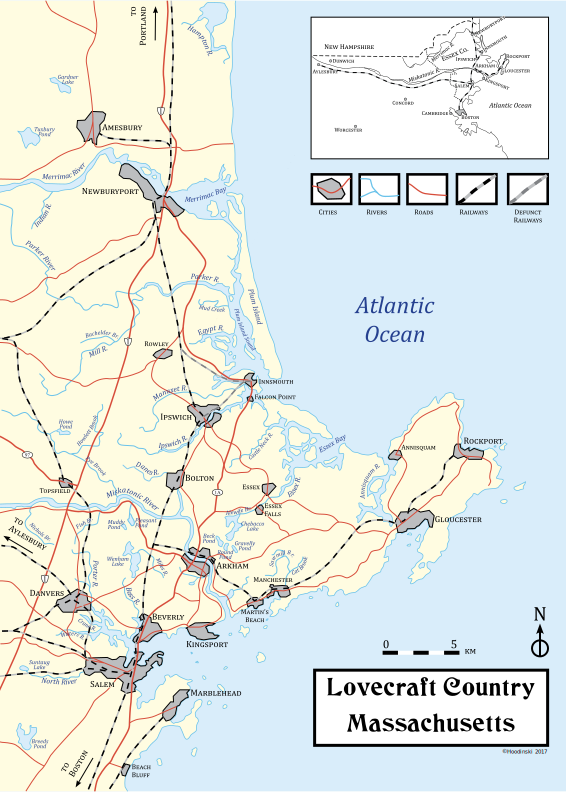
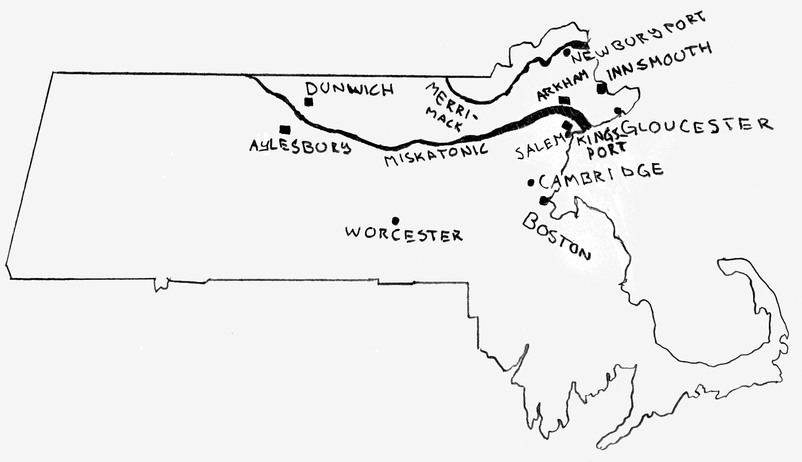

# Страна Лавкрафта

Подробная карта «Страны Лавкрафта»

Страна Лавкрафта (англ. Lovecraft Country) — вымышленные города в произведениях американского писателя Говарда Филлипса Лавкрафта. Термин придумал Кит Гербер для обозначения литературного достояния Лавкрафта, установившего фундаментальные стандарты для окружения Новой Англии — ставшего одним из самых популярных в фантастической литературе. «Энциклопедия Лавкрафта» предполагает, что автор совмещал легенды двух городов и таким оригинальным образом создавал новый смешанный тип. Места действий в основном охватывают штаты Массачусетс, Вермонт и Род-Айленд. Лавкрафт использует настоящие названия штатов и округов, но рядом с ними граничат и полностью вымышленные города. Лавкрафт часто переносит города и достопримечательности из Великобритании в состав штата Массачусетс. Фраза «Страна Лавкрафта» гораздо больше географии страны или рамок цикла произведений.

Лавкрафт внедряет в свои произведения мифы и знакомит читателя с тайнами городов, где скрываются мифические существа, культы, призраки и пришельцы. С. Т. Джоши, исследователь творчества Лавкрафта, указывает на то, что среди городов «Мискатоникского региона» (англ. Miskatonic) наиболее известными являются Мискатоникский университет и река Мискатоник, что тянется вглубь штата — она напоминает название Нил, которое означает «Речная долина». Лавкрафт пишет, что его любимый город Провиденс основан на семи холмах — что напоминает Рим.

Лин Картер, биограф Лавкрафта, называет некоторые города графствами, поскольку Лавкрафт упоминает, что некоторые из его вымышленных городов расположены в черте графства или округа. Например, «Эссекс» существует как округ в США и как несколько городов с одинаковым названием в штатах Массачусетс, Вермонт и Нью-Йорк, а также как графство в Англии. Воображаемая «Страна Лавкрафта» никогда не была жёсткой системой, а скорее является своего рода эстетической конструкцией.

Произведения Лавкрафта составляют огромную мультивселенную, поскольку истории связаны между собой, а некоторые названия переходят из одного окружения в другое. События происходят в одних и тех же городах, при этом, они не противоречат друг другу, а лишь дополняют, и все они — маленькая часть от целого.

## Описание

Карта Страны Лавкрафта

Лавкрафт впервые представил элементы окружения сельской местности Новой Англии уже в ранних произведениях: «Алхимик», «Склеп» и «Дагон». Начиная с самых первых произведений Лавкрафт описывает старинные особняки, замки, склепы, старинные улочки, особняки, циклопические руины, сказочные города, ведьмовские холмы и многое другое. Лавкрафт описывает окружение сельской местности Новой Англии, где скрываются колдуны, бежавшие из Салема, после процесса над салемскими ведьмами. Колдуны перешли на скрытый образ жизни и распространились по небольшим поселениям, где возникли новые магические сообщества. Наиболее широко известны такие поселения, как: Аркхем, Провиденс, Данвич, Иннсмут, Кингспорт, Бостон и другие.

Лавкрафт отводит огромное внимание описанию локаций в своих произведениях. В рассказе «Страшный старик» впервые появляется портовый город Кингспорт. В рассказе «За стеной сна» житель деревни вступает в контакт пришельцем. В рассказе «Извне» учёный из Провиденс создаёт машину, что открывает проход в «Иные миры». В рассказе «Безымянный город» описан мифический город, который в доисторические времена населяла раса рептилий. В рассказе «Изгой» древний замок и «Загробный мир». В рассказе «Музыка Эриха Цанна» описан «Потусторонний район» города. В рассказе «Герберт Уэст — реаниматор» впервые появляется Аркхем. В рассказе «Затаившийся Страх» описан особняк в горах, где скрываются чудовища. В рассказе «Крысы в стенах» описано подземелье замка времен Древнего Рима. В рассказе «Праздник» Кингспорт описан как город-призрак из «Потустороннего мира».

В центральных произведениях Лавкрафт переходит к окружению современных городов. В рассказе «Ужас в Ред Хуке» описан Нью-Йорк теряющий черты традиций под наплывом толп иностранцев. В рассказе «Зов Ктулху» описан Новый Орлеан и Р’льех. Становится более заметно пристрастие автора к обширным, монолитным руинам. В рассказе «Модель для Пикмана» впервые описывается Бостон и «Потусторонние тоннели», по которым бродят Гули из Страны снов.

В более поздних произведениях Лавкрафт создает легендарные колдовские деревушки. В рассказе «Ужас Данвича» появляется Данвич, где колдуны проводят ритуалы на холмах. В рассказе «Тень над Иннсмутом» раса глубоководных скрывалась в индустриальном порту города Иннсмут. В рассказе «Грёзы в ведьмовском доме» ведьма проводила шабаш в Аркхеме. Окружение в поздних произведениях Лавкрафта абсолютно хаотичны. В рассказе «Хребты Безумия» описан древний город в Антарктике и раса Старцев. В рассказе «Шепчущий во тьме» описана планета Юггот, посещаемая Ми-Го. В «За гранью времён» описана планета Великой расы Йит.

## Новая Англия

|Русскоязычное название     |Оригинальное название      |Описание                               |Произведение           |
|---------------------------|---------------------------|---------------------------------------|-----------------------|
|Мискатоник                 |Miskatonic                 |река, протекающая через многие города в глубь штата Массачусетс.   |«Картина в доме»                           |
|Салем                      |Salem                      |деревушка в штате Массачусетс. Часто упоминаемая деревня, откуда происходят все колдовские семьи.              |«Картина в доме»       |
|Кингспорт                  |Kingsport                  |один из наиболее часто упоминаемых городов в штате в Массачусетсе. |«Ужасный старик», «Праздник», «Загадочный дом на туманном утёсе», «Тень над Иннсмутом» |
|[Мискатоникский университет](https://ru.wikipedia.org/wiki/%D0%9C%D0%B8%D1%81%D0%BA%D0%B0%D1%82%D0%BE%D0%BD%D0%B8%D0%BA%D1%81%D0%BA%D0%B8%D0%B9_%D1%83%D0%BD%D0%B8%D0%B2%D0%B5%D1%80%D1%81%D0%B8%D1%82%D0%B5%D1%82) |Miskatonic University      |университет в Аркхеме. Наиболее значимое учреждение в штате Массачусетс.                                       |«Герберт Уэст — реаниматор»    |
|[Аркхем](https://ru.wikipedia.org/wiki/%D0%90%D1%80%D0%BA%D1%85%D0%B5%D0%BC)   |Arkham                     |город в штате Массачусетс. Самое известное место действий «Мифов Ктулху». Герои упоминают Ферму в Чепмена (англ. Chapman farmhouse), Пруд Самнера (англ. Sumner’s Pond), городское кладбище (англ. Christchurch), кладбище для бедных на Поле Поттера (англ. Potter’s field), Бар «Комершал Хаус» (англ. Commercial House bar) и Сумасшедший дом Сефтон (англ. Asylum at Sefton)   |«Картина в доме» и «Герберт Уэст — реаниматор» |
|Болтон	                    |Town of Bolton             |индустриальный город по-соседству с Аркхемом, где находится цирк Болтона (англ. Circus of Bolton).             |«Герберт Уэст — реаниматор»    |
|Церковь Доброй Воли        |Free-Will Church           |заброшенная церковь на Федерал-хилл в Аркхеме.                 |«Обитающий во Тьме»                            |
|Испепелённая пустошь       |Blasted heath              |выжженные земли в округе Аркхема, где была ферма Эмми Пирса, но позже они были затоплены водой.                |«Цвет из иных миров»   |
|Дом Де Ла Поер             |House of De la Poer        |дом семьи Де Ла Поер из Эссекса в Аркхеме.                     |«Крысы в стенах»                               |
|[Данвич](https://ru.wikipedia.org/wiki/%D0%94%D0%B0%D0%BD%D0%B2%D0%B8%D1%87)   |Dunwich                    |деревушка в глубинке Массачусетса, рядом с Аркхемом.           |«Ужас Данвича»                                 |
|Уилбрэхем                  |Wilbraham                  |деревушка недалеко от Данвича.                                 |«Наследство Пибоди»                            |
|Эйлсбери-Пайк              |Aylesbury pikes            |деревня за Данвичем.                   |«Окно в мансарде», «Тень в мансарде» и «Затаившийся у порога»          |
|Спрингфилд                 |Springfield                |деревушка недалеко от Данвича.                                 |«Наблюдатели»                                  |
|Хампден                    |Hampden                    |город в штате Массачусетс.                                     |«Дерево на холме»                              |
|Бостон                     |Boston                     |один из наиболее часто упоминаемых городов в штате Массачусетс.    |«Склеп», «Картина в доме», «Модель для Пикмана», «Ужас в Ред Хуке», «Цвет из иных миров», «Хребты Безумия» и «Вне времени».    |
|Склеп Хайдов               |Tomb of the Hydes          |склеп в лесу у холма в Бостоне, где появился призрак	        |«Склеп»                                        |
|Студия Пикмана             |Pickman’s studio           |студия художника Пикмана в Бостоне, где находилась галерея со скульптурами псов и гулей из загробного мира.    |«Модель для Пикмана»   |
|Гробница Аверилиев         |Tomb of the Averills       |тайная комната под городским кладбищем в Бостоне.              |«Герберт Уэст — реаниматор»                    |
|Музей Кэбот                |Cabot Museum               |музей археологии в Бостоне на Бичер-Хилл. Герои упоминают острова Меланезии и Полинезии, Новую Зеландию, Чили, Дюссельдорф, Алеутские острова, Таити, Саккара, Помпеи, Египет, Халдею, Персию, Мексику, Перу, Китай, Африку, а также Гиперборею, Атлантиду, Му, Яддит-Го, К’Наа, и Юггот.  |«Вне времени»  |
|Провиденс                  |Providence	                |город в штате Род-Айленд, который находится на 7 холмах.       |«Извне», «Единственный наследник», «Ночное братство», «Случай Чарльза Декстера Варда» и «Обитающий во Тьме»    |
|Холмы                      |Hills	                    |располагаются повсюду в Мискантоникской долине, напоминают Семь холмов Рима, на них обитают странные существа и скрыты следы колдовских поселений.	|   |
|Висельный Холм             |Gallows Hill	            |холм в Салеме, также называется Холм Коппа (англ. Copp’s Hill), где казнили ведьм на салемском процессе.       |«Модель для Пикмана»   |
|Медов Хилл                 |Meadow Hill	            |холм в Аркхеме, где проводили ритуалы ведьмы и демоны.         |«Неименуемое»                                  |
|Сторожевой Холм            |Sentinel Hill	            |холм в Данвиче, где колдун Уэйтли призвал Йог-Сотота.          |«Ужас Данвича»                                 |
|Федерал Хилл               |Federal Hill	            |холм в Провиденс.	                                            |«Обитающий во Тьме»                            |
|Бикон-Хилл                 |Beacon Hill	            |холм в Бостоне, где стоял Музей Кэбот. Название упоминает маяк.    |«Вне времени»                              |
|Нью-Йорк                   |New-York	                |город в штате Нью-Йорк.                                    |«Холод», «Зов Ктулху» и «Дневник Алонсо Тайпера»   |
|Олбани                     |Albany	                    |город в штате Нью-Йорк, где находится городская психиатрическая больница.  |«За стеной сна»                    |
|Кэтскилские горы           |Catskill Mountain region	|горы в штате Нью-Йорк, где три столетия изолированно жили крестьяне.       |«За стеной сна»                    |
|Маунтин-Топ                |Mountain-Top	            |деревушка в штате Нью-Йорк, вблизи гор Адирондак.              |«Каменный человек»                             |
|Темпест-Маунтин            |Tempest Mountain           |деревушка у подножья гор в штате Нью-Йорк.                     |«Таящийся ужас»                                |
|Патерсон                   |Paterson                   |город в штате Нью-Джерси, где куратор музея Гайд-Парк изучал статуэтку Культа Ктулху.  |«Зов Ктулху»           |
|Денверс                    |Danvers                    |город в штате Колорадо.	                                    |«Модель для Пикмана»                           |
|Милуоки                    |Milwaukee                  |город в штате Вашингтон.                                       |«Обитающий во Тьме»                            |
|Тауншенд                   |Townshend                  |деревня в Вермонт. Герои упоминают Бреттлборо, Нью-Хэмпшир, Уолтхэм, Конкорд, Эйер, Фитчбург, Гарднер, Этхол и Гринфилд.   |«Шепчущий во тьме» |
|Мэйнвилль                  |Mainville                  |деревушка в штате Пенсильвания.                                |«Тайна кладбища»                               |
|Портленд                   |Portland                   |город в штате Мэн.                                             |«Тварь на пороге»                              |
|Огасте                     |Augusta                    |город в штате Мэн.                                             |«Тварь на пороге»                              |
|Мэйфэр                     |Mayfair                    |деревушка в штате Мэн.                                         |«Пожиратель призраков»                         |
|Потоуонкет                 |Potowonket                 |деревушка в штате Мэн.                                         |«Зелёный Луг»                                  |
|Новый Орлеан               |New Orlean                 |город в штате Луизиана. Герои упоминают Калифорнию, Сент-Луис, Париж, Африку, Гаити, Филиппины, Западную Ирландию, Исландию, Гринландию, Кэйп-Верде, Норвегию, Австралию, Вальпараисо, Новую Зеландию, Окленд, Осло, Кальяо, Сан-Франциско, Китай, Эдиберг, а также Брауновский университет, Принстонский университет, Тулейнский университет, Сиднейский университет, Клуб Искусств Провиденса, Художественную Школу Род-Айленда. |«Зов Ктулху»   |
|Чёрный лес                 |Black haunted woods        |лес за болотами с кипарисами на север от Нового Орлеана, где проводили ритуалы Вуду и вызывали летающих существ.   |«Зов Ктулху»   |
|Ньюпорт                    |Newport                    |порт из которого пароход ходит в Провиденс.                    |«Зов Ктулху»                                   |
|Иннсмут                    |Innsmouth                  |самое известное портовое поселение, недалеко от Аркхема.       |«Тень над Иннсмутом»                           |
|Йхантлей                   |Y’ha-nthlei                |подводный город Глубоководных.                                 |«Тень над Иннсмутом»                           |
|Ипсвич                     |Ipswitch                   |маленькое портовое поселение, недалеко от Иннсмута.            |«Тень над Иннсмутом» и «Тварь на пороге»       |
|Глочестер                  |Glouchester                |маленькое портовое поселение, недалеко от Иннсмута.            |«Тень над Иннсмутом» и «Ужас на Мартинз Бич»   |
|Мартинс Бич                |Martin’s Beach             |маленькое портовое поселение, недалеко от Иннсмута.            |«Ужас на Мартинз Бич»                          |
|Ньюберипорт                |Newburyport                |маленькое портовое поселение, недалеко от Иннсмута.            |«Тень над Иннсмутом» и «Ужас на Мартинз Бич»   |
|Даальберген                |Daalbergen                 |деревушка рядом с горами Апалачи в штате Флорида.              |«Две чёрные бутылки»                           |
|Ветреный склон	            |Windy Connecticut hillside |деревушка в штате Коннектикут, где находится Школа Брауна.     |«Ловушка»                                      |
|Северный рудник            |Norton Mine                |рудник в штате Южная Дакота, расположенная на юге Кактусовых гор (англ. Cactus Mountains). |«Перевоплощение Хуана Ромеро»  |
|Пещера Путешествий         |Cavern of journey          |пещера в штате Южная Дакота, рядом с озером Джуэл (англ. Jewel Lake).  |«Перевоплощение Хуана Ромеро»          |
|Мамонтова пещера           |Mammoth Cave               |пещера в штате Кентукки.                                       |«Зверь в пещере»                               |
|Гейнсвильский пик          |Gainsville pike            |деревушка в штате Флорида, рядом с Большой Кипарисовой топью.  |«Показания Рэндольфа Картера»                  |

### Другие страны

|Русскоязычное название     |Оригинальное название  |Описание                           |Произведение                   |
|---------------------------|-----------------------|-----------------------------------|-------------------------------|
|Англия	                    |England                |часть Великобритании.              |«Артур Джермин», «Пёс», «Крысы в стенах», «Потомок»    |
|Лондон                     |London                 |столица Великобритании.            |«Пёс» и «Ужас в музее»         |
|Дом Джерминов              |Jermin House           |дом семьи Джерминов в Лондоне.     |                               |
|Стоунхендж                 |Stonehenge             |культовое сооружение в Великобритании. |«Крысы в стенах»           |
|Йоркшир                    |Yorkshire              |графство в Англии.                 |«Потомок»                      |
|Суссекс                    |Sussex                 |графство в Англии или в штате Массачусетс. |«Склеп» и «Вызов извне»                        |
|Кент                       |Kent                   |графство в Англии или в штате Массачусетс. |«Гипнос»               |
|Уиндем                     |Windham                |графство в штате Вермонт.          |«Шепчущий во тьме»             |
|Фенхэм                     |Fanham                 |деревушка в Англии.                |«Слепоглухонемой»              |
|Бингер                     |Binger                 |деревушка в штате Оклахома, рядом с графством Каддо (англ. Caddo County).                              |«Курган» и «Проклятие Йига»        |
|Мит	                    |Mit                    |графство в Ирландии, где находится деревушка Килдерри (англ. Kilderry) и Баллилох (англ. Ballylough).  |«Болото Луны»                      |
|Корнвол                    |Cornwall               |графство в Англии.                 |«Крысы в стенах»               |
|Эссекс                     |Essex                  |графство в Англии.                 |«Крысы в стенах» и «Случай Чарльза Декстера Варда»     |
|Карфакс                    |Carfax                 |поместье Де Ла Поер на берегу реки Джеймс (англ. James). Герои упоминают Вигринию, Беллвью и Париж.    |«Крысы в стенах»                   |
|Хануэлл                    |Hanwell                |психиатрическая больница в Эссексе.        |«Крысы в стенах»      |
|Анкестер                   |Anchester              |деревушка в Эссексе.               |«Крысы в стенах»               |
|Замок Эксхам Праери        |Exham Priory           |замок Де Ла Поер в деревне Анкестер, что вблизи Эссекса.           |«Крысы в стенах»       |
|Замок Нортем               |Northam Castle         |замок барона Нортема в Йоркшире.   |«Потомок»                      |
|Рю д’Осейль                |Rue d’Auseil           |косая улица на склоне холма, которая ведёт в иные миры, аналогичная другим знаковым улицам.            |«Музыка Эриха Цанна»               |
|Замок де К.                |Comte de C             |фамильный замок на склоне горы во Франции. |«Алхимик»              |
|Замок Шато Фаусесфламес    |Château Faussesflammes, Averoigne  |руины замка в Оверни, откуда останки странных тел доставили в Музей Кэбот.                 |«Вне времени»                      |
|Клаусенбург                |Klausenburg            |город в Трансильвании, где находиться замок Барона Ференци, что восточнее Рагузы (англ. Rakusa).       |«Случай Чарльза Декстера Варда»    |
|Оттава                     |Ottawa                 |столица Канады.                    |«Герберт Уэст — реаниматор»    |
|Сент-Элуа                  |St. Eloi               |маленькая деревня в Бельгии.       |«Герберт Уэст — реаниматор»    |
|Голландское кладбище       |Holland churchyard     |странное кладбище в Нидерландах, где некромант покоился в склепе.  |«Пёс»                  |
|Роттердам                  |Rotterdam              |город, в котором был отель, мрачный квартал и воровской притон.    |«Пёс»                  |
|Конго                      |Kongo                  |река в Африке. Герои упоминают Англию, Португалию, Гвинею, Чикаго, Бельгию, а также Оксфорд, бар «Голова рыцаря» (англ.Knight’s Head) и сумасшедший дом в Хантингдоне (англ. Huntingdon).  |«Артур Джермин» и «Картина в доме» |
|Египет                     |Egipt                  |страна в Северной Африке.          |«Ньярлатхотеп» и «Погребённый с фараонами»             |
|Помпелло                   |Pompello               |город в Древнем Риме у подножия Пиренеев в Ближней Испании.        |«Очень древний народ»  |
|Тегея                      |Tegea                  |город в Аркадии в Древней Греции.  |«Дерево»                       |
|Юкатан                     |Yucatan                |полуостров в Центральной Америке. Герой упоминает Германскую империю, Берлин, Вильгельмсхавен, Рейн, Пруссию, Ливерпуль, Нью-Йорк. |«Храм» |
|Острова Полинезии          |Polinesia islands      |острова в Тихом океане, где Обед Марш встретил Глубоководных.      |«Тень над Иннсмутом»   |
|Неизвестный остров         |Unmarked Pacific island    |архипелаг в Тихом океане, поднявшийся со дна где-то в Меланезии или Полинезии, там в склепе нашли мумию.           |«Вне времени»      |
|Гималаи                    |Himalayas              |священные горы в Азии.             |«Шепчущий во тьме» и «Хребты Безумия»                  |
|Антарктика                 |Antarctic              |континент, где скрыт город Старцев. Герои упоминают Самоа, Панамский канал, Хобарт, Гренландию, Аляску, Крит, Сибирь   |«Хребты Безумия»   |

### Древние миры

|Русскоязычное название |Оригинальное название  |Описание   |Произведение   |
|-----------------------|-----------------------|-----------|---------------|
|[Р’льех](https://ru.wikipedia.org/wiki/%D0%A0%E2%80%99%D0%BB%D1%8C%D0%B5%D1%85)    |R’lyeh                 |затонувший город, где спит Ктулху.                                                                         |«Зов Ктулху»                   |
|Безымянный город в Аравийской пустыни  |Nameless City of Arabia Deserta    |потусторонний город, который посещали в древности пришельцы.                   |«Безымянный город»             |
|Ирем, Город Столбов    |Irim, is the City of Pillars   |древний город.                                                                                     |«Безымянный город»             |
|Земные недра           |Earth’s bowels         |подземные миры в Земли, в которые ведут потусторонние тоннели, а в некоторые можно попасть через бездну.   |«Безымянный город»             |
|Кейнан или Хинайн      |K’n-yan                |подземный мир, который может быть загробным, где живут потомки от Старцев.                     |«Курган» и «Шепчущий во тьме»              |
|Йот                    |Yoth                   |подземный мир, залитый красным светом.                                                         |«Курган» и «Шепчущий во тьме».             |
|Н’кай                  |N’kai                  |подземный мир, самый тёмный и нижний из обитаемых пещер, родина жабообразного Тсатхоггуа.      |«Курган» и «Шепчущий во тьме».             |
|К’Наа или К’нян        |K’naa                  |древнее королевство, где находится гора Яддит-Го, увенчанные гигантской крепостью из огромных камней, чужаками с Юггота.   |«Вне времени»  |
|Му                     |Mu                     |затонувший континент.                                                                          |«Вне времени» и «Врата серебряного ключа»  |
|Яддит-Го               |Yaddith-Gho            |базальтовая гора на острове К’Наа или континенте Му.                                           |«Вне времени» и «Врата серебряного ключа»  |
|Гиперборея             |Hyberborea             |исчезнувший континент, со столицей Коммориом (англ. Commoriom).                                |«Вне времени» и «Хребты Безумия»           |
|Узулдарум              |Uzuldaroum             |второй по величине город в Гиперборее.                                                         |«Хребты Безумия»                           |
|Атлантида              |Atlantis               |затонувший материк.                                                                            |«Храм», «Ботон» и «Вне времени»            |
|Валузия                |Valusia                |древняя империя в Палеозойской эре, где жили люди-ящеры, созданная Робертом Говардом.          |«Шепчущий во тьме» и «Хребты Безумия»      |
|Лемурия                |Lemuria                |древний затонувший континент.                                                                  |«Шепчущий во тьме» и «Хребты Безумия»      |
|Даф                    |Dath                   |пустынные земли в пост-апокалиптическом будущем Земли. Герои упоминают столицу Юанарио (англ. Yuanario) и города Ньяра (англ. Niyara), Южный Ярат (англ. Southern Yarat), Перат (англ. Perath), Бейлин (англ. Baling), Лотон (англ. Loton) и Борлиго (англ. Borligo).  |«Переживший человечество»  |

### Космос

|Русскоязычное название |Оригинальное название  |Описание                                                                               |Произведение               |
|-----------------------|-----------------------|---------------------------------------------------------------------------------------|---------------------------|
|[Юггот](https://ru.wikipedia.org/wiki/%D0%AE%D0%B3%D0%B3%D0%BE%D1%82)                  |Yuggoth                |неизвестная науке планета Солнечной системы (Лавкрафт отождествляет его с Плутоном).   |«Шепчущий во тьме»         |
|Йит                    |Tith                   |неизвестная науке планета.                                                             |«Шепчущий во тьме»         |
|Шаггай                 |Shaggai или Chag-Hai	|неизвестная науке планета.                                                             |«Обитающий во Тьме»        |
|Йекуб                  |Yekub                  |неизвестная науке планета.                                                             |«Вызов извне»              |
|Нептун                 |Neptune                |планета Солнечной системы, которую посещали Ми-Го.                                     |«Шепчущий во тьме»         |
|Венера                 |Venus                  |планета Солнечной системы, на которой в будущем люди построят поселение Терра-Нова.    |«В стенах Эрикса»          |
|Юпитер                 |Jupiter                |планета Солнечной системы                                                              |«Врата серебряного ключа»  |
|Марс                   |Mars                   |планета Солнечной системы                                                              |«Врата серебряного ключа»  |
|Яддит                  |Yaddith                |неизвестная науке планета.                                                             |«Врата серебряного ключа»  |
|Китанил                |Kythanil               |неизвестная науке планета.                                                             |«Врата серебряного ключа»  |
|Стронти                |Shonhi                 |неизвестная науке планета.                                                             |«Врата серебряного ключа»  |
|Мтуру                  |Mthura                 |неизвестная науке планета.                                                             |«Врата серебряного ключа»  |
|Кат                    |Kath                   |неизвестная науке планета.                                                             |«Врата серебряного ключа»  |
|Кайнарт                |Kynarth                |неизвестная науке планета.                                                             |«Врата серебряного ключа»  |

## Мискатоникская долина

Первые примеры окружения Новой Англии заметны в ранних рассказах «Алхимик» (1917) и «Склеп» (1917), где описываются таинственные долины и холмы в штате Массачусетс. В рассказе «Склеп» впервые упоминается Суссекс. В рассказе «Картина в доме» (1919) впервые упоминается Мискатоникская долина, колдовские холмы, Аркхем и корабль «Салемский купец», а также приводится что-то вроде манифеста о том, почему сельская местность Новой Англии является подходящим фоном для окружения ужасов:

>   Искатели острых ощущений любят наведываться в глухие, потаенные места. Они охотно посещают катакомбы Птолемея и узорчатые мавзолеи гиблых полуденных стран, забираются на залитые лунным светом башни полуразрушенных рейнских замков и сходят вслепую по стертым ступеням в провалы, зияющие чернотой среди руин заброшенных азиатских городов. Дремучий лес с нечистой силой, безлюдный горный кряж служат для них объектами паломничества, и они подолгу кружат возле таящих немую угрозу монолитов, высящихся на необитаемых островах. Подлинный ценитель ужасов превыше всего ставит старинные усадьбы, затерянные в новоанглийской глуши, ибо именно там силы зла пребывают в своем наиболее полном и первозданном обличий, идеально согласуясь с окружающей их атмосферой суеверия и невежества.
>
>   Г. Ф. Лавкрафт. «Картина в доме» (1919).
 
Лавкрафт в письме 1930 года Роберту Говарду описал увлечение Новой Англией: «Этот ночной чёрный Массачусетс, легендарный, представляющий действительно жуткое увлечение. Вот материал для действительно глубокого исследования массовой неврастении, ведь никто не может отрицать существование глубоко болезненной черты в пуританском воображении».

## Страна Снов

Лавкрафт создает десятки волшебных городов, которые находятся в «Стране Снов» — мире, что находится в искривлённом времени и пространстве. Окружение имеет черты и архитектуру Ближнего Востока. В произведениях выражены черты жанра фэнтези. Лавкрафт создаёт целые фэнтезийные миры в «Цикле снов». Среди локаций встречаются мифические города и места.

Рассказы: «Полярис» (1918), «Белый корабль» (1919), «Карающий Рок над Сарнатом» (1919), «Память» (1919), «Забвение» (1920), «Кошки Ултара» (1920), «Ньярлатхотеп» (1920), «Поиск Иранона» (1921), «Иные Боги» (1921), «Гипнос» (1922), «Что приносит Луна» (1922), «Сомнамбулический поиск неведомого Кадата» (1927)

>   В земле Мнара есть большое тихое озеро, в которое не впадает и из которого не вытекает ни рек, ни ручьев. 10000 лет назад на его берегу стоял могучий город Сарнат, но сейчас от него не найти и следов. В незапамятные времена, когда мир был ещё молод, у озера стоял другой город; он был выстроен из серого камня и назывался Иб. Древний, как само озеро, он был населен очень странными существами, чей вид отталкивал грубостью форм, появившиеся на свет во время зарождения мира. На сложенных из кирпичей колоннах Кадатерона есть надписи о том, что в одну из ночей эти существа спустились с луны в повисший над землей Мнара густой туман и вместе с ними спустилось на землю большое тихое озеро и серый каменный город Иб. Обитатели серого города поклонялись зеленому идолу Бокруга и устраивали жуткие пляски в холодном свете луны.
> 
>   Г. Ф. Лавкрафт. «Карающий рок над Сарнатом» (1919).

## Циклопические руины

Чтобы сделать города реалистичными Лавкрафт внедряет в произведения мифологию. В окружении появляются циклопические руины древних городов и памятники античной архитектуры Древнего Египта, Древнего Рима, Древней Греции и других народов. Дорическая и ионическая архитектура описаны в рассказе «Он» (1925).

Рассказы: «Дагон» (1917), «Дерево» (1920), «Дерево на холме» (1920), «Храм» (1920), «Артур Джермин» (1920), «Безымянный город» (1921), «Болото Луны» (1921) и «Крысы в стенах» (1923), «Погребённый с фараонами» (1924), «Очень древний народ» (1927), «Ибид» (1927).

>   Далеко в Аравийской пустыне лежит Безымянный Город, полуразрушенный и безмолвный; его низкие стены почти полностью занесены песками тысячелетий. Этот город стоял здесь задолго до того, как были заложены первые камни Мемфиса и обожжены кирпичи, из которых воздвигли Вавилон. Нет ни одной легенды настолько древней, чтобы в ней упоминалось название этого города или те времена, когда он был ещё полон жизни. Приблизившись к безымянному городу, я сразу же ощутил тяготевшее над ним проклятие. В жуткой выжженной долине, залитой лунным светом, таинственно и зловеще выступает он из песков. Так высовываются части трупа из неглубокой, кое-как закиданной землею могилы. Ужасом веяло от источенных веками камней этого допотопного чуда, этого пращура самой старой из пирамид.
> 
>   Безымянный город» (1921)

Впервые элементы «Мифов Ктулху» появились в рассказе «Дагон» (1917). В рассказе «Храм» (1920) появились циклопические древние руины, а также эллинистическая архитектура. В рассказе «Зов Ктулху» (1926) появился город Р’льех. Становиться заметно пристрастие Лавкрафта к обширным, монолитным руинам, которые станут столь почитаемыми среди его последователей.

Рассказы: «Храм» (1920) «Зов Ктулху» (1926), «Курган» (1930), «Хребты Безумия» (1931), «Врата серебряного ключа» (1932), «Вне времени» (1933).

>   Великий каменный город Р'льех, с его монументами и надгробиями исчез под волнами. Когда звезды займут благоприятное положение, то город восстанет вновь. Тогда из земли восстанут ее черные духи, призрачные и забытые, полные молвы, извлеченной из-под дна забытых морей. Люди видят сны об огромных Циклопических городах из титанических блоков и о взметнувшихся до неба монолитах, источавших зеленую илистую жидкость и начиненных потаенным ужасом. Стены и колонны там покрыты иероглифами, а снизу, с какой-то неопределенной точки звучит голос, который голосом не является; хаотическое ощущение, которое силой воображения можно преобразовать в звук - Ктулху Фхтагн!
> 
>   Г. Ф. Лавкрафт. «Зов Ктулху» (1926).

## Готика

В центральных произведениях выражены черты готических романов. В окружении устанавливаются старинные храмы 16 века, погосты, склепы и обветшалые имения, что сочетают готическую и колониальную архитектуру. В рассказе «Герберт Уэст — реаниматор» (1921) появляется Аркхэм и Мискатоникский университет. Провиденс впервые появляется в рассказе «Из глубин мироздания». Лондон впервые появляется в «Пёс». Денверс впервые описан в «Модель для Пикмана».

Рассказы: «Показания Рэндольфа Картера» (1919), «Изгой» (1921), «Музыка Эриха Цанна» (1921), «Герберт Уэст — реаниматор» (1922), «Пёс» (1922), «Таящийся ужас» (1922), «Крысы в стенах» (1923), «Неименуемое» (1923), «Праздник» (1923), «Возлюбленные мертвецы» (1923), «Две чёрные бутылки» (1924), «Заброшенный дом» (1924), «Модель для Пикмана» (1926), «Ужасы старого кладбища» (1933), «Эксгумация» (1935).

>   Темпест-Маунтин вблизи Катскилльских гор, отмечен кратковременным проникновением голландской цивилизации, которая оставила несколько полуразрушенных особняков да пару тронутых печатью вырождения деревушек на этих Богом забытых склонах. Вот уже более ста лет Затаившийся Страх поселился в мрачном необитаемом особняке Мартенсов и вызывает из его убежища гром. Люди утверждают, что это просто его голос. Первобытные деревья окружают дом, словно, каменные столпы в друидском храме. Вспышки молний освещают стены необитаемого особняка, увитые плющом, и заброшенный сад в голландском стиле, дорожки и беседки которого густо покрыты какой-то белой плесенью. Рядом, на семейном кладбище Мартенсов скособоченные деревья широко раскинули жуткие ветви, а их корни сдвинули с могил плиты.
> 
>   Г. Ф. Лавкрафт. «Таящийся ужас» (1922).

## Современные города

Впервые элементы окружения современного города появляются в рассказе «Ужасный старик» (1920), где описывается портовый город Кингспорт. Лавкрафт сделал основной сценой действий окружение современных городов 19 века, теряющих черты традиций под наплывом толп иностранцев. В произведениях выражены черты жанра детектива. Георгианская архитектура впервые появляется в рассказе «Заброшенный дом» (1924), а более подробно описана в «Загадочный дом на туманном утёсе» (1926). Бостон описан в «Ужас в Ред Хуке» (1925). Нью-Йорк описан в «Холод» (1926). Новый Орлеан описан в «Зов Ктулху» (1926). Йоркшир описан в «Потомок» (1927).

Рассказы: «Из глубин мироздания» (1920), «Ужас в Ред Хуке» (1925), «Он» (1925), «Холод» (1926), «Зов Ктулху» (1926), «Серебряный ключ» (1926), «Загадочный дом на туманном утёсе» (1926), «Потомок» (1927), «Цвет из иных миров» (1927), «Последний опыт» (1927), «Ловушка» (1931), «Зловещий священник» (1933), «Дневник Алонсо Тайпера» (1935), «Обитающий во Тьме» (1935).

>   В Ред-Хуке преобладают кирпичные строения первой четверти прошлого столетия. Наиболее темные улочки и переулки сохранили тот мрачный колорит, что литературная традиция определяет как диккенсовский. Следы былого благополучия можно различить в основательной архитектуре старых домов и церквей, где остались прогнившие балясины лестничных проёмов, покосившиеся и сорванные с петель массивные двери, изъеденные червями декоративные пилястры или поваленные ржавые ограждения. Иногда в домах можно встретить лёгкий остеклённый купол, в котором в стародавние времена собиралась семья капитана, чтобы наблюдать за кораблями в океане. Отсюда, из этой морально и физически разлагающейся клоаки, к небу несутся самые изощрённые проклятия на более чем сотне различных языков и диалектов.
> 
>   Г. Ф. Лавкрафт. «Ужас в Ред Хуке» (1925).

## Легендарные колдовские деревушки

Лавкрафт описывает легендарные колдовские деревушки, в которых живут призраки и еще недавно преследовали ведьм. В окружении описывается сельская местность в глубинки, где встречаются отчуждённые деревни со старинными постройками 17 века. В рассказе «Ужас Данвича» появилось описание местности в округе Данвича.

Рассказы: «Картина в доме» (1919), «Затаившийся Страх» (1922), «Случай Чарльза Декстера Варда» (1927), «Цвет из иных миров» (1927), «Проклятие Йига» (1928), «Ужас Данвича» (1928), «Тень над Иннсмутом» (1931), «Грёзы в ведьмовском доме» (1932), «Каменный человек» (1932), «Тварь на пороге» (1933), «Зловещий священник» (1933).

>   болотистая местность вызывает инстинктивную неприязнь и страх из-за стрекота невидимых козодоев; изобилия светлячков и хриплого свиста жаб. Узкая сверкающая лента Мискатоника в его верховьях очень напоминает змею, когда он, изгибаясь, подходит к подножию куполообразных холмов. Засеянные поля встречаются всё реже; а редкие дома несут на себе отпечаток старости, разрушения и запущенности. Никакого притока людей Данвич не знает. Пару веков назад, никто бы не смеялся над рассказами о служителях Сатаны, ведьминой крови и странных лесных обитателях. С тех пор, как Данвичский ужас 1928 года был замят усилиями местных жителей, все указатели, где был отмечен Данвич, убрали. Это место прошло по пути регресса и упадка, столь характерному для захолустных уголков Новой Англии. Его жители образовали свою собственную расу, имеющую явные признаки вырождения и узкородственных кровных связей. Представители старейших семей приехали из Салема в 1692 году и смогли уцелеть.
> 
>   Г. Ф. Лавкрафт. «Ужас Данвича» (1928).

В рассказе «Тень над Иннсмутом» Лавкрафт создал индустриальный порт Иннсмута, где скрывалась раса глубоководных. Также тут упоминается Ньюберипорт, Ипсвич, Глочестер, Мартинс Бич.

>   Иннсмут заполнен компактными домами начала XIX века. В нём ощущается непривычный дефицит зримой, ощутимой жизни. Над чёрными дымоходами не курится ни единый дымок, а три высокие неокрашенные колокольни холодно маячат на фоне омываемого морем горизонта. Приземистая каменная церковь построена намного позже; её создатели решили предпринять неуклюжую попытку подражать традициям готики. Необъятная взору масса провисающих двускатных крыш и заострённых фронтонов домов ясно свидетельствует о далеко зашедшем упадке. Во многих крышах зияют чёрные провалы, а некоторые обвалились целиком. Большие, квадратные дома, выстроенные в георгианском стиле, с унылыми куполообразными крышами, располагаются вдали от кромки воды, поэтому пара из них относительно крепкие на вид. Над всем этим зависает всепроникающий, тошнотворный рыбный запах из этих мерзких портовых трущоб. Гнетущая напряжённость местных жителей проявляется в их виде. “Иннсмаутская внешность” не просто отражает состояние психики, а самая настоящая болезнь. Портовые районы стали убежищем наиболее тяжёлых и запущенных случаев тайного недуга.
> 
>   Г. Ф. Лавкрафт. «Тень над Иннсмаутом» (1931).

## Хаотичные космические миры

В поздних произведения Лавкрафт описывает хаотичные космические миры, где появляются другие планеты. В произведениях выражены черты жанра научной фантастики.

Рассказы: «За стеной сна» (1923), «Курган» (1930), «Шепчущий во тьме» (1930), «Хребты Безумия» (1931), «Врата серебряного ключа» (1932), «Ужас в музее» (1932), «Вне времени» (1933), «За гранью времён» (1935), «Вызов извне» (1935), «В стенах Эрикса» (1936).

>   Перемещаясь во времени можно посетить на Юггот, ближайшую планету солнечной системы, населённую существами Ми-Го. Настанет день, когда оттуда будет направлен на нас управляемый поток сознания этих существ. Там, на Югготе, имеются огромные города - гигантские многоярусные сооружения из чёрного камня. Солнце на этой планете светит не ярче звёзд, но тамошние обитатели не нуждаются в свете. Наоборот, свет приносит им вред и мешает им, поскольку его нет в чёрных глубинах космоса, по ту сторону пространства времени, где они обитают и откуда они явились. Чёрные смоляные реки, текущие под загадочными циклопическими мостами, - построенными ещё более древней расой полипов, изгнанной и забытой прежде, чем нынешние создания пришли на Юггот из пучины бесконечности. Тамошний тёмный мир полон грибных садов и городов без единого окна, а его обитатели были здесь задолго до окончания сказочной эпохи Ктулху и помнят скрывшийся под водами Р'льех, когда он ещё возвышался над океаном. Они были и внутри Земли - есть такие отверстия в земной коре, о которых людям ничего не известно, - в том числе, в холмах Вермонта, - а в них великие неизведанные миры непознанной жизни; залитый голубым светом Кейнан, залитый красным светом Йотх, и чёрный, лишённый света Н'кай, откуда явился Тсатхоггуа.
> 
>   Г. Ф. Лавкрафт. «Шепчущий во Тьме» (1930).

## Произведения написанные в соавторстве

Ни одно из произведений написанных в соавторстве не происходит в городах созданных Лавкрафтом. События всегда разворачиваются недалеко или по соседству и лишь ссылаются на воображаемые города, которые Лавкрафт отделил от них. Локации отличаются контрастом и экзотикой. Эта идея позволяет обойтись без теории и заблуждений о «Мифах Ктулху». В рассказе «Крадущийся хаос» Лавкрафт описывает архитектуру эклектического стиля.

## Дописанное Августом Дерлетом

Август Дерлет дописал не завершённые рассказы Лавкрафта после его смерти. Можно сказать, что эти рассказы «были дописаны призраком». Дерлет отговорил других писателей, поклонников «Мифов Ктулху» создавать свои произведения в окружении Новой Англии. Так он сохранили множество из изначальных идей автора и дополнил пробелы в окружении, используя фрагменты и заметки из писем Лавкрафта. В основном Дерлет издал рассказы о Данвиче: «День Уэнтворта», «Наследство Пибоди», «Тень в мансарде», «Тайна среднего пролёта», «Наблюдатели», главным из которых является «Затаившийся у порога». Рассказы «Рыбак с Соколиного мыса», «Иннсмутская глина» и «Комната с заколоченными ставнями» относятся к Иннсмуту. Рассказ «Ведьмин лог» происходит в титульной долине на холмах к западу от Аркхема. Рассказ «Единственный наследник» происходит в Провиденс и похож на «Последний опыт». Рассказ «Предок» похож на Артур Джермин. Рассказ «Лампа Альхазреда» похож на «Селефаис». Рассказ «Тёмное братство» похож на «Из глубин мироздания». В рассказе «Ведьмин лог» Дерлет упоминает архитектуру эклектического стиля.

## Последователи «Мифов Ктулху»

В «Мифах Ктулху» оставили свой след писатели: Фрэнк Лонг, Роберт Говард, Роберт Блох, Фриц Лейбер, Колин Уилсон, Брайан Ламли, Генри Каттнер, Генри Уайтхед, Стивен Кинг — группа, называемая «Кругом Лавкрафта». Лавкрафт хотел, чтобы его идеи активно использовали другие писатели, обмениваясь ссылками между своими произведениями.

Одним из творческих наследников Лавкрафта является и Стивен Кинг. Ужасы Кинга можно разграничить на три части: космический (Лавкрафт), загробный и научный (Мэри Шелли). Действие книг Стивена Кинга происходит в небольших американских городках, что также характерно и для работ Лавкрафта, который считал, что самые страшные вещи творятся в тихих местах.
