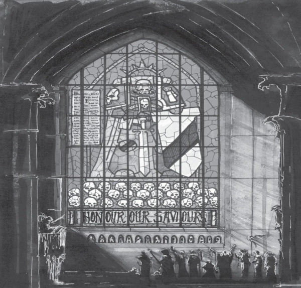
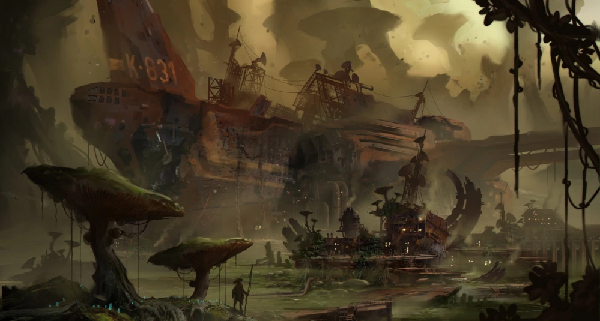

# Истории далёкого гримдарка. Что стоит почитать из книг по вселенной Warhammer 40,000

## И с чего вообще стоить начать

В 2017-м году вселенная Warhammer 40,000 отпраздновала 30-летие. За время своего существования вселенная претерпела заметные изменения (актуальным сейчас считается кодекс 8-й редакции), но ядро её осталось неизменным: помимо реальной вселенной есть варп — вселенная метафизическая (этакий мир идей по Платону), в которой обитают антропоморфные (и не очень) существа, состоящие из чистой энергии, которых подпитывают души и эмоции всех живых разумных существ (отсюда — Хаос). Человечество развилось до такого уровня, что научилось путешествовать сквозь варп на расстояния, которые в любых других случаях невозможно бы было пересечь, а в 30-м тысячелетии появился Император, человек, возжелавший освободить человечество от необходимости взаимодействовать с варпом, а значит и подвергаться влиянию Хаоса. Для завоевания галактики он создал примархов (сверхлюдей-военачальников) и разработал методики улучшения человеческого тела для создания воинов (космических десантников), способных вести войну в мире полном ужаса и угроз, которые представляют не только существа из варпа, но и враждебные людям расы. Один из примархов, Хорус, предал Императора и решил узурпировать его трон, параллельно заключив сделку с сущностями варпа. Гражданская война (именуемая «Ересь Хоруса» — сейчас отдельный литературный цикл и сеттинг со своими игровыми правилами для варгейма) захлестнула Империум и определила всю его историю на более чем 10 тысяч лет вперёд.

Скорее всего вы уже читали
[статью на DTF](https://dtf.ru/flood/12142-kosmicheskaya-gotika-vselennaya-warhammer-40-000) о том, как устроен мир сорокового тысячелетия,
может быть [заглядывали на Лурк](http://lurkmore.to/%D0%92%D0%B0%D1%80%D1%85%D0%B0%D0%BC%D0%BC%D0%B5%D1%80),
или читали [нетленку ЛКИ](http://www.lki.ru/text.php?id=750) о вселенной.
Если нет, то с ними всегда можно ознакомиться, если хотите сформировать примерное понимание того, как обстоят дела в мире Молота Войны. Также я бы рекомендовал прочитать интервью с людьми, которые стояли у истоков сеттинга, чтобы лучше понимать его специфику. Но сегодня я хочу рассказать о литературе, которую выпускает издательство Black Library, одно из структурных подразделений Games Workshop. В том году оно тоже отпраздновало юбилей: BL исполнилось 20 лет. За этот период было написано несколько сотен романов и повестей и тысячи рассказов, а количество авторов, которые так или иначе работали над литературной составляющей сеттинга, колеблется в районе сотни человек.

Я читаю произведения по вселенной уже около 5-ти лет и около 3-х лет пишу обо всём, что издаётся или было издано в России. Несмотря на то, что Вархаммер — в первую очередь настольная игра, в России сложилось очень крепкое комьюнити людей, кому вселенная интересна вне рамок варгейма (хотя они тоже могут покупать миниатюры и даже их красить). Эти люди следят за тем, как эта вселенная развивается (в хорошую или плохую сторону — вопрос дискуссионный), читают издаваемую в России литературу (всего издано около полутора сотен книг и они продолжают выходить) и даже занимаются фанатскими переводами того, что у нас не издаётся.

Многие из преданных фанатов в российском комьюнити узнали о вселенной из книг, изданных «Азбукой» в начале нулевых (цикл о капитане Вентрисе и Ультрамаринах, цикл об инквизиторе Эйзенхорне, цикл о Серых Рыцарях, цикл о Рагнаре и Космических Волках, цикл о комиссаре Каине, цикл об Испивающих Душах), кто-то подтянулся уже позже, когда Россию захлестнула волна интернетизации или когда лицензия перешла к издательству «Фантастика» Книжный Клуб. Особенность литературных произведений по вселенной состоит в том, что они не копируют бэк дословно, там находится большой простор для творчества. Первые произведения начали появляться ещё в начале 90-х, но они были скорее фанфиками по мотивам сеттинга, нежели произведениями, жёстко привязанными к бэку, а значит непротиворечивыми относительно актуального канона. То же самое можно отнести и к книгам, выходившим примерно до середины нулевых, ведь многие из них писались до или параллельно с третьей редакцией кодексов. «Современный» сороковник по заверению многих начинается примерно с 5-й редакции, со времён которой не происходило жёстких изменений (выбрасывания целых рас или богов).

В романе «Хельсрич» один из второстепенных героев прислуживал в таком храме, пока орки не уничтожили титан, на плечах которого и был возведён храм.

Не смотря на то, что формально все написанные книги отражают вселенную, ранние книги по духу и содержанию могут разительно отличаться от того, что было написано позже. Литература по вселенной создавалась одними авторами, которые фактически создали язык вселенной, к работе подключались другие, смотрели на ранее написанное и пытались сделать лучше, ярче, интереснее, глубже. Это было органическое развитие, которое можно с лёгкостью проследить, если читать книги сообразно времени их выхода (что особенно чувствуется в цикле «Ересь Хоруса»), а не согласно хронологии описываемых в них событий. Хардкорный путь вхождения в литературу по вселенной — чтение от более ранних книг к более поздним, ведь если читать наоборот, то можно испытывать значительные когнитивные диссонансы из-за изменения в описании конкретных деталей (яркий пример — мыслеречь, понимание работы с которой на момент нулевых не было сформировано).

За последние несколько лет я подсадил на литературу с десяток людей непосредственно, советуя им что-то, что было бы для них наиболее интересно и не требовало большого порога вхождения. Зачастую всё начиналась с простого: кому-то приглянулся космический сеттинг, готическая эстетика, антиутопичность и реализм, вечная война и обилие битв, идея борьбы человека с внутренним разрушительным началом… Для каждого из этих аспектов есть свои романы или отдельные циклы, авторы которых порой умудряются довести идеи до совершенства. Какие-то произведения написаны с целью привлечь людей в хобби, какие-то для того, чтобы раскрыть некую часть бэка с новой стороны, чтобы продать новую линейку миниатюр, какие-то для того, чтобы рассказать, как происходящее на игровом столе могло бы ощущаться войнами, если бы те были живыми. Вся литература по вселенной — фансервис, ибо позволяет фанатам сеттинга почувствовать его живым, поставить себя на место конкретных героев, увидеть их глазами определённые события или места.

Но даже несмотря на общий меркантильный интерес GW, автором удаётся порой писать произведения, которые смело можно называть качественной литературой без иронии. Таким авторам удаётся ухватить не только сущность вселенной, но и рассказать очень живые, проникновенные истории. Далее я бы хотел посоветовать те книги и циклы, которые нравятся лично мне и циклы, которые заточены под определённую цель и умело её достигают. Большинство из этих книг можно купить прямо сейчас в России в магазине издательства, а за какими-то, возможно, придётся побегать по авито или другим барахолкам.

## «Пятнадцать часов» Митчела Сканлона

Аграрные миры — одни из самых спокойных мест в Империуме. Люди занимаются тем, что обеспечивают огромную имперскую машину продуктами, а взамен получают безопасную жизнь. Но иногда и жителям таких миров приходится отдавать своих детей в ряды Имперской Гвардии. Сына фермера обучают воевать, отправляют на фронт, но из-за случайной бюрократической оплошности его взвод попадает на планету, где уже десятилетия идёт война с орками, и победу не может одержать ни одна из сторон. Там то и раскрывается смысл названия романа: если гвардеец пережил первые 15 часов, то скорее всего он будет воевать ещё долго.

**Читать, если вам нравится:** «На Западном фронте без перемен» Ремарка

## «Тёмный Клубок» Петера Фехервари

Это арт из игры Exoplanet: First Contact, но при этом до жути атмосферен и как нельзя лучше показывает одно из мест действия романа «Каста Огня» — имперский линкор, капитан которого уже много лет гниёт заживо и жив только из-за постоянных переливаний крови.

Большинство авторов BL начинают с пробы пера в рассказах цикла для новичков, а потом попадают в «большую лигу»: начинают писать по «Ереси Хоруса» или получают возможность написать о каком-то важном бэковом событии или явлении. Фехервари разительно отличается от большинства авторов: он сидит только в сороковнике и пишет произведения, действие которых происходит близ Дамоклова залива — территории, за право владеть которой борются почти все фракции, но главное противоборство идёт между людьми и Тау, молодой расой чужаков, цивилизация которых больше всего напоминает нашу с вами (точнее, условно «светлое» завтра человечества). Произведения Петера эклектичны, но все взаимосвязаны местами, отдельными героями или определёнными событиями.

Главным его произведением на данный момент является роман «Каста Огня» (до коррекции отделом маркетинга BL — «Громовой край»), история о покрытой джунглями планете Федра, где уже долгое время тау ведут партизанскую войну. Роман по духу напоминает «Апокалипсис Сегодня» с лавкрафтовскими мотивами, но сам автор говорит, что вдохновлялся кинокартиной «Агирре, гнев божий». Но что ещё более важно: Фехервари не персонифицирует Хаос, не создаёт демонов и не сталкивает их с героями в открытом сражении. Хаос у Петера действует тоньше, его источником является сам человек. Также у нас вышел его роман «Культы генокрадов», о том, как в человеческие сообщества вторгаются Чужие и сборник «Шас’о», в который вошли рассказы и повести нескольких авторов об Империи Тау.

**Читать, если вам нравится:** Лавкрафт, путешествие людей в неизвестное, исследование самых тёмных уголков души человека

## Инквизиторский цикл Дэна Абнетта

Инквизиция в Warhammer 40,000 — это самые сильные спецслужбы, власть которых имеет религиозные основания. Они могут конфисковывать имущество и устранять людей по своему желанию, уничтожать целые планеты, если того требуют обстоятельства, они обладают доступом к самым современным технологиям. Они обладают огромной властью и не всегда могут сдержать себя от использования её в своих интересах (цикл Эйзенхорна). Они борются с террористическими организациями, сектами, вольны отправляться в самые опасные места ради защиты Империума (цикл Рейвенора). А иногда они сталкивают между собой, если начинают подозревать своих коллег в ереси (цикл Биквин). И за этим чертовски интересно наблюдать

На данный момент цикл состоит из квадрологии об инквизиторе Эйхзенхорне, трилогии об инквизиторе Рейвеноре и одной книги из цикла о Елизавете Биквин.

**Читать, если вам нравится:** бондиана, детективы, мыльные оперы

## Битвы Космического Десанта

Цикл «рекламных брошюр», повествующих об определённых битвах космического десанта. Каждое произведение самодостаточно и не требует особых познаний в бэке вселенной. Знаете лишь про космодесантников и орков? — Пожалуйста, вот 400 страниц забористых сражений одних с другими. На данный момент у нас издано 10 книг цикла (из 20-ти вышедших за рубежом). Однозначного ознакомления заслуживает роман «Хельсрич», об обороне одноимённого города-улья от орков. Роман «Мир-механизм», этакий паззл об захвате Звезды Смерти некронов, только собрав который можно осознать все нюансы истории. Романы «Мир Ринна» и «Очищение Кадилла», то же повествующие о сражениях с орками. Можно обратить внимание и на романы «Железная Ярость» и «Гибель Единства». На данный момент цикл Space Marine Battles пошёл на спад и его место занял цикл повестей Space Marine Legends, рассказывающий о конкретных космодесантниках.

**Читать, если вам нравится:** очень много текстового экшена, ратная доблесть, расчленёнка

## Книги, предназначенные для нового читателя
### А также циклы, которые они начинают

В эту категорию попадает почти всё, что у нас издавалось силами «Азбуки», но я бы выделил романы об Ультрамаринах и Космических Волках. Они все написаны так, чтобы открыть мир сорокового тысячелетия для читателя, но их специфика состоит в том, что сами авторы зачастую открывали для себя этот мир. Эти произведения — удачные попытки олитературивания вселенной, которые после прочтения других произведений смотрятся несколько наивно. В этот же ряд можно вписать и «Инквизиторов Космоса» (в оригинале просто Inquisitor, после 2002-го года — Draco), написанных 1990-м. Это роман первой трилогии по вселенной, который за исключением бэковых моментов читается вполне бодро.

**Читать, если вам нравится:** открывать новые для себя миры, несколько наивные истории

## Повелитель Ночи» Саймона Спуриэра

История о космодесантнике-предателе, который переместился из 32-го тысячелетия в 41-е. Это первый серьёзный мостик к эпохе, когда Император ещё ходил среди людей, а об угрозе Хаоса знали единицы. Стоит читать ради того, чтобы осознать, сколь силён отдельный космодесантник и какой ужас он способен вселить в сознания людей. Также это одно из первых произведений, которое детально описывает повседневный быт города-улья.

**Читать, если вам нравится:** Ганнибал Лектер, экзистенциализм, high tech low life, где второго намного больше, чем первого

## «Призраки Гаунта» Дэна Абнетта

Призраки Гаунта — это депрессивная история полка, родной мир которого был разрушен, и теперь воины вынуждены или просто умереть, или выслужиться так, чтобы получить свой мир для заселения. Мир, им конечно же, не дадут, зато воевать под предводительством своего командира Ибрама Гаунта они будут очень много. На русском языке есть лишь первые 4 романа, но даже и они заслуживают внимания: очень искренние и живые. Всего вышло 14 романов и Дэн Абнетт, автор цикла, не собирается останавливаться. Также у цикла есть два спин-оффа: «Титаникус», роман про сражения человекоподобных роботов в мире-кузнице и «Двуглавый орёл», роман о пилотах боевых истребителей.

**Читать, если вам нравится:** истории про войну, описания армейского быта, сражения в духе Второй Мировой

## «Комиссар Каин» Сэнди Митчелла

Кайафас Каин — герой, который на самом деле боится умереть и очень часто ведёт себя как трус. Но он обладает живым умом и удачей, которая раз за разом помогает ему спастись. Он понимает, что его жизнь зависит от жизни окружающих его людей и что их необходимо ценить, и поэтому остаётся очень любим бойцами. Это одна из самых «лёгких» серий, наполненных солдатским юмором и саркастическим отношением к сеттингу. За это и любима многими.

**Читать, если вам нравится:** истории о персонажах, которым всегда везёт

## Ересь Хоруса

Литературный бэк сороковника, детальное описание восстания Хоруса и, по сути, отдельная вселенная — так 31-е тысячелетие не похоже на 41-е. За 12 лет вышло 50 номерных книг, появилась серия повестей о примархах — о том, что было до предательства Хоруса. Чтобы прочувствовать всю мощь «Ереси» лучше на какое-то время проникнуться сороковым, прочувствовать пиетет к Императору, к примархам, узнать о религии Империума, а потом сесть за атеистическую «Ересь», в которой сам Император запретил почитать себя как бога и этим положил начало гражданской войне.

Разобраться в том, как читать «Ересь Хоруса», — та ещё задачка. Можно читать по порядку выхода номерных книг, можно читать по хронологии событий внутри цикла, а можно комбинировать их с чтением бэкбуков.

**Читать, если вам нравится:** космооперы, визионерство

## Качественный фансервис

Ряд книг и циклов, которые лично мне нравятся как человеку, который очень много прочитал о вселенной.

Энтони Рейнольдс — трилогия о Фабие Байле («Фабий Байл. Прародитель», «Фабий Байл. Лорд клонов»). Самые смешные произведения, автор которых хорошо понимает сеттинг и потому умудряется выдавать такие шутки, которые бьют знатоков вселенной наповал. А ещё главный герой — атеист. Возможно даже единственный во всей вселенной.

Аарон Дембски-Боуден — трилогия о создании Чёрного Легиона («Коготь Хоруса», «Чёрный Легион»). История о том, как Абаддон, первый капитан Сынов Хоруса, собирает разбитые войска предателей и решает организовать легион, построенный полностью на братских узах (легионы до этого строились на братстве космодесантников под командованием примарха, который был для них и отцом).

Крис Райт — трилогия о Космических Волках («Кровь Асахейма», «Зовущий бурю»). Космоволки сражаются с нурглитами, будучи в меньшинстве. Очень хорошо раскрыто социальное взаимодействие внутри одного конкретного отряда.

Аарон Дембски-Боуден — Повелители Ночи («Ловец душ», «Кровавый Корсар», «Разведчик пустоты»). Предатели из VIII легиона путешествуют по окраинам Ока Ужаса и пытаются разобраться в собственных мотивах, попутно вырезая лоялистов. Непрямое продолжение романа «Повелитель Ночи».

**Читать, если вам нравится:** Warhammer 40,000

----

Примерно так выглядит список книг, которые я бы посоветовал новичку, желающему чуть больше узнать об этом мире. Ну, а после того как он познакомился — можно читать о том, что интересно в первую очередь: про гвардейцев, техножрецов, лоялистов, предателей или даже о ксеносах. Это очень большая вселенная, и каждый сможет найти там что-то по душе, если поверит в реалистичность подобного сеттинга. Если же хотите держать руку на пульсе выхода свежих книг, то вступайте в группу издательства.
