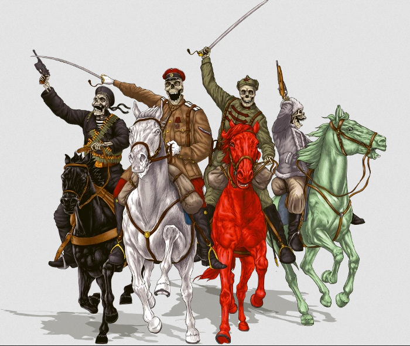
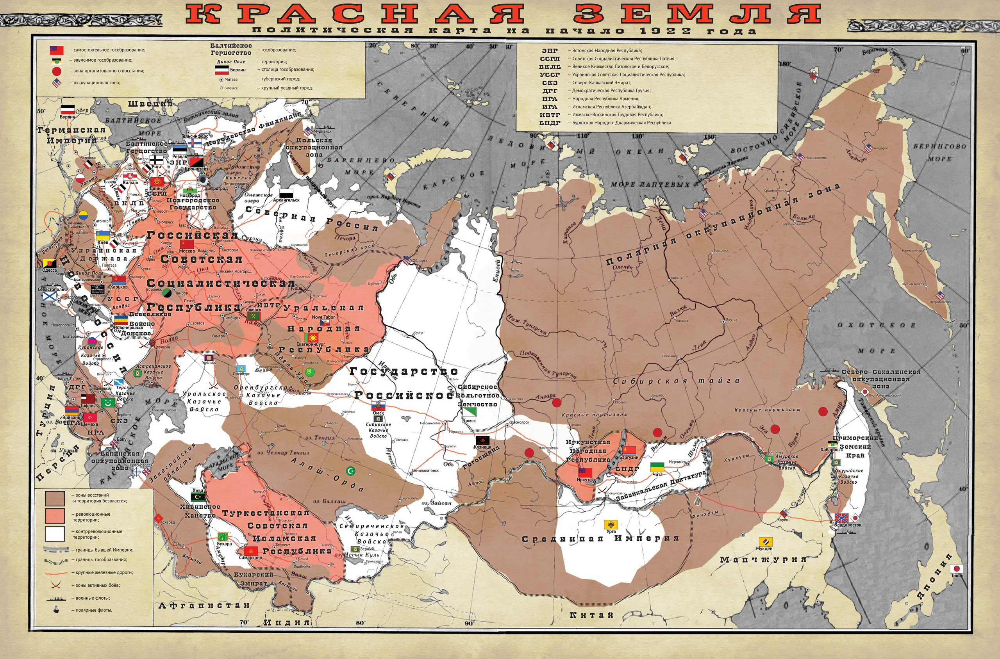

# Красная земля

Красная земля — это игровой мир по альтернативной истории Гражданской войны в России 1918—1923 г., созданный для игры коллективом «Штабъ Духонина»[1] по правилам Savage Worlds 2007 г. Вторая редакция «Красной земли» тоже задумывалась как игровой мир Savage Worlds. Однако смена политики издательства Pinnacle Entertainment Group не позволила бы издать мир, стороны конфликта которого (прежде всего красное движение) не выступали бы однозначными злодеями. Так что «Штабъ Духонина» решил отказаться от Savage Worlds и делать игру на системах Fate и Year Zero Engine, причём впоследствии отказался и от второй. В общем, все у них там сложно. Выход второй редакции состоялся в апреле 2022 года. А в июне фанаты выложили свою, альтернативную версию второй редакции, всё так же в формате игрового мира Savage Worlds.

## Мир игры

Карта России

Отличия начались еще в далеком 1918 г. Второй рейх смог преодолеть внутренние проблемы и, используя ресурсы оккупированных областей бывшей Российской империи, продолжить мировую бойню. Но Европа нам не интересна — события игры происходят в России. В 1919 г. белые армии вышли к окраинам Москвы и, несмотря на отчаянное сопротивление Красной армии, вошли в ее границы. Неизвестно почему, но это событие стало последней каплей для границы между мирами — её начало прорывать. Озверевшие бойцы красных мощным контрнаступлением выгнали белых далеко за пределы столицы, и на фоне этого события не все заметили, что в мире начала происходить всякая чертовщина, но когда из земли встали натуральные мертвяки, стало очевидно — что-то случилось, из-за чего до этого крайне редко проявляющая себя магия вернулась в мир. Что-то, названное **Переломом**.

Московская битва истощила силы всех сторон и уничтожила единство белых армий. Бывшая Империя, которую обычно называют Красной Землёй, все сильнее погружается в хаос, все чаще обнаруживаются мифические существа, причем не только на территории России — говорят, в Финляндии видели Одина. Страна фактически распалась на множество гособразований, каждое со своей идеологией и своим устройством, но всех их можно причислить к одному из четырех Движений. В 1921 г. на Одесской конференции это положение было закреплено на международном уровне, но надолго ли сохранится мир?

## Движения

После Перелома идеология перестала быть просто вопросом мировоззрения — каждый идейный человек душой и телом принадлежит одному из четырех Движений. *(Про безыдейных лор умалчивает).* И это не пустые слова — человек, входящий в любое из движений… меняется. Он становится все меньше похожим на личность и все больше похожим на шаблонного представителя движения, его меньше интересуют свои интересы и интересы конкретных людей, а не собратьев по борьбе. И ему становятся подвластны силы, которые выше человеческих, а некоторые особо ярые сторонники движений после смерти возвращаются к подобию жизни, чтобы служить Движению. Многие лишь печально констатируют, как бесконечная война повлияла на простых людей, некоторые же подозревают, что в ходе Перелома сами человеческие идеалы оказались заражены чем-то нечеловеческим. Коммунизм стал дорогой к коллективному разуму, Белое движение тоталитарной идеологией, крестьянский социализм языческим культом, а анархизм стремлением к разрушению. *Так оно и есть. Перелом прорвал стену между миром живых и мёртвых, и четыре племени духов сражаются за то, чтобы переделать мир на свой манер и организовать слияние двух миров, оставив в мире лишь мёртвых. Движения — это воплощение в реальном мире духов, присвоивших реальные идеалы, а сторонники Движений по факту одержимые духами.* Впрочем, принадлежность к одному из движений не означает резких границ между его сторонниками — так, в Кронштадте спокойно соседствуют Красные и Чёрные, а идею национал-большевизма точно так же разделяют те же Красные и Чёрные. Даже более - Брусилов принадлежит Белому Движению, но служит красным. Идеология человека, Движение и гражданство совпадают далеко не всегда! И далеко не всегда Движение важнее идеологии или гражданства - УрНР тому яркий пример.

### Красное движение

Движение коммунистов, социалистов и прочих левых. Его идеалы — всеобщее равенство и прогресс. Его сторонники выступают за создание Нового человека, свободного от эгоизма и мелкобуржуазных пережитков, для чего будет проведена Перековка. Красные отвергают всякую мистику, а для победы используют достижения Новой Науки — новейших научных дисциплин, свободных от оков буржуазии *и являющихся на деле магией*, верные сторонники движения благодаря некробиотике могут вернутся в виде некробионтов к «жизни», свободные от ограничений смертного тела *вот только кровушку пить приходится*. Излучатели всевозможных волн, новейшие материалы, новейшие двигатели и виды топлива, зооантропы, в конце концов! На землях Красных города наливаются жизнью, и коммунизм кажется недалёким будущим, а деревни… не будем о грустном. На стороне Движения пролетариат, передовая техническая интеллигенция и беднейшие слои населения. А вот остальные классы чужие на этом празднике жизни, регулярно подвергаются репрессиям и отвергаются обществом. В обществе царит «новая мораль», а само будущее общество кажется слишком… механистичным, что ли? Противники Движения считают плоды Новой науки подарками от инопланетных захватчиков, которым служат красные (но при этом сами ею активно пользуются). И, что характерно - они могут быть правы и Красное Движение действительно контролируется инопланетной энергетической формой жизни.

#### Основные государства

* **Российская Советская Социалистическая Республика.** Центр Красного Движения, его мозг и душа. Именно здесь разрабатываются новейшие технологии Новой Науки, здесь куётся Новая Мораль и Новый Человек и именно её армии способны покончить с раздробленностью страны. После убийства Ленина страна возглавляется пентувриатом из Бухарина, Сталина, Троцкого, Дзержинского и некробионта Свердлова. Руководство расколото на несколько политических блоков и пять фракций (военные троцкисты, бюрократы-вертикалисты, национал-коммунисты, богостроители и чекисты-централисты), что не добавляет стабильности. Экономика основана на военном коммунизме, из-за чего, видимо, с сельским хозяйством такой бардак.
* **Украинская Советская Социалистическая Республика**, страна, раскинувшаяся от Харькова до Донецка. Витрина социализма, на которой процветает НЭП в лучших традициях книг Ильфа и Петрова. Да, гражданин Бендер тоже где-то здесь. В теории независимое государство, на деле управляется Москвой — даже НЭП был введён по инициативе Бухарина.
* **Советская Социалистическая Республика Латвия**. Государством руководит [Петерис Стучка](https://ru.wikipedia.org/wiki/%D0%A1%D1%82%D1%83%D1%87%D0%BA%D0%B0,_%D0%9F%D1%91%D1%82%D1%80_%D0%98%D0%B2%D0%B0%D0%BD%D0%BE%D0%B2%D0%B8%D1%87), оно зажато между немецкими марионетками и отражает атаки Балтийского герцогства.
* **Уральская Народная Республика**. Демократическая технократическая утопия, процветающее, либеральное в хорошем смысле слова государство, которое было бы ещё более процветающим, если бы американцы не захватили единственный порт и не поставили бы там свою таможню. Зато строят железную дорогу до Самарканда — с переменным успехом, уж слишком много желающих помешать. Настолько прогрессивное государство, что готово отправить первый спутник в космос. Самое адекватное государственное образование в России, где все Движения равны — в смысле уральцы будут избавляться от любых неадекватов, к какому бы Движению они не принадлежали. Комитет по Контролю над Паронормальными Явлениями считает, что Уралу просто повезло — разломы Петрограда и Байкала просто «не добивают» до Урала и люди сохранили свободную волю. Правда, не все так радужно, как может показаться — либеральная политика привела к разгулу преступности на улицах и сектантству, восстание в хлебных районах спровоцировало дефицит продуктов питания, соседство с Государством Российским и РСФСР угрожает скорой войной, колониальная политика США провоцирует рост мафии, а курс на нейтралитет рубит на корню мечты о том, что устройство УрНР распространится на всю страну.
* **Туркестанская Советская Исламская Республика**. Военная диктатура Фрунзе, который разочаровался в военном коммунизме, решив сменить его политикой примирения, для чего затеявшего эксперимент по синтезу ислама и марксизма. Эксперимент настолько успешен, что в «красные исламисты» записались даже зелёные. Москва такие шалости, включающие в себя регулярные хаджи в Москву для поклонения «мощам Ленина», терпит — а что еще можно сделать? Республика обладает неплохой для данной местности промышленностью.
* **Ижевско-Воткинская Трудовая Республика** — прослойка между РССР и УНР. Непонятно, почему отдельно и кому оно такое надо. Ну разве что как дань [антибольшевистскому рабочему восстанию](https://ru.wikipedia.org/wiki/%D0%98%D0%B6%D0%B5%D0%B2%D1%81%D0%BA%D0%BE-%D0%92%D0%BE%D1%82%D0%BA%D0%B8%D0%BD%D1%81%D0%BA%D0%BE%D0%B5_%D0%B2%D0%BE%D1%81%D1%81%D1%82%D0%B0%D0%BD%D0%B8%D0%B5).
  * По словам авторов она играет для УНР ту же роль что и Монголия для СССР (только гораздо более технологичное и с автоматизированной обороной), т. е. буферное государство.
* **Иркутская Советская Республика** — государство, созданное восставшими против Колчака забайкальцами, страна реальной советской демократии без вашего этого Политбюро: здесь все равны и все решают сообща. А строем ходят, потому что таков исторический момент. Промышленностью пока, несмотря на все старания, ещё не обзавелись, а потому вынуждены полагаться на связи с Москвой.
* **Бурятская Народно-Дхармическая Республика** — государство, чья идеология безумная смесь буддизма и марксизма, особенно в той части, где говорится про законы диалектики. Считают, что большевизм это путь в нирвану и даже как-то ухитрились добыть левую руку Маркса и теперь хранят ее как ценную реликвию. Находятся в состоянии холодной войны с Монголией — в той степени, в какой вообще возможна холодная война между ламами.

#### Деятели

* **Ленин**. Самым неблагополучным образом помер от пули Каплан. Не воскрешён силами Новой Науки, *потому что умер до Перелома, «заражения» идеалов и появления Движений, а потому не успел стать одним из Красных*. Покоится в Мавзолее, пока его внутренности изучают учёные. Объявлен первым сверхчеловеком в России.
* Пентувриат РССР:
  * **Свердлов**. Председатель ВЦИК, первый Высший Некробионт в России, правит страной вместе с четырьмя пока еще живыми деятелями Революции.
  * **Сталин**. Глава наркомата народного контроля, находится в союзе с Зиновьевым и Каменевым (по другим сведениям — в состоянии борьбы с ними) и дружит с «примиренцами» Бухарина. Вместе с Бухариным возглавляет Вертикалистов, отстаивая необходимость планового хозяйства и перемирия с классовыми врагами. Именно его войска в 1919 первыми начали контрнаступление в Москве и именно его блок дал передышку РССР.
  * **Бухарин**. Председатель Высшего Совета Народного Хозяйства, инициатор НЭПа в УССР, друг Сталина, сторонник построения социализма в отдельно взятой стране и второй лидер Вертикалистов. Планирует организовать НЭП в РССР, стоит во главе блока «примиренцев», пытающихся примирить Троцкого и Дзержинского. По другим сведениям, он в союзе со Сталиным, по третьим — с Дзержинским. Короче, сам черт ногу сломит с этой возней пауков в банке.
  * **Троцкий**, «Лев Революции». Глава фракции, а заодно и блока имени себя, нацеленных на Мировую Революцию, противостоит Дзержинскому и выступает за возобновление большой войны со всеми врагами Революции, сверхмобилизации и ликвидации «пережитков старого режима». В его фракцию входят военные и милитаристы.
  * **Дзержинский**. Глава ЧК, борец с паранормальщиной, лучший друг беспризорников и мелких сельских предпринимателей, а попутно заядлый враг Троцкого. Лидер фракции Централистов, тщательно скрывающих свою политическую программу, которая, по некоторым намекам, даже радикальнее идей Богостроителей. Выступает за примат решения внутренних проблем РССР над решением проблем внешнеполитических. Активно в межфракционную борьбу его сторонники не вступают, предпочитая поддерживать одну из фракций, благодаря чему, а также влиянию в ЧК, фракция Централистов получила роль арбитра в спорах фракций.
* **Луначарский**. Нарком просвещения и лидер фракции Богостроителей, продвигающих идеи Новой Науки и Перековки человека обычного в человека Советского. Большинство успехов Новой Морали - его заслуга и его вина, остальная часть на совести Троцкого.
* **Калинин**. Глава фракции национал-большевиков, считающих РССР лишь очередным этапом в истории России. Отрицают идеи интернационализма и Мировой Революции, но при этом все равно поддерживают идеи Троцкого о войне с капиталистами, считая ее крестовым походом против проклятого Запада. Выступают против "борьбы с пережитками" и даже выступают за сохранение РПЦ в качестве противовеса зеленому сектантству.
* **Буденный**. Потерялся где-то в Поволжье, до сих пор всей ЧК ищут.
* **Чапаев**. Все же смог выплыть из Урала и теперь горит жаждой мести казакам, по чьей вине ему пришлось купаться. Из-за того, что слишком долго отсутствовал, потерял доверие московского руководства, но все равно ему поручили задание по охране строящейся дороги РССР-Туркестан.
  * [А ещё отдельные несознательные красноармейцы провели параллели](https://m.vk.com/wall-176037595_4898%7C) с биографией Христа и решили, что он де второе пришествие и организовались в секту имени комдива. Чапаев как атеист этого не оценил.
* [**Виктор Чернов**](https://ru.wikipedia.org/wiki/%D0%A7%D0%B5%D1%80%D0%BD%D0%BE%D0%B2,_%D0%92%D0%B8%D0%BA%D1%82%D0%BE%D1%80_%D0%9C%D0%B8%D1%85%D0%B0%D0%B9%D0%BB%D0%BE%D0%B2%D0%B8%D1%87) [2]. Лидер Уральской Народной Республики. В 1917 Троцкий спас его от разъярённых анархистов, в 1918 — белочехи от Колчака, и с тех пор он активно дружит и с РССР и с чехами, чем огорчает Полоза. Не хочет ни с кем воевать (на Урале и без того проблем хватает), но, видимо, придётся…
* **Киров**. Хороший человек ~~и дирижабль~~ *(в рамках своего Движения, конечно)*. А, поскольку, по законам жанра, хорошие люди должны страдать, руководство Советской России отправило его в самое гиблое место мира — Петроград Обречённый, организовать там Красных военскаутов. Пока справляется.

### Белое движение

Движение искренне верящих в необходимость некой Иерархии, власти более достойных над менее. Неважно — богатых над бедными, сильных над слабыми, умных над глупыми, знатных над простонародьем, но иерархия должна быть! Представители этого движения обладают повышенным уровнем Чести и Долга, в результате чего могут возвращаться с того света для продолжения службы Белому движению *а если оплошают, то духи Белого движения отправят их в адЪ*. Для преодоления вражьих умыслов используют всю мощь организованной магии — Оккультизма, да и православными молитвами не брезгуют пользоваться *еще бы брезговали, это же та же магия*, а уж если подвернется случай воскресить павших русских воинов… В Движение входит офицерство, аристократия, буржуазия, духовенство, купечество и крупное кулачество. Обратной стороной белых идеалов является реакционность и презрение к простому человеку, нередко установление тоталитарных порядков и массовых репрессий, превосходящие эксцессы как массового террора Красных, так и случайного террора Чёрных, благо что порой сочетают оба подхода. Да и неправославно это как-то, молитвами да оккультизмом врагов убивать. Нет ли в этом сатанизма?

#### Основные государства

* **Новороссия**, протянувшаяся от Херсона до Каспия, краса и гордость Белого движения, участник международных отношений и росток молодой демократии. А заодно и гнездовье разврата и преступности — конечно, в этом много где проблемы, но что бы так? Регулярно осаждает Царицын, но взять «Красный Верден» так и не вышло.
* **Казачьи государства**. С ними сам черт ногу сломит, кто из них за кого, поэтому путь будут тут — большинство все же за белых.
* **Северная Россия**, на большей части своей территории абсолютно безумное и дикое место, заросшее лесами и заполненное всякой нечистью, к которой многие относят заплутавшие отряды РККА, бандитов, а в довесок ещё и местную армию. Но при этом это единственное государство белых, где гражданское правительство реально управляет, а не является марионеткой военных или возглавляется генералом, хотя оно и держится в немалой степени благодаря интервентам. Формально часть Государства Российского.
* **Новгородское Русское Государство** — государство Юденича. Старается соответствовать Новгородской Республике с его вече и охраняется духом Александра Невского (но это не точно).
* **Государство Российское** — ленные владения Колчака, все еще мнящего себя лидером всех белых. По сути фашистское государство с триумфами воли, нордизмом, массовыми карательными акциями, регулярными парадами, промыванием мозгов граждан и твёрдыми сословными рамками (последнее уже не совсем фашизм — тяжкое наследие царского режима.).
* **Забайкальская Диктатура**. Государство Семёнова, союзное Японии - союзное настолько, что в школах дети учат японский. Постоянно сотрясается восстаниями и держится на японских штыках и зачарованных бронепоездах.
* **Православный Земский Край**. В теории это очередная территория Государства Российского, но на деле его давно заняли русские монархисты, восстанавливающие «давнишние времена» и пытающиеся на Земском соборе решить, кого ~~и чем~~ именно мазать на  царство и где добыть этого помазанника для помазания.
  * При этом настолько против магии что уничтожают даже белых адептов.
* **Новый Табор**. Нет, цыгане тут ни при чём — это государство, созданное Чехословацким легионом и названное в честь города Табор[3] на юге Чехии, гора около которого стала центром движения таборитов (радикальных гуситов). После Прорыва и кровавого подавления пражского восстания австрийцами окончательно отчаялись, пока высшие силы не указали им их историческую миссию — найти Грааль, который как-то потерялся в горах Урала. Теперь ищут. По сути, является армией Уральской Народной Республики, защищающей последнюю от потенциального вторжения РССР, патрулирая местность на броневагенбургах.
* **Монголия**, она же **Срединная Империя** — подозрительно сильное государство барона Унгерна фон Штернберга. Буддисткие мистики при упоминании барона восторженно закатывают глаза и говорят о грядущей победе над «разноцветным сном», а что творится на деле — загадка. Вполне возможно, что Унгерн действительно один из немногих шансов на спасение от конца света.

#### Деятели

* **Колчак** — правитель Государства Российского. Увлекся поисками Гипербореи, чахнет над имперским златом и мечтает о страшной мести Советам.
* **Слащев**. Один из врангелевских генералов, а заодно глава одной из разведок и оккультист высочайшего уровня.
* **Врангель**. Барон. Глава Новороссии. Один раз уже взял Царицын, с тех пор мечтает повторить.
* **Михаил Дитерихс**. Воевода Православного Земского Края. Настолько поехал по религии, что его не берёт вражья магия. Устроил в своей вотчине теократию с домостроем и монашками (основано на реальных событиях).

### Зелёное движение

Движение простого косного крестьянства и «народного анархизма», живущего землей и умирающего за него. После Перелома его сторонники вернулись к старым языческим практикам и культу Матери-Земли. В обмен Мать-Земля дает своим детям способности к колдунствам и зельеварению, а самых верных детей возвращает в виде упырей, что далеко не всем зелёным по душе. На землях Зелёных города зарастают в считанные месяцы, поля и нивы наливаются богатым урожаем, а на вражьих землях урожай гниет на корню. Идеал Зелёного движения — крестьянская община, управляемая мудрыми старцами и Волхвами. Обратная сторона очевидна — крайняя косность, которую даже белые считают чрезмерной, темнота и постоянно прорывающийся то менталитет толпы, то менталитет сельского обывателя.

#### Основные государства

* **Антоновщина**. Зона восстания тамбовских крестьян под руководством Антонова, кость в горле РССР и ночной кошмар продотрядов. Возглавляется партий эсеров, правда, не совсем ясно — правых или левых.
* **Махновщина**. Территория банд Батьки Махно. Новороссийцы уверяют, что никакой махновщины нет, просто банды обнаглели. Как это бывает с анархистами, густая смесь из чёрных и зелёных деятелей.
* **Алаш-Орда**. На самом деле это даже не государственное образование, а совершенно одичавшие территории Казахстана - степи, солончаки и полупустыни. Типичный фронтир а-ля истерн. Из-за сепаратистских настроений местных оттуда ушли русские, Гражданская война разрушила коммуникации, и регион скатился в дикость и варварство. А после Перелома там развелось множество разных монстров, начиная от олгой-хохроев и гулей и заканчивая сорелями, канаяками и прочими тварями центрально-азиатской мифологии.

#### Деятели

* **Махно**, тот самый. Разъезжает на тачанках и портит настроение *Красным* и *Белым*, распивая *красное* и *беленькую*. Может быть, и чёрный, но его войскам помогают силы Матушки-Земли.
* [**Александр Антонов**](https://ru.wikipedia.org/wiki/%D0%90%D0%BD%D1%82%D0%BE%D0%BD%D0%BE%D0%B2,_%D0%90%D0%BB%D0%B5%D0%BA%D1%81%D0%B0%D0%BD%D0%B4%D1%80_%D0%A1%D1%82%D0%B5%D0%BF%D0%B0%D0%BD%D0%BE%D0%B2%D0%B8%D1%87). Лидер тамбовских повстанцев. По слухам — волкодлак, хотя этих тварей и без него хватает в местных лесах.
* [**Григорий Потанин**](https://ru.wikipedia.org/wiki/%D0%9F%D0%BE%D1%82%D0%B0%D0%BD%D0%B8%D0%BD,_%D0%93%D1%80%D0%B8%D0%B3%D0%BE%D1%80%D0%B8%D0%B9_%D0%9D%D0%B8%D0%BA%D0%BE%D0%BB%D0%B0%D0%B5%D0%B2%D0%B8%D1%87). Один из руководителей сибирских «вольготников» мятежного Томска. *По слухам — умер ещё в 1920, но восстал вурдалаком.* Добрый, жалеет пленных красноармейцев, ~~потому кушает их с жалостью и состраданием~~. В реальной жизни — учёный, в 1876-99 организовал 5 экспедиций в Центральную и Восточную Азию, благодаря чему заслужил большое уважение у казахов. Политикой (против царя) занимался в 1860-х, против большевиков — почти нет.
* **Полоз**. Хозяин всея Урала, который вместо того, чтобы творить дичь, задружился с красными, дабы совместно разгрести бардак в регионе. Не любит белочехов и американцев, вредит им исподтишка.

### Чёрное движение

2.4 Чёрное движение
2.4.1 Основные государства
2.4.2 Деятели
3 Тропы и штампы
4 Примечания

После Прорыва в отдельное движение оформился напитавшийся оккультизмом анархизм, ставший Чёрным движением. Чёрные не делают ставку на организацию, как Белые и Красные, или на массовость, как Зелёные и Красные. Их путь — путь индивидуального террора и разрушение любого порядка. Его сторонники самостоятельны, но при этом действуют вместе, проникая во властные структуры для их развала или уничтожая лидеров, взрывая объекты или устраивая фееричные ограбления. Это Движение привлекает к себе как авантюристов, так и лихих людей, а потому идеология движения многому научилась у преступного мира. Даже свою магию они зовут Фартом, силой удачи и хаоса, способного устраивать самые невероятные совпадения. В душе каждого Чёрного горит Пламень, сила разрушения, *а сам Чёрный после смерти может слиться с ним, став Пламенником, воплощением хаоса, неотличим от обычного человека*. Недостатки очевидны — хаос ради хаоса не та идея, за которой пойдет большинство, даже на Красной земле, да и крайний индивидуализм нередко портит всю малину.

#### Основные государства

* Таки **Свободный город Одесса**. Формально свободный, с первого взгляда оккупированный Францией, на деле же управляемый самыми разными бандитами, предпочитающими называть себя оборотистыми дельцами, а шайки свои фирмами.
* **Свободный Город Владивосток**, полный аналог Одессы, разве что тут вместо французов японцы с американцами.
* **Советская Республика Матросов, Рабочих, Анархистов Кронштадта**, она же Республика М. Р. А. К. Государство моряков и беженцев из обезумевшего Петрограда, гнездовье «Питерских скаутов», ищущих артефакты в аномальной зоне, которой стал Петроград. Благодаря изобилию красной матросни более-менее верный союзник РССР.

#### Деятели

* [**Нестор «Дед» Каландаришвили**](https://ru.wikipedia.org/wiki/%D0%9A%D0%B0%D0%BB%D0%B0%D0%BD%D0%B4%D0%B0%D1%80%D0%B8%D1%88%D0%B2%D0%B8%D0%BB%D0%B8,_%D0%9D%D0%B5%D1%81%D1%82%D0%BE%D1%80_%D0%90%D0%BB%D0%B5%D0%BA%D1%81%D0%B0%D0%BD%D0%B4%D1%80%D0%BE%D0%B2%D0%B8%D1%87) — глава забайкальских бандитов, устраивающий набеги как на Иркутск, так и на семёновцев.
* [**Григорий Рогов**](https://ru.wikipedia.org/wiki/%D0%A0%D0%BE%D0%B3%D0%BE%D0%B2,_%D0%93%D1%80%D0%B8%D0%B3%D0%BE%D1%80%D0%B8%D0%B9_%D0%A4%D1%91%D0%B4%D0%BE%D1%80%D0%BE%D0%B2%D0%B8%D1%87). Алтайский повстанец. Его «повстанческая армия» устраивает трэш, угар и содомию по всей Южной Сибири, за что нелюбим и красными, и колчаковцами. В реале действительно творил — и будучи анархистом, и воюя за красных.
* [**Бенцион Крик**](https://ru.wikipedia.org/wiki/%D0%91%D0%B5%D0%BD%D1%8F_%D0%9A%D1%80%D0%B8%D0%BA). Король преступного мира Одессы, по факту — правитель этого города. Управляет потоками контрабанды, идущей через Вольную Одессу, вешает врангелевцев под настроение, по слухам — дружит с Котовским. Убрать его — неосуществимая мечта всех «фирмачей», все попытки устранения сего господина с треском провалились.
* [**Борис Савинков**](https://ru.wikipedia.org/wiki/%D0%A1%D0%B0%D0%B2%D0%B8%D0%BD%D0%BA%D0%BE%D0%B2,_%D0%91%D0%BE%D1%80%D0%B8%D1%81_%D0%92%D0%B8%D0%BA%D1%82%D0%BE%D1%80%D0%BE%D0%B2%D0%B8%D1%87). Враг Советской России *(и прочих Красных)* номер один. Вредит по-крупному как только может. Если где-то у Советов происходит восстание, саботаж, массовое дезертирство и прочие непотребства — с большой вероятностью можно утверждать, что именно Савинков организовал эту проблему. В реальной жизни был крутым террористом и врагом также царского режима.

## Тропы и штампы

* Аномальная зона — Петроград после Прорыва *из-за демонов, засевших на его территории*, стал почти буквально Городом, которого нет, и аналогом Зоны из «Пикника на обочине» Стругацких: сплошные аномалии и артефакты, да еще и мутанты на каждом шагу. А если кому мало, то тут еще и склад белого угля, пожар на котором способен вызвать взрыв в насколько мегатонн.
  * Байкал, обжитый Зелёными ведунами.
  * Также такой зоной может стать Екатеринбург, если Новая Наука перестанет справляться с подавлением прорыва в доме Ипатьевых.
  * И еще множество более мелких зон.
  * Сахалин с его Разломом
* Апокалиптический маньяк — такими становятся слишком погруженные в Черное Движение. Впрочем, разрушение мира и есть цель этого Движения. Чуть более человечные и вменяемые (именно «чуть») оправдывают свои воззрения гностицизмом — "мир есть клетка человечества, вперед к Истинной Свободе!
* Археолог-авантюрист — частое явление в данном сеттинге. Встречаются всех сортов и калибров — от целого государства искателей Грааля до одиночек в поисках чего-то ценного.
* Безрелигиозный фанатик — адепты Красного и Чёрного движений, особенно первые (Чёрные-то мистикой нередко балуются).
* Благонамеренный экстремист — в основном Чёрное движение, но регулярно встречаются и у других.
* Вампир — *некробионты Красного движения*. Без крови едут крышей, *поэтому на территории Красных множество донорских пунктов*/
* Верность до конца — в основном присуща Белому движению, но регулярно встречается и у остальных. Самые верные в том или ином виде возвращаются даже с того света.
* Воинствующий атеист — Союз Воинствующих Безбожников. Организация Красных, поставивших своей целью уничтожение религии и всякой прочей мистики на всей территории Красной Земли — как с помощью агитации и пропаганды, так и уничтожая физические носители религии… и носителей. Особо махровые безбожники неуязвимы к чудесам и магии и не верят даже в Новую Науку. *И правильно делают — магия она, как есть магия.* Курируются Наркоматом Просвещения.
* Враг моего врага — УрНР и Государство Российское люто ненавидят друг друга, но американская таможня в Обдорске настолько их бесит, что ради изгнания американцев они готовы объединится.
  * Похожая ситуация назревает во Владивостоке, где местное население постепенно сатанеет от понаехавших со всего мира преступников и оккупантов Антанты.
* Геноцид — Чехия была уничтожена Австро-Венгрей при попытке всенародного восстания. С фитилькои, если речь только о городах, лор в этом месте туманен.
* Злодей с хорошей репутацией — ведуны. До Перелома скрывали свою натуру от односельчан, творя добрые дела, после него притворятся перестали и перешли в разряд просто злодеев. Главная причина существования толп нежити и одни из немногих, кто в курсе всей подоплёки происходящего.
* Зомби — низшая нежить на службе Движений. У каждого — своя и со своим колоритом:
  * У Красных это некробионты — «спецъединицы». Оживлённые Новой Наукой трупы, выполняющие функции роботов и во многом им подобны. Ну и такими становятся представители других Движений, когда их попытались оживить в виде высших некробионтов. Разум спецъединицам не положе, они немногим умнее и сообразительнее обезьян.
  * у Зелёных поименован в упыря — медлительный гниющий и голодный труп, бросающийся на живых (если только не под контролем колдуна или какого-нибудь духа). Зелёных слегка понадкусывает, после чего убитый становится новым упырем, членов остальных Движений ест целиком. Большие группы упырей могут после хоровода стать «упыриным царём» — тварью из нескольких упырей, сросшихся наподобие крысиного короля и от удачных попаданий мертвецы «отсоединяются» и действуют отдельно.
  * У Белых это не совсем зомби, но разговорчивостью не отличается. Низшие Бессмертные скорее что-то вроде материализующихся призраков, давших клятву служения. Уничтоженный Бессмертный появится вновь как ни в чем не бывало, если только не разрушить символ, связывающий его с тварным миром — захватить знамя полка, крепость и т. п. *Не справившийся со своей задачей несчастный отправляется духами Движения в Тартар, то есть Ад.* В основном это солдаты, но известны случаи, когда ими становились рабочие.
  * У Черного Движения зомби нет — в основной книге правил не описаны. Позже фанаты добавили Душегубов — трупы, в которые вселился Пламень. Быстрые, свирепые, склонны к садизму. Издали смахивают на душевнобольных и наркоманов, вблизи — на одержимых.
* Изменившаяся мораль — постоянное явление для Красного Движения. Адамизм (???), теория стакана воды, богоборчество…
* Киборг: благодаря так называемым привоям (устройствам Новой науки, неразрывно связанных с кровеносной и нервной системами организма) киборги — довольно распространенное явление среди Красных.
* Мерзкий Улей — Владивосток. Работорговля, детская проституция, гей-клубы в бывших церквях, вампиры, торгующие консервированной кровью...
* Мраккультист — после Перелома эти деятели расплодились в России в таких количествах, что тот же Кронштадт вынужден содержать интернат для детей, чтобы их не воровали по ночам. Первое место уверенно держит Чёрное движение, второе делят Зелёное и Белое. Красное, несмотря на атеизм, тоже замаралось — только их мраккультисты не осознают, чем занимаются.
* Несовместимое с жизнью неверие — Отпечаток Атеизм у Красных заставляет не верить в магию и неправдоподобные сведения (Какие крокодилы в Волге?! Хотя похожие чудовища у Зелёных есть…), что может выйти боком, когда у противников появляется настоящий маг или по лесу водит взаправдашний леший. Впрочем, цветная фишка за это тоже даётся, а вот фомам неверующим приходится куда тяжелее в мире, где недавно появилась магия и все сопутствующее.
* Несовместимая с жизнью набожность/суеверность — может, и не совсем, но Отпечаток Суеверность у Зелёных и Мессианство у Белых может доставить проблем. Хотя следование такому поведению может дать цветную фишку, необходимую для активации цветных черт.
* Отсылка:
  * Неофициальный девиз Горного Общества — Обезопасить. Удержать. Сохранить.
* Постапокалипсис без апокалипсиса — начался после Февральской революции и ещё даже не достиг своего пика.
* Свои собаки грызутся, чужая не встревай — пять блоков в РССР могут сколько угодно грызться между собой, но ни один из блоков никогда не пойдет на сговор с врагами РССР, даже ради победы во внутрипартийной борьбе.
* Превратить в животное — встречается и такое. Достаточно эксперименты Семёнова вспомнить, да и Новая Наука таким не брезгует.
* Техномагия — *Новая Наука*.
  * Кстати, далеко не факт. Есть мнение, что Перелом просто изменил законы мироздания и *Новая Наука* их использует. Или она использует не открытые даже в 21 веке законы, знания о которых передали инопланетяне.
* Уволен из гестапо за жестокость — Джа-Лама проявил себя настолько садистом и полным чудовищем, что был изгнан…Унгерном. Когда тебя выгоняет за жестокость военный социопат, то это повод задуматься. Ну, и по идеологии они что-то не поделили, не без этого.
* Упырь — восставший из мертвых представитель Зелёного движения. Сами зелёные, вопреки слухам, к этаким товарищам по борьбе относятся с тихим ужасом, вопреки уверениям волхвов о том, что «упыри тоже люди и даже лучше». В 1921 г. произошло массовое восстание мертвецов на юге России.
* Флеботинум — Красный Керосин, он же — Рубедин, на котором работают изделия Новой Науки *в руках не-новонаучников*. Месторождения данных веществ есть только на территориях Красных. Противники движения утверждают, что это кровь узников концлагерей, на что красные отвечают, что кровь не имеет такой энергоёмкости и это всего лишь миф. *С учётом нужды некробионтов в крови, а также некоторых эффектов при провале броска Новой Науки есть подозрение, что догадки противников Красного движения имеют под собой опору…*

## Примечания

1. Если кто не в курсе: идиома времён ГВ «отправить в штаб Духонина/к Духонину» была эвфемизмом расстрела.
2. В нашей реальности — эсер, председатель Учредительного собрания; после его принудительного роспуска боролся против большевиков, в 1920 эмигрировал.
3. Город был назван в честь горы Фавор (Thabor) в Святой Земле, а в восприятии чехов слилось со словом «табор» (укреплённый лагерь), что как раз сродни цыганскому становищу.
