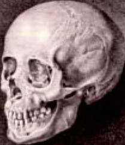
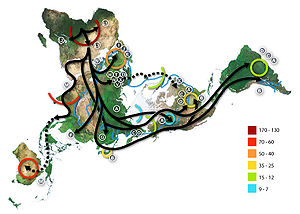
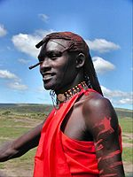
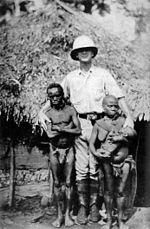
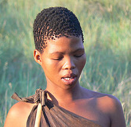
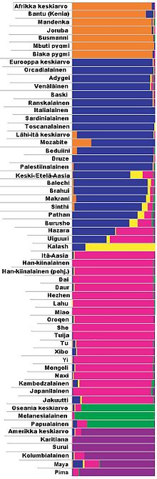
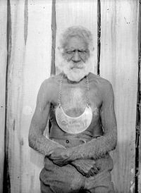

# Расы

Ра́са — система человеческих популяций, характеризующихся сходством по комплексу определённых наследственных биологических признаков, имеющим внешнее фенотипическое проявление и сформировавшимся в определенном географическом регионе. Черты, характеризующие разные расы, зачастую появляются как результат адаптации к различным условиям среды, происходившей в течение многих поколений.

Критерием отличия расы от вида является отсутствие существенных препятствий для создания плодовитого потомства, что приводит к образованию множества переходных форм в области смешения рас.

Содержание понятия «раса», в целом, более или менее однозначно воспринимается разными исследователями, однако в деталях имеются существенные расхождения, разные школы антропологов выделяли от четырёх до семи основных рас и десятки малых антропологических типов.

## Этимология

Слово «раса» в русском языке известно с середины XIX века, являясь заимствованием из фр. race или нем. Rasse, которые в свою очередь восходят к исп. raza или итал. razza. Дальнейшая этимология не вполне ясна: существуют версии о происхождении слова от лат. generatio («рождение, способность к размножению»), лат. ratio («род», «порода», «разновидность») или араб. ra’s («голова», «происхождение», «начало»).

## Расоведение

Череп, обнаруженный в 1795 году в Грузии, выдвинутый Блуменбахом в качестве гипотезы о происхождении европейцев с Кавказа

Расове́дение — раздел антропологии, изучающий человеческие расы.

Расоведение изучает классификацию рас, историю их формирования и такие факторы их возникновения, как селективные процессы, изоляция, смешение и миграции, влияние климатических условий и вообще географической среды на расовые признаки.

Расоведение получило особенное распространение в национал-социалистической Германии и др. западноевропейских странах, а также ранее в США (Ку-клукс-клан), где служило обоснованием институционализированного расизма, шовинизма и антисемитизма. Велик вклад в расоведение советских учёных (таких, как В. В. Бунак, В. П. Алексеев и др.).

Иногда расоведение отождествляют с этнической антропологией. Однако последняя относится, строго говоря, только к изучению расового состава отдельных этносов, то есть племён, народов, наций, и происхождению этих общностей.

В той части расовых исследований, которые направлены на изучение этногенеза, антропология ведёт исследования совместно с языкознанием, историей, археологией. При изучении движущих сил расообразования антропология вступает в тесный контакт с генетикой, физиологией, зоогеографией, климатологией, общей теорией видообразования. Изучение рас в антропологии имеет значение для решения многих проблем. Оно важно для решения вопроса о прародине человека современного вида, использования антропологического материала как исторического источника, освещения проблем систематики, главным образом малых систематических единиц, познания закономерностей популяционной генетики, уточнения некоторых вопросов медицинской географии.

## Отрицание существования рас

В середине XX века возникла концепция нереальности рас как внутривидовых подразделений человечества. Одним из первых её сформулировал бельгийский учёный Ж. Йерно, объявивший расу не фактом, а понятием.

В последние десятилетия в американской и западноевропейской антропологии проявилась решительная тенденция к отрицанию реальности существования человеческих рас. По мнению отечественного антрополога Л. Т. Яблонского, «расоведческие исследования в США стали делом не совсем приличным и даже опасным».

## Деление на расы

Ранняя миграция человечества по исследованиям митохондриальных ДНК (в тысячах лет до настоящего времени)

Существует множество мнений о том, сколько рас может быть выделено внутри вида Homo sapiens. Существующие точки зрения варьируют от гипотезы двух основных расовых стволов до гипотезы 15 самостоятельных рас. Между этими крайними точками зрения лежит широкий спектр гипотез, постулирующий от 3 до 5 расовых стволов.

При всей внешней несхожести, расы одного ствола связаны большей общностью генов и ареалов, нежели соседние расы. Согласно Большому Советскому Энциклопедическому Словарю, существует около 30 человеческих рас (расово-антропологических типов), объединенных в три группы рас, которые именуются «большими расами». Стоит отметить, что сами расы (малые расы) делятся на субрасы, и нет единого мнения относительно принадлежности тех или иных субрас к тем или иным расам (малым расам). Кроме того, разные антропологические школы используют разные названия для одних и тех же рас.

### Типологическая концепция расы

Типологическая концепция расы исторически появляется первой. Согласно типологическому подходу, описав черты конкретного человека, можно четко отнести его к той или иной расе: выделяются расовые типы, и каждый индивид оценивается по степени приближения к тому или иному «чистому» типу. Например, ширина губ и носа больше определенной величины в сочетании с низким головным указателем, большим выступанием лица вперед, курчавоволосостью и кожей темнее некого типового стандарта расценивается как свидетельство принадлежности к негроидной расе. По такой схеме можно даже определять расовую принадлежность конкретного человека в процентах. Сложность типологической концепции заключается в выделении «чистых» типов, отчетливо отличающихся один от другого. В зависимости от количества таких типов и признаков, определенных как расовые, будет меняться и расовое определение человека. Более того, последовательное строгое применение типологического принципа приводит к тому, что родные братья могут быть отнесены к разным расам.

Как отмечал видный отечественный антрополог В. П. Алексеев, типологическая концепция расы «всё больше приобретает характер анахронизма и отходит в историю антропологической науки».

### Популяционная концепция расы

В современном отечественном расоведении господствует популяционная концепция расы. Согласно ей, раса — это совокупность популяций, а не индивидуумов. Раса рассматривается как самостоятельное образование, имеющее свою собственную структуру. Признаки в пределах расы складываются в иные сочетания по сравнению с индивидуумом.

В США отход от типологической концепции расы к популяционно-генетической датируется 1950 г. В СССР основы популяционной концепции расы были сформулированы ещё в 1938 г. В. В. Бунаком. В дальнейшем концепция была развита В. П. Алексеевым.

### Западный ствол

#### Европеоиды

Природный ареал европеоидов — от Европы до Урала, Северная Африка, Юго-западная Азия и Индостан. Включают нордическую, средиземноморскую, фальскую, альпийскую, восточно-балтийскую, кавкасионскую, динарскую и другие подгруппы. Отличается от других рас в первую очередь сильной профилировкой лица. Остальные признаки широко варьируются.

#### Негроиды

Представитель негроидной расы — коренной кениец.

Природный ареал — Центральная, Западная и Восточная Африка. Характерные отличия — курчавые волосы, темная кожа, расширенные ноздри, толстые губы и др. Выделяется восточная подгруппа (нилотский тип, высокорослый, узкосложенный) и западная подгруппа (негрский тип, круглоголовый, среднего роста). Особняком стоит группа пигмеев (негрилльский тип).

#### Пигмеи

Пигмеи в сравнении с европеоидом среднего роста

Природный ареал пигмеев — западная часть Центральной Африки. Рост от 144 до 150 см для взрослых мужчин, кожа светло-коричневая, волосы курчавые, тёмные, губы сравнительно тонкие, крупное туловище, руки и ноги короткие, этот физический тип можно классифицировать как особую расу. Возможная численность пигмеев может составлять от 40 до 200 тысяч человек.

#### Капоиды, бушмены

Бушмены

Капоиды (бушмены, койсанская раса). Природный ареал — Южная Африка. Низкорослые, с инфантильными чертами лица. Имеют самые короткие и закрученные волосы. Кожа желто-бурая, не упругая — быстро появляются морщины, отвисает складка над лобком («готтентотский передник»). Характерна стеатопигия (преимущественное отложение жира на ягодицах), сильный лордоз. Особая складка века, выступающие скулы и желтоватая кожа придают бушменам некоторое сходство с монголоидами. Это параллельно возникшие приспособления к жизни в сходных условиях полупустынь.

### Восточный ствол

  
Кластеры Розенберга

Расы восточного ствола характеризуются двумя отличиями: большей эволюционной архаичностью (в частности, медленнее протекает общечеловеческий процесс упрощения зубов) и повышенной мигрантностью. Это вызвано географическими особенностями восточного очага. Обилие географических барьеров — морей, гор, огромных рек, а также шельфов, которые в период оледенения то обнажались, то затапливались, давало преимущества более мигрантным группам. А в условиях рассредоточенности населения фактор инфантилизации, выковавший современного человека, действовал слабее[источник не указан 271 день].

#### Монголоиды

Изначально населяли Восточную Евразию, сформировались на территории современной Монголии. Внешность отражает приспособление к условиям пустынь (пустыня Гоби — одна из самых больших по площади пустынь мира; находится в Монголии и северном Китае, территорию которых в основном населяют монголоиды). Главная черта — защита глаз от повышенной инсоляции, пыли, холода и т. д. Для этого служит узкий разрез век, дополнительная складка — эпикантус, тёмная радужка, густые ресницы, выступающие скулы с подушками жира, длинные (если не стричь) прямые и черные волосы. Выделяют две контрастирующие группы: северную (массивные, высокие, светлокожие, с крупным лицом и низким сводом черепа) и южную (грацильные, невысокие, смуглые, небольшое лицо и высокий лоб). Этот контраст вызван действием фактора инфантилизации в перенаселенных южных регионах. Молодая раса — около 12 тысяч лет.

#### Американоидная раса

Американоидная раса — раса, распространена в Северной и Южной Америке. Американоиды характеризуются прямыми чёрными волосами и «орлиным» носом. Глаза чёрные, шире, чем у азиатских монголоидов, но уже, чем у европеоидов. Эпикантус сравнительно редок у взрослых, хотя довольно част у детей. Рост американоидов часто очень высокий.

#### Австралоиды

Австралиец

Австралоиды (австрало-океанийская раса). Древняя раса, имевшая огромный ареал, ограниченный регионами: Индостан, Тасмания, Гавайи, Курилы (то есть почти половина земного шара). Повсеместно вытеснялась и смешивалась с мигрантами. Включает группы: полинезийскую, меланезийскую, австралийскую, веддоидную, айнскую. Чрезвычайно разнообразная раса. Черты внешности коренных австралийцев — более светлая кожа коричневых оттенков, крупный нос, длинные волнистые волосы, выгорающие как пакля, массивное надбровье, мощные челюсти резко отличают их от африканских негроидов. Велико между ними и генетическое расстояние. Однако среди меланезийцев (папуасов) часто встречаются спиральные волосы, что, наряду с генетической близостью, свидетельствует о небольшом притоке мигрантов из Африки. Веддоиды — более грацильные австралоиды, изначально населяющие Индостан. По мере заселения Индостана европеоидными мигрантами они притеснялись как представители «низших каст». В Индонезии и Индокитае веддоиды смешались с южными монголоидами.

## Общие замечания

### Метисы и мигранты

В результате смешанных браков появляются смешанные расы. Мулаты — результат совмещения негроидной и европеоидной расы, метисы — монголоидной и европеоидной, а самбо — негроидной и монголоидной. Более того, существуют целые народности, в настоящее время меняющие свою расовую принадлежность. Например, жители Эфиопии и Сомали переходят от негроидной к европеоидной, а жители Мадагаскара — от монголоидной к негроидной. Следует учитывать, что в постколумбовую эпоху огромные массы населения покинули свои природные ареалы. Поэтому в Саскачеване может проживать бушмен, а в Нукуалофе — голландец. Но это уже — результат действия не антропологических, а исторических факторов. Кроме того, немалую долю современного человечества составляют метисы, результат межрасового смешения. Ещё в доколумбову эпоху на границе рас сформировались метисные переходные типы — эфиопский, айнский, южносибирский и другие. Активные расселения и завоевания европейцев усилили процесс смешения и миграций. Больше всего метисного населения в Южной и Северной Америке. В частности, практически все афроамериканцы являются не чистыми негроидами, а мулатами. Чтобы подавить ксенофобию, в таких обществах общественные организации пропагандируют негативное отношение к расовой сегрегации.

### Белый человек

Древнее человечество, представленное ранними тропическими популяциями Homo (Homo habilis, Homo rudolfensis, Homo ergaster и др.), было, вероятно, тёмнопигментированным. Тёмную кожу, волосы и глаза имели также мигранты из Африки, давшие начало основной части современного человечества вида Homo sapiens. Потеря пигмента происходила лишь на окраинах ареала. Сочетание светлой кожи, волос и радужки глаз в доколумбову эпоху составляло лишь небольшую долю населения Земли, сосредоточенного в беломоро-балтийском «поясе блондинов». Однако заселение гигантских территорий Северной Америки и севера Евразии привели к росту ареала и популяции людей европеоидного типа. В настоящее время эта популяция вновь сокращается за счёт более низкой рождаемости в белых семьях и смешения с чернокожим населением, несущим доминантные гены.

### Расовые различия

Каждая раса по-своему лучше приспособлена для выживания в конкретных условиях: эскимосы в арктических пустынях, а нилоты — в саваннах. Однако в эпоху цивилизации такие возможности появляются у представителей всех рас. Тем не менее, факты, относящиеся к расовой физиологии, по-прежнему оказывают своё влияние на жизнь людей.

## Происхождение рас

### Неандерталец

Неандерта́лец, человек неандертальский (лат. Homo neanderthalensis)  — ископаемый вид людей, обитавших 300-24 тысяч лет назад. Неандертальцы обладали средним ростом (около 165 см) и массивным телосложением. Объёмом черепной коробки (1400—1600 см³ и выше) они даже превосходили современных людей. Их отличали мощные надбровные дуги, выступающий широкий нос и очень маленький подбородочный выступ. По краниологическим показателям неандертальцы были долихоцефалами. Существуют данные о том, что среди них были рыжие и бледнолицые. Расшифровка генома неандертальца показала, что этот вид не был непосредственным предком людей — их эволюционные линии разошлись около 500.000 лет назад. Однако, вероятно, существовало несколько эпизодов межвидового скрещивания неандертальцев с Homo sapiens (в частности, около 50.000 лет назад). Гены неандертальцев обнаружены только у представителей внеафриканских популяций; таким образом, скрещивание с неандертальцами могло внести некоторый вклад в формирование рас.

### Денисовец

Денисовский человек — предположительно новый вид вымерших людей, известный по крайне фрагментарному материалу, обнаруженному в Денисовой пещере. Это второй вид вымерших представителей гоминин, для которого стал известен полный митохондриальный и почти полный ядерный геномы, которые и позволили пролить свет на принадлежность этих останков. Вид жил около 40 тысяч лет назад и имел ареал, пересекающийся по времени и месту с территориями, населяемыми неандертальцами и современными людьми, однако появление денисовцев вызвано миграциями из Африки, отличными от переселений Homo erectus, неандертальцев и современных людей.

Найдены следы гибридизации Денисовского человека с Homo sapiens. В геноме меланезийцев обнаружено около 5% общих генов с прочитанным ядерным геномом Денисовского человека.

### Кроманьонец

Кроманьонцы, ранние представители современного человека в Европе и отчасти за её пределами, жившие 40-10 тыс. лет назад (период верхнего палеолита); возможные предки европеоидной расы.

Телосложение кроманьонцев было менее массивным, чем у неандертальцев. Они были высокорослы (рост до 180—190 см) и имели вытянутые «тропические» (то есть свойственные современным тропическим популяциям человека) пропорции тела.

Их череп по сравнению с черепом неандертальцев имел более высокий и округленный свод, прямой и более гладкий лоб, выступающий подбородок (неандертальские люди имели скошенный подбородок). Людей кроманьонского типа отличало низкое широкое лицо, угловатые глазницы, узкий, сильно выступающий нос и крупный мозг (в среднем около 1600 см³).

### Идалту

Идалту (лат. Homo sapiens idaltu) — древний подвид человека разумного. Идалту населяли территорию современной Эфиопии. Приблизительный возраст найденного человека Идалту — 160 тыс. лет. Предполагается, что этот подвид, обладавший рядом архаичных краниологических признаков, мог быть непосредственным предком современного подвида Homo sapiens sapiens.
