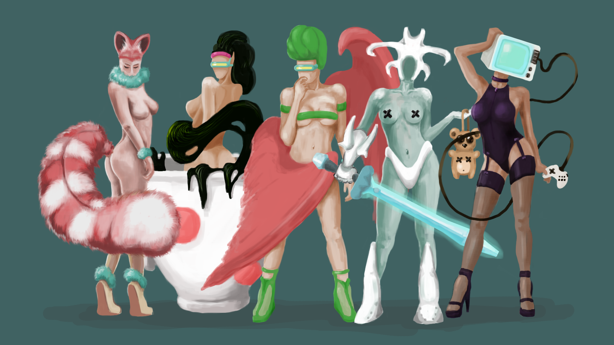

# Делаем игру за три дня

## День первый — персонажи и анимация

Возможно ли создать полноценную игру за три дня?

----

Безусловно, вопрос дискуссионный. С одной стороны, задача вполне осуществима, с
другой — слишком много нюансов... Просматривая конкурсные проекты с Ludum Dare,
можно убедиться в том, что даже за короткий период идея может обрести жизнь.

Но как долго она проживёт? И возможно ли полностью раскрыть идею? А что с
качеством реализации? Сколько игрового времени может дать проект, сделанный за
два-три дня? Вопросов слишком много.

Я убеждён, что за три дня можно создать хорошую игру. Конечно, придётся
балансировать между качеством и временем. Сжатые сроки потребуют от
разработчика оригинального подхода к решению проблем. В этом состоянии очень
много плюсов. Один из них — это концентрированный опыт, который позволит
реально оценить возможности разработчика. Подобная практика будет формировать
наиболее выгодные алгоритмы разработки и отсеивать лишние действия.

Разработкой компьютерных игр я занимаюсь три года. Подробнее о моём опыте вы
можете прочитать здесь. Главное, что со временем удалось накопить множество
небольших хитростей, которые значительно ускоряют процесс разработки. Эти
хитрости касаются всех аспектов: рисования, создания анимации, написания музыки
и программирования.

Эта статья открывает условный марафон из трёх дней. Каждый день будет посвящен
какому-либо аспекту создания игры. На данный момент я могу предложить следующие
варианты.

* День первый: персонажи и анимация.
* День второй: окружение и механика.
* День третий: музыка и сборка.

Конечно, по ходу написания материала возможны некоторые изменения, но я
постараюсь придерживаться обозначенной последовательности. Также стоит
уточнить, что задуманный марафон предполагает подсчёт затраченного времени на
разработку, которая будет вестись параллельно с написанием материала.

На подготовку этой статьи у меня ушло три дня, один из которых был посвящён
непосредственно самой разработке. Это значит, что финальный проект будет
доступен не через три дня, а через больший промежуток времени.

Я буду фиксировать время, потраченное на разработку, чтобы определить итоговый
результат. Присоединяйтесь, будет интересно!

### Идея как начало конца

Много ли у вас идей? У меня много, но толку от этого мало. Бывает, в голове
возникает свежая мысль на уровне образов. Она ещё не имеет своей концепции, но
уже вызывает интерес. Такая мысль ненадолго вспыхивает в сознании и может
погаснуть навсегда, если отвлечься. Эту искру нужно поймать. Я уже давно
записываю все свои творческие вспышки в блокнот, чтобы не упустить их в будущем.

В моменты, когда требуется серьёзная идея, я просто комбинирую записанные в
блокнот мысли. Собранная идея обретает свою страницу в блокноте. Такой подход 
позволяет использовать накопленные записи, освобождая место для свежих мыслей.

Гораздо хуже, когда блокноты копятся, а потом выкидываются. Иногда кажется, что
придумать что-то новое гораздо легче, чем поднимать старые записи и искать в
них интересные мысли. Это ошибка, из-за которой разработчик обрастает
макулатурой. Когда порядок отсутствует, то одни и те же мысли пережёвываются по
десять раз. А время идет.

В этот раз я не утруждал себя поиском новой идеи для проекта. Просто открыл
блокнот и уже на третьей странице нашёл нужную мне комбинацию мыслей. Можно
считать, что на этом этапе я не потратил времени на разработку, ведь идеи были 
уже готовы.

Главная проблема в том, что некоторые идеи не так просты, как кажется на первый
взгляд. Иногда разработка может затянуться из-за непредусмотрительности.
Разработчик начинает раздувать искру, и она превращается в пожар, за которым
сложно уследить. Все ресурсы сгорают и разработчик остаётся ни с чем. Эта
аллегория наиболее точно передаёт суть той ситуации, когда создатель игры
переоценивает свои силы.

Бесконтрольное развитие одной идеи может стать причиной смерти всего проекта.

Поэтому так важно ограничить свои амбиции и не выходить за обусловленные рамки.
Исходить нужно из реальных возможностей.

Лучший вариант для марафона — это что-нибудь незамысловатое в плане
программирования. Творческие задачи, связанные с кодом, могут затянуться
надолго. Поэтому я выбрал самый доступный вариант — простой платформер.

### Форма, эскиз и концепт

В мире огромное количество художников. Каждый старается найти свой стиль и
обрести узнаваемость. Конкуренция приводит к появлению совершенно новых
подходов в анимации и рисунке. С одной стороны, борьба за узнаваемость
мотивирует творца делать свою работу лучше, но с другой — некоторые выбирают
путь примитивизации форм. Количество элементов в рисунке уменьшается, а
наиболее важные структуры гиперболизируются.

Самый простой путь к популярности персонажа — это сконцентрировать внимание
зрителя на его лицевых элементах. А ещё лучше заполнить лицом всё пространство
силуэта. Этот приём является подобием квинтэссенции кубизма. Пабло Пикассо в
своих картинах в буквальном смысле раскраивает изображаемый объект на
плоскости, заполняя пространство на холсте.

Большинство современных иллюстраторов используют простые геометрические фигуры
в качестве формы для силуэта. Пространство внутри персонажа заполняется
наиболее выразительными и запоминающимися чертами. И в итоге всё сводится к
банальному акцентированию на форму.

Естественно, что так делают не все художники. Стоит помнить о том, что более
сложные смысловые структуры требуют от зрителя определённой подготовки. Можно
бесконечно смотреть на творения Казимира Малевича, но без понимания сути
супрематизма как силы, двигающейся в сторону «чистой беспредметности», уловить
художественную ценность «Чёрного квадрата» почти невозможно.

Моя задача — наглядно показать, что даже без знаний основ академического
рисунка можно сотворить узнаваемого персонажа. Зачем усложнять творческий
процесс, когда уже имеются простые решения. Лучше направить эту энергию на
решение новых задач.

Меня интересует простая форма, с которой можно будет комфортно работать. На
этом этапе можно позволить себе полную свободу действий. Главное —
отталкиваться от простых геометрических фигур. Их удобно комбинировать и
дополнять. Поиск формы занял у меня десять минут. Все картинки и анимация
нарисованы в Photoshop, но вы можете использовать любой другой графический
редактор. Лишь бы вам было комфортно.

После того, как найдена комбинация фигур, можно приступать к первому эскизу. Он
будет базироваться на выбранной форме. Удобней рисовать на новом слое поверх
скомбинированных фигур, настроив их прозрачность.

[Поэтапное создание концепта персонажа](https://leonardo.osnova.io/aafaf794-6cbe-9f91-daef-0bab4e89db99/-/format/mp4/)

Думаю, стоит подробнее разобрать процесс подготовки концепта персонажа. У меня 
получилось шесть этапов.

* На первом этапе я стараюсь использовать резкие линии в одно движение.
 Нарисовать окружность — задача сложная, но если разбить её на сегменты, то
 можно получить несколько простых линий. По такому принципу происходит
 построение первого эскиза. В любой момент, когда я недоволен результатом, есть
 возможность вернуться на несколько шагов назад, используя привычную комбинацию
 клавиш Ctrl+Alt+Z. А главное — такой алгоритм позволяет отменить неудачный
 сегмент без риска удалить всё изображение. Поэтому я рисую маленькими
 кусочками. Их удобно удалять и редактировать.
* На втором этапе удобно вносить корректировки в контур. Можно даже
 поэкспериментировать с инструментами масштабирования, чтобы придать более 
 узнаваемую форму. В моём случае всё осталось без изменений.
* На третьем этапе закрашиваем персонажа любым цветом.
* На четвёртом этапе я добавил немного собственных теней. Полутени отсутствуют,
 и в этом есть свои плюсы. Такой подход позволяет подчеркнуть рисованный стиль
 и сохранить объём. А самое главное — это экономия времени.
* На пятом этапе скорректирован цвет и добавлены блики. Также немного доработан
 контур.
* На шестом этапе изображён крайний концепт персонажа. Немного увеличена
 контрастность и яркость. Это далеко не финальная версия, ведь для ощущения
 целостности персонажа нужно избавиться от некоторых сегментов контура. На этом
 этапе персонаж выглядит собранным из отдельных кусков. Однако с таким контуром
 удобно работать во время анимации. Все необходимые корректировки я вношу на
 этапе интегрирования изображений в программный код.

На создание концепта персонажа у меня ушло десять минут. Конечно, можно
нарисовать лучше, но зачем? Я делаю компьютерную игру, а не рисую картину на 
выставку. Здесь стоит помнить, что игра — это совокупность множества элементов.
И часто сумма всех слагаемых превосходит ожидаемый результат.

[Создание этого концепта заняло 80 минут](https://leonardo.osnova.io/0e7f054f-d905-419c-39d2-7a82ade78642/-/format/mp4/)

Логично предположить, что более детализированный концепт потребует больше
времени на анимацию. Я исхожу из того, что мне важен законченный проект. Именно
поэтому экономия времени будет на всех этапах. И только когда игра будет
полностью собрана, можно рассмотреть вариант дополнительной детализации.

### Анимация

На мой взгляд, анимация персонажей — самый трудоёмкий этап разработки. Он 
требует терпения и сноровки. Однако и здесь есть свои хитрости. Прежде всего
стоит определить для себя основные приёмы анимации, которые будут использованы
в проекте. Не мне рассказывать вам о двенадцати принципах анимации Уолта
Диснея. Вы можете самостоятельно ознакомиться с ними на просторах сети. Я же
поделюсь с вами своими соображениями насчет анимации.

* Во-первых, вся анимация в пределах четырёх кадров. По своему опыту могу 
 утверждать, что такого количества достаточно.
* Во-вторых, новый кадр создаётся путём редактирования основного эскиза.
 Необязательно рисовать каждый кадр заново. С помощью марионеточной деформации
 и инструментов искажения можно добиться неплохих результатов. Обычно один кадр
 анимации у меня состоит из двух слоёв: на первом контур, на втором закрашенная
 область в границах контура. Такую конструкцию легко корректировать и вносить
 новые детали.
* В-третьих, я не исправляю допущенные ошибки сразу после их обнаружения. Это
 отнимает время. Велика вероятность того, что большинство дефектов не будут
 замечены игроком. Исправлять стоит лишь те ошибки, которые слишком заметны.
 После того, как игра будет полностью готова, у разработчика есть возможность 
 взглянуть на проект целиком. На фоне общей картины всегда ускользают мелкие
 детали, на которых можно неплохо сэкономить.

Определившись с принципами анимации, можно перейти к её количеству. Всё зависит
от разнообразия действий, которые будет выполнять персонаж. Я делаю простой
платформер, поэтому главный герой должен уметь бегать и прыгать. Это уже два
вида анимации. Также будет присутствовать анимация, когда персонаж стоит. Ещё
персонаж должен уметь стрелять.

Конечно, можно сэкономить время, сделав взаимодействие главного героя с врагами
путем прыжка им на макушку, как в Super Mario. В этом случае можно пренебречь
анимацией выстрела. Мой же персонаж будет уметь стрелять. Я сделаю для этого
отдельную анимацию.

### Анимация покоя

Для анимации, когда персонаж стоит, очень удобно использовать принципы сжатия и
растяжения Уолта Диснея. Время можно сэкономить за счёт двух одинаковых кадров
— первого и третьего. Но я обычно делаю кадры разными за счёт лёгкого изменения
теней. Это позволяет подчеркнуть рисованный стиль.

[Анимация покоя, нарисованная за 30 минут](https://leonardo.osnova.io/9ebb35af-9716-10e4-bf7b-38f1b100bd21/-/format/mp4/)

Анимация хвоста имеет большое значение. Именно с помощью неё можно задать
ощущение плавности для всей конструкции. В моём случае получился резкий переход
между вторым и третьим кадром, но исправлять я ничего не буду. Необходимо
придерживаться обозначенных принципов. Иначе разработка может затянуться.

### Анимация движения

Очень трудно уместить в четыре кадра плавную анимацию передвижения персонажей.
Особенно, если у объектов имеются очевидные конечности. Поэтому изначально было
запланировано нарисовать главному герою условный намёк на лапки. Всё-таки
персонаж стилизованный, и я могу позволить себе сместить акцент в сторону
общего восприятия. Обойдусь без уточнения таких деталей, как усы и лапки.

[Анимация передвижения, нарисованная за 60 минут](https://leonardo.osnova.io/9cdae535-2e3a-cdd5-0aa2-0e52f2b49357/-/format/mp4/)

За моими плечами 25 компьютерных игр, выполненных в пиксельной графике. На
рисованный стиль я перешёл совсем недавно и успел сделать всего два проекта.
Это объясняет то, что некоторые приёмы пиксельной анимации перекочевали и в
новый стиль.

Стоит пояснить, почему я отказался от пиксельной графики. Проблема в затратах
на её анимацию.

[Осьминог. Пиксельная анимация](https://leonardo.osnova.io/e9d5ba04-84d1-2e99-4a88-322ce755a53c/-/format/mp4/)

Осьминог, вписанный в плоскость размером 320x160 пикселей с десятью кадрами
анимации, занял у меня десять часов работы. Я не вижу ничего сложного в
рисовании пиксельной графики. Проблема в том, что этот процесс занимает очень
много времени. Особенно пиксельная анимация.

Когда всё сводится к монотонному переставлению пикселей на протяжении
нескольких часов — приходит осознание того, что пора менять стиль. Я сам завёл
себя в творческий тупик, используя одни и те же приёмы в пиксельной анимации.
Игры становились похожими, а развитие визуального стиля остановилось. Было
решено отказаться от пиксельной графики. Однако на старых проектах можно
проследить некоторую вариативность. Предлагаю оценить разницу между пиксельной
анимацией передвижения в пять, шесть и десять кадров.

* [Пример пиксельной анимации в пять кадров](https://leonardo.osnova.io/29567217-3259-7759-9987-8f8060fc2752/-/format/mp4/)
* [Пример пиксельной анимации в шесть кадров](https://leonardo.osnova.io/4c323ddd-7f09-4486-151b-317a9592983a/-/format/mp4/)
* [Пример пиксельной анимации в десять кадров](https://leonardo.osnova.io/bd3ef2a7-8eee-80d3-1a56-3e4e27f97d81/-/format/mp4/)
* [Пример пиксельной анимации в шесть кадров. Наиболее удачный вариант](https://leonardo.osnova.io/a5bfdc41-6538-1c78-8b24-8fc260763c54/-/format/mp4/)

Очевидно, что с увеличением количества кадров можно добиться плавности
движения. Но тут есть очень важный нюанс. Необходимо очень точно подобрать
скорость движения персонажа и скорость смены кадров. Иногда лучше пожертвовать
парой из них, чем делать разную скорость анимации передвижения и покоя. Вообще
я пришёл к выводу, что разное количество кадров в разных действиях вызывает
лёгкий дискомфорт в восприятии, особенно если анимация бега отстаёт от скорости
движения персонажа.

[Варианты анимации передвижения](https://leonardo.osnova.io/68b21c07-a59e-ed88-98fe-032960738537/-/format/mp4/)

Очень удобно, если у персонажа есть колёсики. Тогда можно значительно
сэкономить время на анимации передвижения. Вариантов может быть много. Всё
зависит от того, сколько времени готов потратить разработчик на анимацию.

### Анимация прыжка

Раньше я делал анимацию прыжка всего в два кадра. Один кадр на движение вверх,
другой на движение вниз. Однако с опытом пришло понимание, что двух
статических кадров мало. Я использую следующий вариант: один кадр на движение
вверх, один кадр в пиковой точке и два кадра на движение вниз.

[Анимация прыжка, нарисованная за 40 минут.](https://leonardo.osnova.io/5c9fab8a-836d-446a-0a45-574c5ddc7b9a/-/format/mp4/)

После приземления анимация покоя запускается со второго кадра. Этот нюанс
позволяет передать момент инерции.

### Анимация выстрела

Здесь я использую один очень хитрый приём. Анимация выстрела будет нарисована
отдельно от главного персонажа. Таким образом я буду комбинировать её с
анимацией передвижения, прыжка и покоя. Главное — грамотно отцентрировать кадры
двух разных анимаций.

[Анимация выстрела, нарисованная за пять минут](https://leonardo.osnova.io/601dce58-5d54-5027-e207-b9efb0a89067/-/format/mp4/)

На нижних рисунках видно, что бластер занимает меньшее пространство на
плоскости, чем позволяют размеры кадра. Это сделано нарочно. Мне проще задать
центр на самом рисунке, чем потом прописывать координаты для отражения кодом.
Когда персонаж будет менять направление движения, кадры будут отражаться
относительно оси, которая проходит через обозначенный центр.

Теперь о самой анимации. Очевидно, что большая пуля выглядит эффектней, чем
маленькая. Однако разница между диаметрами пули и ствола слишком заметна. Её 
можно сгладить, добавив во время выстрела вспышку в виде белой окружности. В 
самой игре при выстреле будет происходить тряска экрана — это значительно 
увеличит эффект от анимации.

### Дополнительные игровые элементы

Игровое пространство должно быть наполнено разными элементами. В том числе 
объектами, которые смогут завлечь игрока в сложные ситуации. Такие элементы 
выступают в роли мотивирующего фактора. Они позволяют игроку накапливать очки, 
которые в процессе игры можно обменять на что-нибудь полезное. Например, на 
дополнительную жизнь. Принцип очень стар и банален. В этом случае не 
обязательно придумывать что-то новое. Меня вполне устраивает вариант с 
колбаской. На нём я и остановлюсь.

[Варианты бонусов](https://leonardo.osnova.io/72327f59-8e9f-c80f-e3aa-3e381801d60b/-/format/mp4/)

Несмотря на простоту выбранного бонуса, его создание заняло время. На колбаску 
ушло десять минут. Связано это с поиском наиболее удачного положения и с 
характером анимации. Конечно, можно бесконечно увеличивать количество кадров и 
детализацию, но нужно ли это делать? Я считаю, что нет. Совсем необязательно 
добиваться плавности анимации. Главное, чтобы элемент вписывался в общую 
концепцию.

[Три варианта анимации. Каждый состоит из 12 кадров на кружку и 6 кадров на пар. Итоговое время: два часа](https://leonardo.osnova.io/acf5ab1c-6bc2-33c0-1ddc-db2cb9e414c8/-/format/mp4/)

Я напомню, что необходимо придерживаться принципов анимации на протяжении всей 
разработки. Такой подход позволит выдержать визуальную целостность проекта.

### Вражеские персонажи

Создание вражеских персонажей происходит по тому же алгоритму, что и построение
главного героя. Хитрость в том, чтобы убрать из процесса всё лишнее. В моём
случае у врагов будет только анимация движения. Я специально придумал
персонажей без ног, чтобы сэкономить время.

[Варианты вражеских персонажей](https://leonardo.osnova.io/6e3116dd-c458-2942-d53b-848ff44421a6/-/format/mp4/)

Несмотря на то, что вражеские персонажи довольно просты, на поиск форм ушло
время. В общей сложности на трёх врагов было потрачено три часа. Персонажи
будут иметь разные траектории движения, что слегка разнообразит игровой
процесс. Ничего особенного. Простая экономия на врагах, которую я постараюсь
компенсировать за счет игрового окружения. Об этом в следующей статье.

### Итоги за первый день

* Поиск формы — 10 минут.
* Концепт персонажа — 10 минут.
* Анимация покоя — 30 минут.
* Анимация бега — 60 минут.
* Анимация прыжка — 40 минут.
* Анимация выстрела — 5 минут.
* Бонус (колбаска) с анимацией — 10 мин.
* Вражеские персонажи — 180 минут.

Общее время составило 5 часов и 45 минут. Можно смело округлить до 6 часов. Я
думаю, что это оптимальная цифра, которую легко распределить на весь день с
учётом бытовых потребностей. Рабочие циклы протяжённостью в два часа позволяют
поддерживать энтузиазм и трудоспособность.

К сожалению, я трудился без серьёзных перерывов на протяжении обозначенного
времени, что сильно вымотало и утомило. Не совершайте такую ошибку! Работа
одновременно над несколькими проектами вынуждает меня уделять разработке по
8-10 часов в день. Это неправильно.

Я знаю разработчиков, которые проводят за проектами по 12 часов. Уверен, что
есть и те, кто трудится круглосуточно, уделяя сну 4-5 часов. Сидячая работа
перед монитором — не самый лучший способ достичь крепкого здоровья. Про этот
аспект не стоит забывать. Молодой и горячий характер, нацеленный на достижение
успеха, всегда игнорирует прописные истины. Поэтому берегите здоровье смолоду.
Каким образом? Решайте сами. Мои статьи не про здоровый образ жизни.

В заключение приглашаю вас в свою группу. Всем творческих успехов и терпения!
До новой встречи!

## День второй — окружение и механика: уже можно поиграть

Про механики, окружение и деньги.

----

Добрый день!

Опережая повествование хочу сообщить, что марафон в три дня окончен! Ссылку на
результат (на игру) я оставлю в конце. Не забывайте, что запланирована ещё одна
статья, посвященная написанию музыкального сопровождения. Её я закончу на
следующей неделе, если не будет никаких сдвигов в графике.

Прошлая статья была посвящена процессу создания персонажей и их анимации.
Теперь пришла очередь более подробно разобрать варианты окружения и способы
реализации игровой механики.

В этот раз я обозначу структуру статьи, чтобы было проще ориентироваться. Весь
материал разбит на несколько блоков.

* Игровое окружение.
* Игровая механика.
* Итоговый подсчёт времени на разработку.
* Про деньги (интересно получилось).
* Общий итог.

Также хочу отметить, что все варианты и ошибки буду рассматривать только на
своих примерах. Это будет справедливо. Критиковать чужое творчество я ещё не
дорос. К тому же у меня достаточно своих проектов, на которых можно «отвести
душу».

### Игровое окружение

С игровой механикой все ясно - простой платформер. Никаких извращений. Поэтому
рассмотрим механику чуть позже. С примерами и пояснениями. Сейчас акцентирую
внимание на игровое окружение.

Игровое окружение — это очень важная составляющая любого проекта. Именно оно
создает игровую атмосферу. С помощью окружения можно умело создавать 
разнообразные ситуации, погружающие игрока в виртуальный мир. Окружение — это 
своеобразное тело игры, в которое помещены персонажи. Оно должно полностью 
соответствовать игровой механике.

Над игровым окружением можно трудиться бесконечно долго, детализируя каждый 
объект или фон. Но я исхожу из сути обозначенного марафона - игра за три дня. 
Поэтому в разработке такого типа многое зависит от правильной экономии. Однако 
важно найти баланс, чтобы готовый проект выглядел целым.

Существует такое понятие, как сеттинг — это и есть игровое окружение. Сеттинг 
может быть разный, всё зависит от фантазии и индивидуальных предпочтений. Меня 
же больше интересуют варианты построения игровых уровней, которые позволят 
быстро заполнить игровое пространство.

### Вариант первый: генерация уровней

Пример игрового окружения с генерацией уровней

Очень удобный вариант, когда игра сама генерирует игровое пространство.
Генерация может происходить на основе заготовленных конструкций или на основе
алгоритма, который необходимо написать один раз. Такой вариант интересен своей
непредсказуемостью, несмотря на запрограммированную логику. Количество
заготовленных конструкций может варьироваться в зависимости от уровня сложности
или предпочтения игрока.

На картинке, расположенной выше, в игре происходит генерация блоков со
смещением в 32 или 64 пиксела. За счет этого могут появиться пространства между
платформами, которые необходимо перепрыгнуть. Сначала создается верхний блок,
который формирует нижний. Количество горизонтальных блоков в одной платформе
может изменяться от двух до пяти. Подобную основу легко осуществить программным
кодом и оформить в виде скрипта. В дальнейшем исходный скрипт можно усложнять,
а полученные варианты генерации комбинировать между собой. В принципе, такой
подход позволяет осуществить бесконечную генерацию игрового окружения.

Главный минус в том, что этот вариант требует серьезной работы с кодом. Каждая
новая конструкция прописывается отдельно, а потом интегрируется в основной
алгоритм. Строчек кода получается много. Если сделать перерыв в разработке на
пару дней, то потом потребуется время, чтобы вспомнить всё нюансы. Поэтому
удобно помечать комментариями наиболее сложные места.

Для меня программирование — это сложный процесс. Я часто совершаю ошибки и
вязну в формулах, поэтому вариант с генерацией уровней для меня не самый
лучший. В своё время я попробовал подобный подход и убедился, что создавать
интересные игровые ситуации лучше самостоятельно.

### Вариант второй: основа из одного блока

[Пример игрового окружения на основе одного блока](https://leonardo.osnova.io/f93f8b01-6098-cd87-4a19-6bd5639abf52/-/format/mp4/)

Идеальный вариант для различных раннеров и скролл-штуеров когда требуется
быстро и оригинально заполнить игровое пространство — это использование одной
формы. Часто в динамичных жанрах окружение выступает фоном, дополняя игровой
процесс. В таких ситуациях можно использовать один и тот же повторяющийся
элемент для ограничения пространства.

Наслаиваясь друг на друга экземпляры одной формы будут создавать иллюзию
целостного объекта. На основе такого конструктора можно собрать множество
вариантов игровых уровней.

### Вариант третий: плиточная конструкция

Пример игрового окружения на основе плиточной конструкции. С дефектом

Использование плиток — это очень распространенный, но нудный способ. Я
пользовался им, когда только начинал делать игры. Каждая плитка — это небольшое
изображение. Такие маленькие картинки ещё называют тайлами. Суть в том, что
игровое пространство заполняется плиткой в зависимости от структуры уровня.

Плиток может быть разное количество, главное — это грамотно их нарисовать,
чтобы в результате получить целое полотно. Проблема в том, что человеческий
глаз легко улавливает повторяющиеся сегменты и быстро теряет к ним интерес. С
другой стороны такой вариант не отвлекает от игрового процесса и позволяет
сконцентрироваться на механике.

У меня уходили часы на то, чтобы слепить пару уровней вручную из заготовленных
плиток. Потом я стал использовать программный код для заполнения пространства.
Однако в любом случае велика вероятность дефектов. Из-за невнимательности или
недоработок кода всегда часть плиток оказывались не на своих местах. Тут я могу
винить только себя.

Сейчас я стараюсь отказаться от этого варианта. По-моему, он требует слишком
много временных затрат.

### Вариант четвертый: основа из отдельных объектов.

[Пример игрового окружения на основе отдельных объектов. Одинаковые объекты закрашены одним цветом](https://leonardo.osnova.io/653c040f-f441-cda1-1621-fe54045c2e44/-/format/mp4/)

Можно нарисовать уровень целиком! Это прекрасно, ведь каждая новая сцена будет с
эксклюзивным содержанием. Но сколько времени это займет? Очень много, поэтому
проще заготовить отдельные объекты, из которых можно собрать несколько уровней.

На данный момент я выбираю именно этот вариант. Он позволяет экономить время и
постепенно наполнять игру новым контентом. Главное сделать появление новых
элементов постепенным, как бы подготавливая игрока к возможной смене локаций.

Элементы игрового окружения.

С одной стороны возникают сложности, ведь придется рисовать каждый новый объект
отдельно — это время и дополнительные усилия. Однако и здесь удастся
сэкономить, если не гнаться за разнообразием. Например, всегда можно поделить
одну большую платформу на несколько маленьких. Чуть дорисовать их и получить ещё
несколько новых объектов, которые удачно впишутся в игровое пространство.

Имея заготовленные элементы можно смело приступать к сборке игры.

[Сборка игры.](https://leonardo.osnova.io/79fc3b0c-7726-bc59-34d0-b5da7cd0b4e2/-/format/mp4/)

Игровой фон — это тоже часть окружения, которая не должна отвлекать игрока, но
обязана дополнять игровое пространство. Вариантов бесконечное множество. Я
выбрал некое подобие параллакса из нескольких слоев. Скорость движения каждого
слоя можно подобрать индивидуально, а можно поэкспериментировать с числами
Фибоначчи. Я всегда подбираю на глаз.

### Игровая механика

За три года в игрострое я перепробовал множество доступных игровых механик. Это
связано с тем, что в моменты творческого определения я был в поиске наиболее 
оптимального жанра, который позволял бы мне реализовывать идеи. Игровая
механика напрямую связана с жанровыми особенностями. Некоторые жанры имеют свои 
догмы, от которых разработчику никуда не деться. Не пугайтесь, что иногда я 
буду использовать слова жанр и механика, как синонимы.

В этом блоке пробегусь по разным жанрам для того, чтобы показать какие из них 
можно сделать в одного. Исходить буду только из своего опыта.

Пример игры-головоломки на основе физики

Самая простая механика, оказалось, была спрятана в жанре физических 
головоломок. Сейчас многие игровые конструкторы имеют встроенные физические 
движки. Нужно только поставить в нужном месте галочку и объекты в игре начнут 
подчиняться законам физики. Магия.

Игру, что изображена на картинке чуть выше, я сделал за три дня. Ничего 
особенного. Простая физическая головоломка с приятной музыкой. 
Интуитивно-понятная механика и элемент разрушения затягивают игрока. Всегда 
интересно смотреть на что-то падающие. А если добавить взрывы и больше активных
элементов, то можно достичь завораживающего эффекта.

Пример игры в жанре три-в-ряд

Три-в-ряд — очень распространенная механика. В принципе, подобную основу можно 
усложнять до бесконечности. Я считаю такие игры довольно скучноватыми. Однако 
такую концепцию неплохо использовать в качестве дополнения к основному проекту.
Например, в виде мини-игр.

Пример простого платформера.

Механика платформера отлично подходит для знакомства с основами
программирования. Именно этот жанр ассоциируется у большинства с пониманием
того, что такое игры. Возможно, эти ощущения идут из прошлого. Именно
платформеры преобладали на приставках Dendy и Sega. А про эти приставки в 
России знает каждый. Должен знать во всяком случае.

Сделать интересный платформер не так просто. Их и так слишком много в разных 
вариантах и комбинациях. Для марафона я выбрал именно такую механику.

Пример персонажей для игры в жанре визуальной новеллы

Визуальные новеллы — это весьма специфические игры, на мой взгляд. До недавнего
времени я считал их очень скучными и необоснованными. Игра должна содержать в
себе динамику и азарт. Каково было мое удивления, когда я понял, что хороший
сюжет может наполнить игру новыми красками. А если добавить к нему отличное
визуальное сопровождение, то можно получить настоящий шедевр.

Свою визуальную новеллу я так и не закончил. Возможно, в скором времени доведу
её до конца. Оказывается есть очень много тонкостей, в которых мне ещё
предстоит разобраться. Пока не до этого.

Пример приключенческой аркады

Конечно, приключенческие аркады — это довольно широкое понятие. Тем лучше, ведь
под него можно подогнать самые разнообразные игры. Я не буду расписывать
подробности. Экспериментирую с вариантами управления была сделана игра про
Жуков, которую я не знаю к какому жанру отнести. Там есть приключения и
элементарное управление, поэтому пусть это будет приключенческая аркада. В
любом случае механику чего-то простого, основанного на взаимодействии через
одну клавишу, не стоит упускать из виду.

Сюрреалистический квест

Квесты — это тот жанр, на котором я хочу сконцентрироваться в будущем. Он
позволяет реализовывать множество интересных ситуаций. А если рассматривать
жанр, как базу для различных комбинаций в виде мини-игр, то квесты становятся
идеальным вариантом для меня.

Пример top-down shooter'а.

Стрелялки с видом откуда-то сверху — это мой любимый жанр. Динамичный,
вариативный и красочный. С визуальной точки зрения он создает иллюзию большей
свободы, чем механика платформера.

Отборный микс с сюрреалистической основой

Сейчас мое творчество находится на стадии комбинирования разных жанров. Это
позволяет разнообразить игровой процесс и поддерживать энтузиазм. Одна и та же
механика в процессе разработки быстро надоедает и вместо того, чтобы
параллельно создавать ещё один проект для разнообразия, я стал объединять
наработки в одно целое. Раньше мне нравилось трудиться одновременно над
несколькими проектами — это интересный опыт, но не практичный.

### Итоговый подсчёт времени

Ну, а теперь можно подсчитать, сколько времени ушло на игру за два дня
разработки.

* Игровое окружение: фоны, платформы, гриб, пузырь, шипы, анимация взрыва — в
 общей сложности 3 часа.
* Игровые звуки — 30 минут.
* Музыкальное сопровождение: один трек — 40 минут.
* Перенос всех картинок и частичное их редактирование — 2 часа.
* Дизайн уровней: 7 вариантов — в среднем по 10 минут на каждый.
* Программный код — 2 часа.
* Прочее — 3 часа.

Итого 12 часов и 20 минут. Можно смело округлить до 13 часов. Теперь прибавляем
6 часов разработки за первый день и получаем 19 часов. Это даже меньше суток!

Стоит пояснить некоторые нюансы. Во время разработки возникает очень много
отвлекающих факторов. Элементарные вещи от кружечки чая до ответов по
электронной почте отнимают время. Я не стал высчитывать погрешность, а просто
включил все отвлекающие факторы в общее время. В любом случае мне важно
показать процесс разработки в целом, а не детализировать все до сотых секунды.

Пункт «прочее» подразумевает тестирование игры и исправление мелких огрехов. С
первого раза за всем не уследишь, поэтому полезно оставить игру на некоторое
время. А потом просмотреть свежим взглядом.

Несмотря на то, что дополнительные исправления по отдельности занимают мало
времени — их может быть достаточное количество, чтобы успеть утомиться. Что-то
где-то подправить на пару градусов, убрать пару строчек ненужного кода,
поменять местами пару картинок — и вот уже пролетела пара часов.

Также стоит отметить, что весь обозначенный процесс нужно рассматривать в
контексте инди-разработки. Это значит, что у меня нет отдельных тестировщиков и
времени на их поиск. Да, и если честно такую игру можно смело протестировать
самому.

### Про деньги

А теперь самое интересное. Сколько можно заработать на игре, сделанной за три
дня? Меня тоже волнует этот вопрос, поэтому я всё подсчитал. С удовольствием
поделюсь с вами расчетами. Однако они требуют небольшой преамбулы, чтобы
прояснить некоторые тонкости.

Логика расчетов такова: в месяц можно сделать три посредственные игры. Из
расчёта одна неделя на одну игру, включая все необходимые подготовления на
Steam. Оставшиеся дни месяца пусть разработчик использует на свое усмотрение.
Например, на творческий поиск или философские размышления об индустрии.

Сразу скажу, что не учитывал в расчётах некоторые налоги и временные затраты на
одобрение проекта в Steam. Это не так важно, потому что я исходил из наихудшего
варианта. Выглядит он следующим образом: около 10 долларов в месяц с одной игры
и 50 долларов с каждой распродажи. Очень пессимистичный вариант, но наиболее
вероятный для проектов низкого качества. Также я не учитывал приток посещений
на страницу проекта в Steam за счет дополнительной рекламы со сторонних
ресурсов. Смысл такой: сделал игру, выложил её в магазин, поставил скидки и
забыл. Больше никаких усилий.

Для удобства восприятия размещу пару иллюстраций и поясню их.

Один год — одна игра и шесть периодов со скидкой.

Для начала я посчитал заработок с одной игры. На картинке, которая чуть выше,
обозначен условный год. Каждый квадратик — это месяц. Символ иностранной валюты
обозначает заработок в 10 долларов, а символ процентов — дополнительный
заработок в 50 долларов на периодах со скидкой. Очевидно, что за год игра
захватит минимум четыре сезонные распродажи на Steam. Однако толку от них мало.
На распродажах огромное количество хороших игр с отличной скидкой. Большая
удача, если кто-то решит купить посредственный проект вместо очередного хита. В
этом случае не спасает даже скидка в 90%. Возможен вариант, когда игрок скупает
посредственные проекты на сдачу от основных покупок. Именно поэтому я приравнял
сезонные распродажи к обычным периодам со скидкой. Таких периодов получится
около шести в год. И здесь я тоже ориентируюсь на худший вариант —
дополнительный заработок в 50 долларов.

В итоге одна игра может принести целых 420 долларов в год. Из этой суммы стоит
вычесть 100 долларов на покупку игрового слота, который позволяет опубликовать
одну игру в Steam. Также имеет смысл вычесть 30%, которые заберёт себе торговая
площадка. Ну, и напоследок я вычел ещё 18% от общей суммы. Это налог на продажу
цифрового контента, введённый в России с 1 января 2017 года. В подробности
налогов я не вникал. Знаю только то, что в каждой стране сборы разные. Но я
посчитал эти 18 процентов — так финальная цифра обретает более пикантное
значение.

Около 166 долларов в год на одной игре. Это примерно 10 тысяч рублей. Цифры
впечатляющие и даже завораживающие. Не понятно только одно: почему так много
людей стремится попасть в игрострой?

На самом деле всё не так уж и плохо. После публикации игры у разработчика
появляется доступ к игровым ключам, которые можно продать. Даже при плохом
исходе реализация ключей через бандлы может принести до 500 долларов. Главное
не спешить. Я не беру в расчёт слив ключей в разные оптовые магазины — это
самый крайний вариант.

Вторая итоговая цифра уже более вдохновляющая — целых 666 долларов. Это
примерно 40 тысяч рублей.

Теперь посчитаем заработок с 12 игр — одна игра в месяц.

Заработок с 12 игр

Думаю, логика моих расчётов ясна. Она отображена на картинке, которая чуть
выше. С каждой новой игрой происходит потеря одного месяца, что также
сказывается и на периодах со скидкой. Осталось вычесть уплату за слоты и
налоги. В итоге получается около 720 долларов. Это примерно 43 тысячи рублей.
Добавим прибыль с продажи ключей в бандлах от каждой игры. Получим около 4,3
тысячи долларов, что эквивалентно 260 тысячам рублей в год с 12 игр.

Немного поясню: я исхожу из расчёта один бандл в два месяца — аналогично
периодам со скидкой, но с дополнительным заработком в 100 долларов. Эти цифры
немного отличаются от расчетов для одной игры, где я учитывал дополнительный
заработок с бандлов в 500 долларов. Погрешности, которые не так сильно важны,
но облегчают подсчёты.

Идея в том, чтобы делать по три посредственных игры в месяц, а это уже 12,9
тысячи долларов или 774 тысячи рублей. А также около 84 дней условного отпуска.
А если добавить праздничные и выходные дни, то получится около 200 свободных
дней. И не стоит забывать, что для разработчика следующий год начнется с
подготовленной базой и гарантированным заработком.

Надеюсь, вы понимаете, что достаточно сотни таких разработчиков и Steam
пополнится на 3600 посредственных игр в год. Я сам частично выбрал подобный
путь. И не вижу в этом ничего плохого. Пока Steam будет давать такие
возможности — ими будут пользоваться. В моём городе средняя зарплата в 15 тысяч
рублей — это 180 тысяч в год без учёта отпускных и премиальных. 28 дней
отпуска. В 2018 году 118 выходных или праздничных дней. Это 146 свободных дней.
Ощущаете разницу?

Все расчёты сделаны на основе худшего варианта событий. А что если повезёт?
Вдруг игра станет хитом? Ну, хуже от такого поворота событий точно не будет. В
любом случае разработка игр даёт возможность ощутить надежду. А это состояние
для многих важней, чем деньги.

### Общий итог

Я не призываю разработчиков закидывать Steam некачественными проектами. Мне
важно объяснить игрокам, почему количество посредственных игр растет. Не
забывайте, что игрострой движется в сторону упрощения и массовости. Процесс
создания игр становится доступным для каждого. Успех популярных новинок сводит
многих игроков с ума. Они хотят попробовать себя в игрострое. Вдруг повезёт и
молодой парень или девушка станет миллионером, слепив простенькую игру за три
дня. А потом яхта, Гавайи и счастливая жизнь. Но это потом, а пока нужно начать
с малого — засунуть свой проект в Steam.

Разве это плохо? По-моему, Steam — это единственная площадка, которая позволяет
разработчику делиться своими трудами так просто. Все игроки разные и
разработчики тоже. У каждого свое мнение и видение индустрии. А Steam позволяет
высказываться абсолютно всем. И это хорошо.

Ну, а теперь про результат трёх дней разработки. Игру можно скачать бесплатно
на Itch'е. Она короткая и многие огрехи обусловлены временными ограничениями.
Рассуждать на тему того, можно ли назвать такую игру полноценной, я не буду.
Вопрос весьма дискуссионный. Главное, что даже на таком игровом варианте можно
заработать денег. Этим я и займусь.

Однако для начала стоит довести проект до более презентабельного вида. Добавить
пару боссов, дорисовать фоны, сделать больше новых уровней и локаций,
интегрировать поддержку контроллера, написать больше музыки. Сделать всё, чтобы
было не стыдно брать за игру деньги. Возможно, уже в следующей статье будет
ссылочка на страницу проекта в Steam.

Не забудьте заглянуть в мою группу. Я, пожалуй, сделаю небольшой перерыв на
пару дней — соберусь с мыслями. А вам желаю успехов и добра! До встречи!

## День третий — музыка

Где взять хорошую музыку для своей игры.

----

К сожалению, этот материал я задержал, но в этом нет ничего страшного. Эта
статья легко воспринимается в отрыве от первых двух. Тем более, что во втором
материале я уже показал итог эксперимента в виде игры и подсчитал все
затраченное время. Поэтому можно смело приступать к третьему дню.

Прежде всего, я хочу предложить вам послушать несколько музыкальных композиций
из разных компьютерных игр. Естественно, я выбрал их на свой вкус, поэтому не
претендую на какую-либо объективность. На мой взгляд, именно эти треки наиболее
ярко передают весь спектр и разнообразие музыкальных жанров в контексте
игрового сопровождения.

* Sims 3 — Identity Check
* Doom (2016) — Rip & Tear
* The Neverhood — Klayman Shuffle
* Medal of Honor: Allied Assault — Tiger Tank
* ToeJam & Earl in Panic on Funkotron — Theme Song

Подобный список можно продолжать бесконечно — слишком много хорошей музыки в
компьютерных играх. Осталось только понять, зачем она нужна.

Если внимательней взглянуть на современных популярных исполнителей, то очень
часто их произведения уступают по своей насыщенности игровым саундтрекам.
Ситуация интересная. В случае с поп-музыкой тренд движется в сторону упрощения.
Так было всегда. Популярная музыка имеет свои задачи, которые она эффективно
выполняет. Цель поп-музыки — это массовость, а значит простота и доступность.

С игровыми саундтреками всё немного иначе. На мой взгляд, их задача — это
создание неповторимой атмосферы в игре. И чем сложнее игровой продукт, тем
сложнее все его составляющие. Любой ААА-проект требует скрупулезного внимания к
деталям. И музыкальное сопровождение не является исключением.

Несмотря на то, что ААА-игры и поп-музыка стремятся к максимальному охвату
аудитории — музыка получается разная. В первом случае очевидное усложнение в
зависимости от игровой атмосферы, во втором — движение к простоте. Поразительно
то, что разнообразные оркестровые аранжировки удивительным образом дополняют
любой ААА-проект. В том время, как подобное звучание отвергается в поп-музыке.
И здесь возникает первый нюанс, на который я хочу обратить ваше внимание.

Чем масштабней игровое действие, тем сложней музыкальная аранжировка.

Это значит, что вряд ли эпичное космическое сражение будет сопровождаться тремя
гитарными аккордами. Скорее всего, разработчики отдадут предпочтение
чему-нибудь более выразительному с массой музыкальных инструментов.

А что инди? Инди-игры, как инди-музыка — это самовыражение. По крайней мере так
было раньше. Масштаб самовыражения зависит от возможностей, а возможности от
денег или умений. Зато есть простор для экспериментов, благодаря которым можно
оправдать посредственность продукта.

Не так много инди-проектов с выдающейся амбициозность. В моей практике каждая
игра — это законченный продукт без намёка на дальнейшее продолжение. А значит и
процесс самовыражения отражает только то состояние личности, которое было на
момент создания проекта. В случае с ААА-проектами игровое действие может
растянуться на несколько частей. У аудитории формируется свой комплекс
ожиданий, и разработчик уже не имеет права на ошибку или эксперимент. В этом и
есть главное преимущество инди-разработчиков. Они могут позволить себе
неординарный подход к созданию контента. В том числе и к созданию музыкального
сопровождения.

Здесь стоит учитывать второй нюанс.

Музыку можно усложнять вне зависимости от масштаба игры.

Это моё мнение, но у него есть ряд аргументов.

1. Отличный саундтрек всегда дополнит любой инди-проект.
2. Посредственные игры часто сглаживают впечатление за счёт хорошей музыки.
3. Достойную саундтрек можно продать.

### Где взять хорошую музыку для игры

Музыку можно купить, а можно написать самому. Первый вариант зависит от
бюджета, а второй — от времени и навыков. На просторах сети огромное количество
талантливых композиторов, которые с удовольствием исполнят все ваши музыкальные
прихоти — за деньги. Цены разные. Я же предпочитаю писать музыку сам. Это
выгодно.

Сегодня поговорим о том, как самостоятельно писать музыку без нотной грамоты.
Это может показаться абсурдом, но уверяю вас, что современные программы
позволяют буквально за пару минут создавать неплохие музыкальные композиции. Я
постараюсь описать процесс доступным языком без специфической терминологии.
Однако для тех, кто хочет приобщится к миру понятий и определений, будет
отдельный блок-примечание. В нём я изложу пояснения с точки зрения музыкальной
грамоты на том уровне, который мне доступен.

Для начала предлагаю ознакомиться с некоторыми музыкальными композициями,
которые были написаны для моих игр. Их огромное количество. В общей сложности
за три года было написано более 150 треков. Я выбрал пять композиций, по
которым можно отчетливо проследить развитие музыкальных навыков.

Ничего лучше не придумал, как залить музыку на
[Soundcloud](https://soundcloud.com/anatoliy_qwer/sets/for-dtf?ref=dtf.ru), а
здесь разместить ссылку на плейлист. Последний трек «for DTF» пока не слушайте
— его разберем подробней чуть позже.

Для всех своих игр, которые я издавал самостоятельно — саундтрек бесплатный.
Это один из моих принципов. Авторские проекты не могут быть в разрыве от
авторской музыки. Для меня, игра — это совокупность элементов самовыражения. И
музыка имеет большое значение, поэтому я стремлюсь к тому, чтобы она была
самодостаточной. В моём случае, когда игрок заплатил за игру — он заплатил и за
музыку, а значит имеет право наслаждаться ей в отрыве от самого проекта. К
сожалению, не все издатели разделяют мою точку зрения.

А теперь пришло время поделиться с вами некоторыми приёмами, которые использую
при написании игрового саундтрека. Музыку я пишу с помощью FL Studio. Вы можете
использовать любую другую программу. Думаю, что во всех музыкальных редакторах
есть некое подобие piano roll (своеобразный аналог нотного стана). Он поможет
обойтись без нотной грамоты. Ознакомиться с интерфейсом FL Studio вы можете на
просторах сети. В этой статье акцент на процесс создания мелодии, а не на
изучение программы и её особенностей.

Теперь можно смело прослушать трек «for DTF» из плейлиста. Готовая композиция
начинается с 1:12. К этому треку мы ещё не раз вернёмся.

### Создание музыки

Музыка бывает разная — с этим никто не будет спорить. И чем больше разных
направлений познаёшь, тем больше приходишь к выводу о том, что на любое
творчество найдётся свой слушатель.

Создание ритмического рисунка

Я часто использую прямую бочку (выделена жёлтым овалом) в секции ударных
инструментов. Она отчетливо фиксирует выбранный ритм. Это доступный способ для
создания понятной музыкальной структуры. Затем нужно выбрать главную ноту. Для
этого можете использовать любой инструмент. Просто пощелкайте по виртуальным
клавишам пианино и выберите тот звук, который вам понравится. Нота,
соответствующая клавише, будет для нас тоникой — самым устойчивым звуком, на
основе которого будут происходить дальнейшие построения.

Сегмент «А» вы можете отчётливо слышать на отрезе 4-8 (секунды) трека «for
DTF». Восемь звуков нашего инструмента чётко совпадают с ударами метронома.
Подобный ритмический рисунок звучит очень уныло и быстро надоедает. Гораздо
лучше дела обстоят на отрезке 8-16, который соответствует сегменту «B» на
картинке. В нём второй и шестой звуки были удалены, а третий и седьмой сдвинуты
на пару клеточек влево. Из-за того, что ударение в ритмическом рисунке не
совпадает с сильной долей такта появляется «раскачивающий» эффект. Такой приём
очень часто используется в клубных направлениях. Вы можете поэкспериментировать
с положением звуков. Главное, чтобы на данный момент они были на одной линии —
на одной клавише. Просто доверьтесь своим ощущениям от звучания.

В итоге мы получили простой, но интересный ритмический рисунок, который будет
основой для нашей басовой партии.

> #### Примечание
>
> На первый взгляд может показаться, что выбранная в примере нота До-диез — не
> самая удачная. Ведь при построении мажорного или минорного ладов есть
> вероятность наткнуться на кучу диезов при ключе. Учитывать все знаки
> альтерации при игре с листа — дело непростое. В этом и есть преимущество
> современных программ — они позволяют не обращать внимание на тонкости
> музыкального дела. Игра с листа заменяется кнопочкой «play», а модуляция —
> простым перетаскиванием нот на нужную высоту.

Также стоит отметить, что я не случайно выбрал музыкальный размер 8/4. В данном
случае получается компактный паттерн, которым легко оперировать во время
построения всей композиции. По общему ощущению такой размер ничем не отличается
от 4/4. Я просто схитрил. Программа позволяет это сделать всего одним движением
мышки. Для наиболее изощренных ценителей необычного звучания могу посоветовать
ознакомиться с математическими музыкальными направлениями. Например с math rock
или math metal — послушайте группу «Meshuggah», которая познакомит вас с
нетипичными размерами, такими как 7/8.

И не забывайте про синкопирование. Очень классная вещь при написании
«раскачивающих» треков.

Вкладка «Chord» в FL Studio.

Теперь можно перейти к сочинению основной мелодии. И тут нам поможет еще одна
хитрость. Если перейти во вкладку «Chord», том можно обнаружить два блока:
«Chords» (аккорды) и «Scales» (звукоряды или гаммы). Аккордовые конструкции
отлично подходят для написания аккомпанирующих (сопровождающих) партий. Нас же
больше интересуют гаммы, на основе которых и будет создаваться мелодия. Я
выбрал мажорную гамму и установил её начало на основную клавишу. В итоге,
получился столбик из звуков, который наглядно изображен над буквой «Z». Вы
можете выбрать любую конструкцию на свой вкус.

> #### Примечание
>
> Все выше перечисленные действия направлены на определение музыкальной
> тональности, в которой и будет написана мелодия. В данном случае я выбрал
> До-диез мажор.

В списке имеется даже bebop-гамма. Bebop — это очень необычный джазовый стиль,
построенный на обыгрывании гармонических конструкций. Можете послушать
композицию «Koko» Чарли Паркера, чтобы иметь представление об этом сложном
музыкальном направлении. Когда-то давно я был на одном джазовом концерте, в
котором преобладали импровизационные составляющие на основе хроматических
переходов. Музыка очень сложная для восприятия. А после двух часов
прослушивания в голове начинает что-то заклинивать. Интересные ощущения.

Волшебная сетка

А теперь самое интересное. Если провести вертикальные линии от басовой партии и
горизонтальные линии от столбика «Z», то получится сетка, по которой удобно
строить мелодию. Я стараюсь делать так, чтобы звуки мелодии не наслаивались на
звуки басовой линии. В данном случае есть исключения — звуки подкрашены красным
цветом. Синим цветом подкрашены звуки, располагающиеся в пустых от баса
отрезках. Ниже (под сеткой) показана финальная мелодия.

> #### Примечание
> 
> Подобная сетка позволяет освободить голову от конструкций мажорных и минорных
> ладов. Все необходимые гаммы уже есть в программе. Единственное, что можно
> учитывать — это расположение главных ступеней: тоники, субдоминанты и
> доминанты. Они значительно облегчают процесс сочинения мелодии, но можно
> обойтись и без этих знаний — на слух. Музыкальные редакторы позволяют одним 
> кликом мыши изменить интервальное положение ноты, выбрать наиболее приятное 
> сочетание на слух и насладиться результатом. А сетка значительно ограничивает
> неудачные варианты.

Финальный вариант мелодии и басовой партии

На картинке выше показан финальный вариант мелодии и басовой партии. Готовую
конструкцию можно прослушать на отрезке 1:12-1:36 трека «for DTF». Всё очень
просто: прямая бочка, на всех трех отрезках одинаковый ритмический рисунок у
баса и одинаковая мелодия. На сегментах «А», «B» и «C» у басовых звуков разная
высота — её легко подобрать на слух, используя сетку.

Вот и всё! Остальное зависит от вашей фантазии и желания экспериментировать. Вы
можете использовать другую сетку, инструменты и размеры.

> #### Примечание
> 
> Итоговое звучание я ограничил тремя тактами. Это немного нелогичный подход,
> ведь восприятие привыкло к завершенному квадрату. Однако я могу себе
> позволить такие особенности. Уверяю вас, что люди, далёкие от музыкальной
> грамоты, ничего не заметят. У них даже не возникнет вопросов, почему я
> использовал нестандартное движение через субмедианту. Мне просто так
> захотелось. Музыкальные программы позволяют творить на ощущениях — это
> удивительный способ добиться чего-то интересного и нестандартного. В этом и
> есть суть самовыражения. В этом и есть суть инди.

----

Этот материал написан не для того, чтобы принизить значимость музыкального
образования. Наоборот! Многие боятся попробовать свой талант в музыкальном
деле, потому что уверены, что необходимо специфическое образование и знания.
Когда у человека получается прикоснуться к ранее недостижимым вещам, то
возникает ощущение собственной удовлетворенности и значимости. Это в свою
очередь мотивирует углубится в тонкости и приобрести необходимые навыки.
По-моему, это и есть суть самообразования.

Написав свою первую мелодию, используя примитивные советы из этой статьи,
возникнет желание разобраться с нюансами. В итоге вы обязательно придете к
выводу, что музыкальная грамота даёт больше возможностей для творчества. Она
выводит качество самовыражения на новый уровень. Но для начала необходимо
попробовать свои силы! И сделать что-нибудь простое, но вдохновляющее.

На этом у меня все! Как всегда приглашаю вас заглянуть в мою группу.

Там и музыка, и игры, и рисунки. Всего понемногу.

Спасибо и успехов! До встречи!
