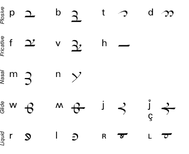
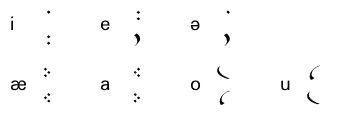
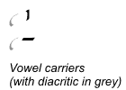
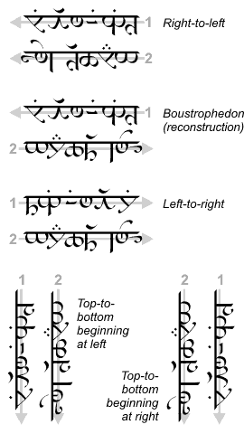
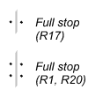

# The Sarati of Rúmil

Rúmil of Valinor created the first writing system of Arda in the Valian Year 1179 [AAm]. On one occasion, Tolkien refers to this script as “The Tengwar of Rúmil” [AppE], but the real name of the writing system was Sarati (each letter being a sarat) [QE].

## The letters

The Sarati is a phonographic script; each sarat represents a phoneme in the spoken language. The characters are tied to specific sounds much more closely than those of the Tengwar, and the Sarati may therefore correctly be referred to as an “alphabet” — as indeed it is in several sources.

There exist sarati for nearly every sound imaginable. It is not without reason that the script is in one source called “the universal Eldarin alphabet system” [R15]. No Sarati texts exploit the full range of possible characters, but use a subset of characters that suit the phonemes of the language being written.

### Consonants

Rúmil being a skilled linguist, the system of the Sarati was based on the linguistic and phonological theories current at the time that he created the script. According to the traditional phonematic analysis of Quenya, vowels were not regarded as complete phonemes, but had the function of modifying, “colouring”, the consonants [FQD].

Thus only consonants were written as true sarati, while vowels were written as diacritics (the word tehtar is never used in the sources as a term for sarati diacritics, and consequently not here either). Depending on the language and placement in relation to its sarat, the vowel diacritic is pronounced before or after the consonant. Other modifications to consonants typically performed by diacritics include doubling the sound, or indicating an adjacent /s/ or a preceding homorganic nasal.

Several sources state that the shapes of the sarati showed much variation [R12, R17]. This is continually confirmed in the samples. In fact, only a limited number of characters remain consistently used throughout the samples, as shown in figure 1. Even the appearance of these characters vary slightly, different allographs being used in different sources. (The sound values are given using the International Phonetic Alphabet.)

|                                                   |
|---------------------------------------------------|
|Figure 1: Sarati consistently used in all sources. |
|                         |

It should be observed that our sources for the Sarati were written by Tolkien over a period of several decades, during which he continually developed the script. It is not always easy to determine to what degree the changes represent alterations in the conception of the Sarati, and when they simply attest the great variation that was part of the script.

In our samples of English text written with Sarati, the sarat for r is always used where the Roman letter R would occur, regardless how the sound is pronounced in modern English. Thus we find it both in <their> and <through> (in The Early Form), <care> and <great> (in The Phonetic Form), <earth> and <bread> (in The Late Form).

### Vowels

The use of vowel diacritics is consistent in general, the variation usually being limited to switching diacritics between similar sounds. Figure 2 summarizes the most common vowel diacritics and their values.

|                                   |
|-----------------------------------|
|Figure 2: Sarati vowel diacritics. |
|          |

Vowel diacritics are always turned with the same side towards the sarat to which they are attached. Figure 2 shows the typical shape of the diacritics when positioned to the left of the sarati. When they are placed right of the sarati, their shape is reversed or “mirrored”.

When representing a vowel with no adjacent consonant, vowel diacritics are placed on a carrier. This normally has the form of a straight line, either parallel with or perpendicular to the writing direction. Long vowels are sometimes indicated by being placed on special carriers, but often the vowel diacritics are doubled instead.

We are told in FQD that before Feanor’s time, the vowel carrier with the shape of a short, straight line was derived from a sarat that had earlier represented the Proto-Eldarin voiced velar fricative [ɣ]. It was theorized that in Quenya, all vowels with no preceding consonant had onced followed a consonant that vanished in the evolution of the language; the voiced velar fricative was one of these consonants. It existed in the language during the Proto-Eldarin time but had later vanished as Quenya evolved. Where voiced velar fricative actually occurs in our samples, it is represented by a markedly different sarat.

## Writing direction

According to R17, the Sarati “was originally written from right to left, or boustrophedon [i.e. alternating right-to-left, left-to-right] beginning at the right. But in books and cursive form it was usually written from top to bottom beginning at the top right-hand corner, though writing from right to left across also occurred.”

The majority of our samples are written top-to-bottom, but most texts that consist of more than a single row actually begin at the top left-hand corner rather than the right. There are also a few samples that are written horizontally left-to-right, just like the Roman alphabet.

Thus, the following writing directions are attested (references to actual samples are given in brackets):

* Right-to-left [R17, RV1b]
* Boustrophedon
* Left-to-right [R16, R19b, R21]
* Top-to-bottom, beginning at right [R17]
* Top-to-bottom, beginning at left [R1, R2, R20, R22, RV1a]

The Eldar were ambidexterous, and could thus write equally well with either hand. When writing right-to-left, they would use the left hand, and when writing left-to-right, they would use the right, so as not to cover what had just been written with the hand. [EHFN] 

### Alignment

The following general description, as found in R17, is consistent with many of the sample documents:

''In book-usage the letters were all arranged so that they were formed as hangers to a bar. This bar was then ruled or drawn continuously, and the consonantal signs were written to the right (or below) the bar, and the vocalic signs to the left (or above) the bar. [R17]''

A substantial number of samples omit the bar [R1, R16, R20, R22, R23, RV1a], while some of these include separate texts where the bar is in place. It is unclear wether these demonstrate a contrast between “book-usage” and other usage.

In a pair of brief, tentative texts, the sarati are aligned to the left of the bar [R20, R22]. Two others, both spelling out Professor Tolkien’s name, have the sarati mirrored around the bar (once omitted) [R22, R23]. In the latter case the vowel diacritics are also mirrored, placed along the bottom of the sarati.

Regardless the writing direction, each sarat is always turned with the same side facing the following letter. This means that when writing left-to-right, the sarati appear mirrored compared to when writing right-to-left. Sarati are also always attached to the bar in the same end. It is therefore unpractical to speak of the right, left, upper or lower part of sarati, since these vary depending on the writing direction and alignment.

On this site I instead refer to the front, back, top and bottom of sarati, the front being the side facing the following sarat in the reading direction, and the top being the end always attached to the bar.
The notable exception to this is the so-called “Gnomish usage” [R21]. Here, the letters are written left-to-right with the vowel diacritics above, but the sarati are angled as if writing vertically.

In the Sarati samples on this site, the writing direction is always top-to-bottom, unless the purpose of the sample is specifically to illustrate something else.

## Punctuation

Usage of punctuation is scarce in Sarati writing. Although a number of punctuation marks are mentioned in descriptions of the writing system, only two are ever used in actual texts (one occurring once, the other twice). Both of these seem to correspond to the full stop of the Roman alphabet. The first is two dots, one on each side of the bar line. The second is the first one doubled.

## Valuations

The different systems for matching sarati with sound values have been referred to as “valuations”. Detailed descriptions of these can be found in the section titled Sarati Valuations.
