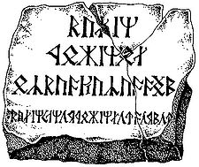

3 Кирт

|                       |   |
|-----------------------|---|
|Тип:                   |консонантно-вокалическое																		|
|Языки:					|кхуздул, синдарин, квенья																		|
|Создатель:				|Дж. Р. Р. Толкин																							|
|Период:				|значительный отрезок истории Средиземья											|
|Направление письма:	|слева направо																								|
|Знаков:				|60																													|
|Происхождение:			|искусственная письменность																	|
|ISO 15924:				|Cirt																												|
|Пример текста			| Надпись на могиле Балина	|

Кирт («Руны»), Кертар — в легендариуме Дж. Р. Р. Толкина: алфавит; изобретён Толкином для созданных им искусственных языков. Представляет собой модифицированные настоящие руны (многие знаки Кирта схожи с рунами футарка, которые, к слову, были использованы Толкином в «Хоббите», но лишь некоторые гласные имеют то же звуковое значение. Система обозначения в Кертаре более упорядоченна, чем в европейских рунах; к примеру, звонкость согласного обозначается дополнительным штрихом).

Поскольку Кирт является алфавитным письмом, одна руна обыкновенно соответствует в нём одной фонеме. Слова как правило разделяются не пробелом, а точкой.

Согласно произведениям Толкина о Средиземье, Кирт (Кертас Даэрон) был изобретён эльфом Даэроном, менестрелем Тингола, короля Дориата. Позже он был расширен до так называемого алфавита Ангертас Даэрон. Несмотря на то, что впоследствии он был в основном вытеснен Тенгваром, некогда изобретённым Румилом, а затем улучшенным и принесённым в Средиземье Феанором, гномы приспособили Кертар для своего языка кхуздул (этот вариант получил название Ангертас Мориа, или Ангертас Эребор): прямые линии Кирта значительно удобнее для вырезания на камне, нежели завитки Тенгвара. Кроме того, более простая ранняя форма Кертара была заимствована различными народами Людей и даже орками.

## Примеры использования

* Надпись на могиле Балина в Мории
* Оформление титульного листа «Властелина Колец»

## Знаки Кирта

|       |                   |   |   |   |   |   |   |   |   |   |   |
|-------|-------------------|---|---|---|---|---|---|---|---|---|---|
|Руны   |Ангертас Даэрон    |Ангертас Мориа |Руны   |Ангертас Даэрон	|Ангертас Мориа	|Руны	|Ангертас Даэрон	|Ангертас Мориа	|Руны	|	Ангертас Даэрон	|Ангертас Мориа	|
| |p	|p		|	|zh		|zh		|	|l		|l	|	|e	|e	|
|	|b	|b		|	|nj		|nj		|	|lh	    |lh	|	|ē	|ē	|
|	|f	|f	    |	|k		|k		|	|ng	    |nd	|	|a	|a	|
|	|v	|v		|	|g		|g		|	|s	    |h	|	|ā	|ā	|
|	|hw	|hw		|    |kh		|kh		|	|s	    |’	|	|o	|o	|
|	|m	|m		|	|gh		|gh		|	|z	    |ŋ	| 	|ō	|ō	|
|	|mh	|mh, mb	|	|ŋ		|n		|	|—	    |ng	| 	|ö	|ö	|
|	|t	|t		|	|kw		|kw		| 	|nd	|nj	|	|—	|n	|
|	|d	|d		|	|gw		|gw		|	|i, y	|i	|	|h	|s	|
|	|th	|th	|	|khw	|khw	|	|—	    |y	| 	|—	|—	|
|	|dh	|dh	|	|ghw, w	|ghw, w	|	|—	    |hy	| 	|—	|—	|
|	|n	|r	|	|ngw	|ngw	|	|u	    |u	|	|—	|ps	|
|	|ch	|ch	|	|nw		|nw		|	|ū	    |ū	|	|—	|ts	|
|	|j	|j	|	|r		|j		|	|w	    |w	|	|+h	|+h	|
|	|sh	|sh	|	|rh		|zh		| 	|ü	|ü	|	|&	|&	|
