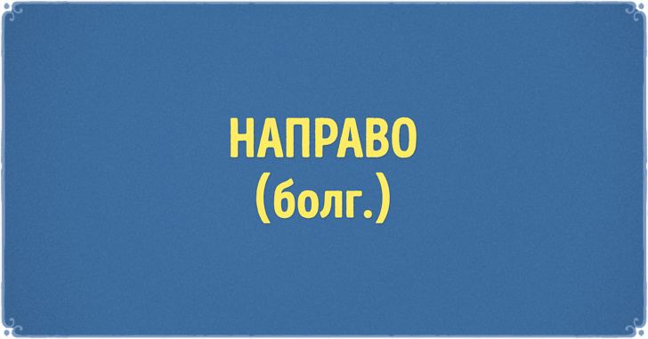

# Тест на знание славянских языков, который вы не пройдете без улыбки

1. 
1. 

1. 
1. 
1. 

1. 
1. 
1. 

1. 
1. 

1. 
1. 
1. 

1. 
1. 

1. 
1. 

1. 
1. 

1. 
1. 
1. 
1. 
1. 

1. 
1. 
1. 
1. 
1. 

1. 
1. 
1. 
1. 
1. 

## Ответы

1. Полная невеста
1. Здоровый завтрак
1. Вареники с мясом
1. Моя дочь
1. Аромат земляники
1. Сладкая жизнь
1. Холостяк
1. Гороховый суп
1. Как вас зовут
1. Дорогой стоматолог
1. Уникальный небоскреб
1. Начало
1. Нелепый предрассудок
1. Экстремальное селфи
1. Вход и выход
1. Разогнать правительство
1. Жестянщик
1. Пятница
1. Местное сообщество

1. Ковер
1. Магазин
1. Внимание
1. Салон красоты
1. Драка

1. Прямо
1. Арбуз
1. Мороженое
1. Самокат
1. Киндер-сюрприз

1. Классно, отлично
1. Стол
1. Пылесос
1. Носки
1. Леденец на палочке, Чупа-Чупс
